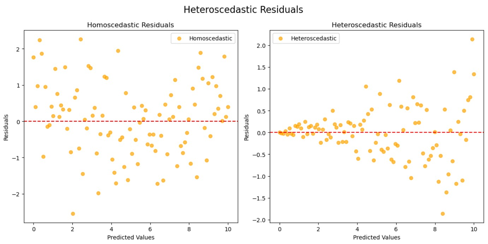
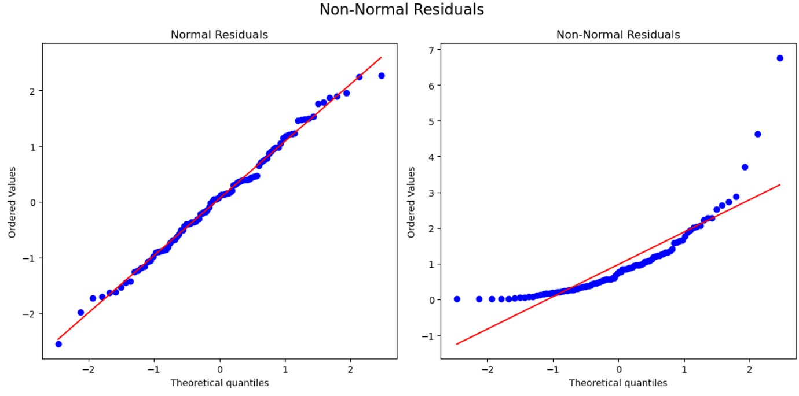

# Machine Learning Key Terms

## Introduction to Machine Learning 

- **Machine Learning (ML)**: A subfield of artificial intelligence that uses algorithms and statistical models to enable computers to make decisions or predictions without being explicitly programmed to perform the task.

- **Features**: The different measurements or properties in a dataset that are used as input for machine learning models. In the house price example, features would include area, number of bedrooms, bathrooms, address, etc.

- **Label**: The forecasting result or output value that the machine learning model attempts to predict based on the features.

## Types of Machine Learning 

- **Supervised Learning**: A type of machine learning where an algorithm learns from example data and associated output provided during training. Each input instance comes with the correct output. Used in applications where historical data predicts likely future events (e.g., fraud detection, insurance claim validation).

- **Unsupervised Learning**: A type of machine learning that deals with data sets without historical labels. The system automatically finds patterns and relationships in the data without being told the "right answer." Commonly used for clustering populations into different groups (market segmentation) or detecting abnormal behavior.

- **Reinforcement Learning**: A type of machine learning where an agent learns how to behave in an environment by performing actions and seeing the results. The agent receives rewards for desired behaviors and aims to maximize cumulative rewards. Used in game theory/strategy (e.g., Google's DeepMind AlphaGo).

## Supervised Learning Process

- **Historical Data**: Known data from the past used to train machine learning models.

- **Labeled Data**: The results (labels) from the historical data that are known and used for training.

- **Categorical Label**: Values that can be divided into several categories but have no order or priority (e.g., brands of soft drinks in a preference survey).

- **Continuous Label**: Information that can be measured on a continuum or scale and can take on any value within a finite or infinite interval (e.g., height, weight, temperature, age, house prices).

- **Classification Problem**: The task that machine learning solves when dealing with categorical labels.

- **Regression Problem**: The task that machine learning solves when dealing with continuous labels.

## Linear Regression Requirements (Page 21)

- **Linear Relationship**: There should be a linear relationship between the dependent and independent variables, which can be checked by creating a scatterplot to see if a linear pattern appears.

- **Independence**: The observations should be independent of each other, meaning the residuals at any point in the dataset should not depend on residuals at any other point.

- **Homoscedasticity**: The variance of the errors should be the same across all levels of the independent variables. If variance changes, linear regression may not be appropriate.

- **Normality**: The residuals of the model should be normally distributed.

