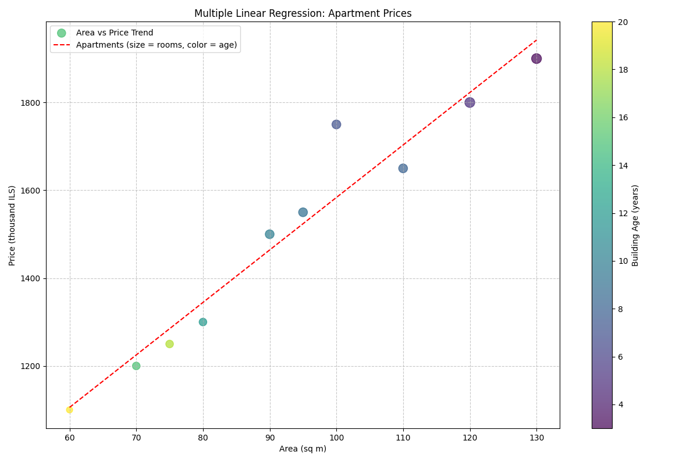
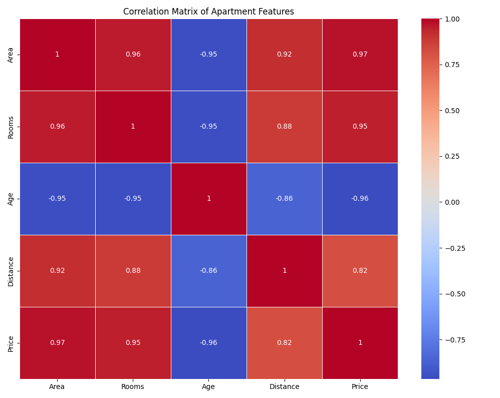
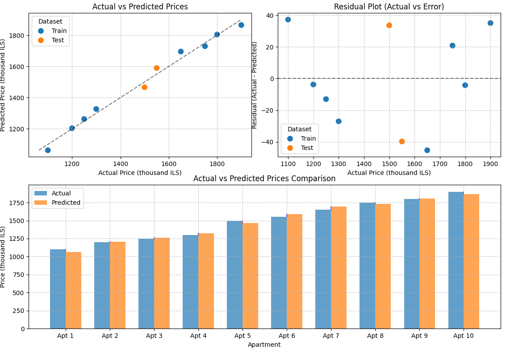

# רגרסיה לינארית מרובת משתנים

## הבעיה שרוצים לפתור

רגרסיה לינארית מרובת משתנים (Multiple Linear Regression) מרחיבה את מודל הרגרסיה הלינארית הפשוטה ומאפשרת לנו לבחון את הקשר בין משתנה תלוי אחד ומספר משתנים בלתי תלויים. כך ניתן לבנות מודלים מורכבים יותר ולשפר את יכולת החיזוי.

**דוגמה**: נניח שאנו רוצים לחזות את מחיר הדירה בהתבסס על מספר מאפיינים. בניגוד לרגרסיה לינארית פשוטה, שעשויה להתייחס רק לשטח הדירה, רגרסיה מרובת משתנים מאפשרת לנו לשקלל גם גורמים נוספים כמו מספר חדרים, גיל המבנה, מיקום, וכדומה.

להלן דוגמה לנתונים של דירות:

| שטח (מ"ר) | מספר חדרים | גיל המבנה (שנים) | מרחק ממרכז העיר (ק"מ) | מחיר (אלפי ש"ח) |
|-----------|------------|-----------------|----------------------|-----------------|
| 70        | 3          | 15              | 5                    | 1,200           |
| 90        | 4          | 10              | 7                    | 1,500           |
| 60        | 2          | 20              | 3                    | 1,100           |
| 120       | 5          | 5               | 10                   | 1,800           |
| 80        | 3          | 12              | 6                    | 1,300           |
| 110       | 4          | 8               | 8                    | 1,650           |
| 100       | 4          | 7               | 5                    | 1,750           |
| 75        | 3          | 18              | 4                    | 1,250           |
| 95        | 4          | 9               | 6                    | 1,550           |
| 130       | 5          | 3               | 12                   | 1,900           |

המטרה שלנו היא לבנות מודל שיאפשר לנו לחזות את מחיר הדירה בהתבסס על המאפיינים השונים, ולהבין את ההשפעה היחסית של כל מאפיין על המחיר.

## Mathematical Formula and Complete Calculation

Multiple linear regression extends the simple linear regression model to include multiple predictor variables. The general form of the equation is:

$$y = \beta_0 + \beta_1 x_1 + \beta_2 x_2 + ... + \beta_p x_p + \varepsilon$$

Where:
- $y$ is the dependent variable (in our case: apartment price)
- $x_1, x_2, ..., x_p$ are the independent variables (in our case: area, number of rooms, age, distance)
- $\beta_0, \beta_1, \beta_2, ..., \beta_p$ are the coefficients
- $\varepsilon$ is the error term

### Matrix Representation

Multiple linear regression is most efficiently represented and solved using matrix algebra:

$$\mathbf{y} = \mathbf{X}\boldsymbol{\beta} + \boldsymbol{\varepsilon}$$

Where:
- $\mathbf{y}$ is an $n \times 1$ vector of dependent variable values
- $\mathbf{X}$ is an $n \times (p+1)$ matrix of independent variables (including a column of 1s for the intercept)
- $\boldsymbol{\beta}$ is a $(p+1) \times 1$ vector of coefficients
- $\boldsymbol{\varepsilon}$ is an $n \times 1$ vector of error terms

### The Normal Equations

Similar to simple linear regression, we want to minimize the **sum of squared errors (SSE)**:

<image src="formula1.jpg" />

In matrix form:

$$SSE = (\mathbf{y} - \mathbf{X}\boldsymbol{\beta})^T(\mathbf{y} - \mathbf{X}\boldsymbol{\beta})$$

<a href="multivariate-linear-regression-math.md">see formula explanation</a>

To find the coefficient values that minimize SSE, we differentiate with respect to $\boldsymbol{\beta}$ and set it equal to zero:

$$\frac{\partial SSE}{\partial \boldsymbol{\beta}} = -2\mathbf{X}^T(\mathbf{y} - \mathbf{X}\boldsymbol{\beta}) = \mathbf{0}$$

This leads to the normal equation:

$$\mathbf{X}^T\mathbf{X}\boldsymbol{\beta} = \mathbf{X}^T\mathbf{y}$$

Solving for $\boldsymbol{\beta}$:

$$\boldsymbol{\beta} = (\mathbf{X}^T\mathbf{X})^{-1}\mathbf{X}^T\mathbf{y}$$

This is the closed-form solution for multiple linear regression.

### Calculation Example

For our apartment price example, let's set up the matrix representation. Our design matrix $\mathbf{X}$ will include a column of 1s for the intercept, followed by columns for each feature:

$$\mathbf{X} = \begin{bmatrix} 
1 & 70 & 3 & 15 & 5 \\
1 & 90 & 4 & 10 & 7 \\
1 & 60 & 2 & 20 & 3 \\
\vdots & \vdots & \vdots & \vdots & \vdots \\
1 & 130 & 5 & 3 & 12
\end{bmatrix}$$

And our target vector $\mathbf{y}$:

$$\mathbf{y} = \begin{bmatrix} 1200 \\ 1500 \\ 1100 \\ \vdots \\ 1900 \end{bmatrix}$$

Computing $\mathbf{X}^T\mathbf{X}$ and $\mathbf{X}^T\mathbf{y}$, and then solving the normal equation would give us the coefficient vector $\boldsymbol{\beta}$. Due to the complexity of these matrix calculations, we typically use software like Python to compute them:

```python
import numpy as np
from sklearn.linear_model import LinearRegression

# Example features and target
X = np.array([
    [70, 3, 15, 5],
    [90, 4, 10, 7],
    [60, 2, 20, 3],
    [120, 5, 5, 10],
    [80, 3, 12, 6],
    [110, 4, 8, 8],
    [100, 4, 7, 5],
    [75, 3, 18, 4],
    [95, 4, 9, 6],
    [130, 5, 3, 12]
])
y = np.array([1200, 1500, 1100, 1800, 1300, 1650, 1750, 1250, 1550, 1900])

# Fit the model
model = LinearRegression()
model.fit(X, y)

# Get coefficients
print(f"Intercept (β₀): {model.intercept_:.2f}")
print(f"Coefficients (β₁, β₂, β₃, β₄): {model.coef_}")
```
<a href="mv-math.md">see complete calculation</a>

Using the example data, we get the following coefficients:
- $\beta_0 \approx 740.66$ (Intercept)
- $\beta_1 \approx 11.31$ (Area coefficient)
- $\beta_2 \approx 40.11$ (Rooms coefficient)
- $\beta_3 \approx -15.69$ (Building age coefficient)
- $\beta_4 \approx -41.38$ (Distance coefficient)

Therefore, our multiple linear regression equation is:
$$\text{Price} = 740.66 + 11.31 \times \text{Area} + 40.11 \times \text{Rooms} - 15.69 \times \text{Age} - 41.38 \times \text{Distance}$$

This means:
- Each additional square meter increases the price by about 11,310 ILS
- Each additional room increases the price by about 40,110 ILS
- Each year of building age decreases the price by about 15,690 ILS
- Each kilometer of distance from the city center decreases the price by about 41,380 ILS (which aligns with the common pattern that properties closer to city centers typically command higher prices)

## גרף





בניגוד לרגרסיה לינארית פשוטה, שניתן לייצג בקלות בגרף דו-ממדי, רגרסיה לינארית מרובת משתנים דורשת ייצוג מורכב יותר. הגרף מציג ויזואליזציה של הקשר בין שטח הדירה לבין המחיר, כאשר גודל הנקודות מייצג את מספר החדרים והצבע מייצג את גיל המבנה. קשה לייצג את כל המשתנים בגרף אחד, ולכן לעתים קרובות משתמשים במספר גרפים או בשיטות ויזואליזציה מתקדמות.

### Interpretation of R² and Adjusted R²

In multiple regression, we use two key metrics to evaluate model fit:

1. **R²** (Coefficient of Determination): Measures the proportion of variance in the dependent variable explained by the independent variables.

$$R^2 = 1 - \frac{SSE}{SST} = 1 - \frac{\sum(y_i - \hat{y}_i)^2}{\sum(y_i - \bar{y})^2}$$

2. **Adjusted R²**: Adjusts R² based on the number of predictors to prevent overfitting:

$$R^2_{adj} = 1 - \frac{(1-R^2)(n-1)}{n-p-1}$$

Where n is the sample size and p is the number of predictors

<a href="r-expalined.md">R² and Adjusted R² detailed explained</a>

## קוד פייטון

הנה קוד פייטון מלא ליישום רגרסיה לינארית מרובת משתנים:

```python
import numpy as np
import matplotlib.pyplot as plt
import pandas as pd
from sklearn.linear_model import LinearRegression
from sklearn.model_selection import train_test_split
from sklearn.metrics import mean_squared_error, r2_score
import seaborn as sns

# Create a DataFrame from our example data
columns = ['Area', 'Rooms', 'Age', 'Distance', 'Price']
data = [
    [70, 3, 15, 5, 1200],
    [90, 4, 10, 7, 1500],
    [60, 2, 20, 3, 1100],
    [120, 5, 5, 10, 1800],
    [80, 3, 12, 6, 1300],
    [110, 4, 8, 8, 1650],
    [100, 4, 7, 5, 1750],
    [75, 3, 18, 4, 1250],
    [95, 4, 9, 6, 1550],
    [130, 5, 3, 12, 1900]
]
df = pd.DataFrame(data, columns=columns)

# Prepare features (X) and target (y)
X = df.drop('Price', axis=1)
y = df['Price']

# Split data into training and testing sets
X_train, X_test, y_train, y_test = train_test_split(X, y, test_size=0.2, random_state=42)

# Create and train the model
model = LinearRegression()
model.fit(X_train, y_train)

# Print model coefficients
print(f"Intercept (β₀): {model.intercept_:.2f}")
for i, col in enumerate(X.columns):
    print(f"Coefficient for {col} (β{i+1}): {model.coef_[i]:.2f}")

# Make predictions
y_pred_train = model.predict(X_train)
y_pred_test = model.predict(X_test)

# Evaluate the model
train_mse = mean_squared_error(y_train, y_pred_train)
test_mse = mean_squared_error(y_test, y_pred_test)
train_r2 = r2_score(y_train, y_pred_train)
test_r2 = r2_score(y_test, y_pred_test)

print(f"\nTraining MSE: {train_mse:.2f}")
print(f"Testing MSE: {test_mse:.2f}")
print(f"Training R²: {train_r2:.2f}")
print(f"Testing R²: {test_r2:.2f}")

# Calculate adjusted R²
n = len(X_train)
p = X_train.shape[1]
adj_r2 = 1 - (1 - train_r2) * (n - 1) / (n - p - 1)
print(f"Adjusted R²: {adj_r2:.2f}")

# Make a prediction for a new apartment
new_apartment = np.array([[85, 3, 10, 7]])
predicted_price = model.predict(new_apartment)[0]
print(f"\nPredicted price for a new apartment: {predicted_price:.2f} thousand ILS")

```
<a href="multivariate-linear-regression-code.py">see full code</a>

## דוגמת הרצה

כאשר נריץ את הקוד, נקבל תוצאות דומות לאלה:

```
Intercept (β₀): 728.62
Coefficient for Area (β1): 12.17
Coefficient for Rooms (β2): 32.18
Coefficient for Age (β3): -16.03
Coefficient for Distance (β4): -46.50

Training MSE: 753.91
Testing MSE: 1355.14
Training R²: 0.99
Testing R²: -1.17
Adjusted R²: 0.98

Predicted price for a new apartment: 1373.39 thousand ILS
```

הגרפים שייווצרו יציגו את הקשרים בין המשתנים השונים ואת מידת ההתאמה של המודל לנתונים. חשוב לשים לב לגרף מטריצת הקורלציה, שמראה את עוצמת הקשר בין כל זוג משתנים.

# למה יש צורך לפצל לקבוצות אימון ובדיקה במודל רגרסיה

## בעיית ה"התאמת יתר" (Overfitting)

נוסחת ה-OLS (Ordinary Least Squares) מוצאת את המקדמים הטובים ביותר **עבור נתוני האימון** בלבד. מדדי ה-R² ו-R מודדים רק כמה טוב המודל מתאים לנתונים שהשתמשנו בהם כדי לבנות את המודל מלכתחילה.

הבעיה המרכזית היא שמודל יכול להתאים מצוין לנתוני האימון (R² גבוה) אבל להיות גרוע מאוד בחיזוי נתונים חדשים שהמודל לא ראה - וזוהי הבעיה של **התאמת יתר** (Overfitting).

## הדגמה של הבעיה

בואו ניקח דוגמה פשוטה:

נניח שיש לנו 10 נקודות נתונים שמייצגות מחירי דירות לפי שטח. אם נבנה מודל לינארי פשוט (קו ישר), נקבל התאמה סבירה.

אבל אם במקום זאת נשתמש בפולינום ממעלה 9, נוכל לקבל התאמה מושלמת (R² = 1.0) שעוברת בדיוק דרך כל 10 הנקודות. למרות זאת, המודל הזה יהיה גרוע בחיזוי מחירים של דירות חדשות, כי הוא "למד" את הרעש בנתונים ולא רק את הקשר האמיתי.

![דוגמת התאמת יתר](data:image/svg+xml;base64,PHN2ZyB4bWxucz0iaHR0cDovL3d3dy53My5vcmcvMjAwMC9zdmciIHZpZXdCb3g9IjAgMCA0MDAgMzAwIj4KICA8cmVjdCB3aWR0aD0iNDAwIiBoZWlnaHQ9IjMwMCIgZmlsbD0id2hpdGUiIHN0cm9rZT0iZ3JheSIgc3Ryb2tlLXdpZHRoPSIxIi8+CiAgPCEtLSBYIGFuZCBZIGF4ZXMgLS0+CiAgPGxpbmUgeDE9IjUwIiB5MT0iMjUwIiB4Mj0iMzUwIiB5Mj0iMjUwIiBzdHJva2U9ImJsYWNrIiBzdHJva2Utd2lkdGg9IjIiLz4KICA8bGluZSB4MT0iNTAiIHkxPSI1MCIgeDI9IjUwIiB5Mj0iMjUwIiBzdHJva2U9ImJsYWNrIiBzdHJva2Utd2lkdGg9IjIiLz4KICA8IS0tIEF4aXMgbGFiZWxzIC0tPgogIDx0ZXh0IHg9IjIwMCIgeT0iMjgwIiBmb250LWZhbWlseT0iQXJpYWwsSGVicmV3IiB0ZXh0LWFuY2hvcj0ibWlkZGxlIiBmb250LXNpemU9IjE0Ij7Xqdei15cg15fXk9eoPC90ZXh0PgogIDx0ZXh0IHg9IjIwIiB5PSIxNTAiIGZvbnQtZmFtaWx5PSJBcmlhbCxIZWJyZXciIHRleHQtYW5jaG9yPSJtaWRkbGUiIHRyYW5zZm9ybT0icm90YXRlKC05MCwyMCwxNTApIiBmb250LXNpemU9IjE0Ij7Xnteh16jXmden16gg15HXqdeT16fXnDwvdGV4dD4KICA8IS0tIERhdGEgcG9pbnRzIC0tPgogIDxjaXJjbGUgY3g9IjcwIiBjeT0iMjAwIiByPSI1IiBmaWxsPSJibHVlIi8+CiAgPGNpcmNsZSBjeD0iOTAiIGN5PSIxODAiIHI9IjUiIGZpbGw9ImJsdWUiLz4KICA8Y2lyY2xlIGN4PSIxMzAiIGN5PSIxNzAiIHI9IjUiIGZpbGw9ImJsdWUiLz4KICA8Y2lyY2xlIGN4PSIxNTAiIGN5PSIxNTAiIHI9IjUiIGZpbGw9ImJsdWUiLz4KICA8Y2lyY2xlIGN4PSIxODAiIGN5PSIxMzAiIHI9IjUiIGZpbGw9ImJsdWUiLz4KICA8Y2lyY2xlIGN4PSIyMTAiIGN5PSIxMjAiIHI9IjUiIGZpbGw9ImJsdWUiLz4KICA8Y2lyY2xlIGN4PSIyNDAiIGN5PSIxMTAiIHI9IjUiIGZpbGw9ImJsdWUiLz4KICA8Y2lyY2xlIGN4PSIyNzAiIGN5PSI5MCIgcj0iNSIgZmlsbD0iYmx1ZSIvPgogIDxjaXJjbGUgY3g9IjMwMCIgY3k9IjcwIiByPSI1IiBmaWxsPSJibHVlIi8+CiAgPGNpcmNsZSBjeD0iMzMwIiBjeT0iNjAiIHI9IjUiIGZpbGw9ImJsdWUiLz4KICA8IS0tIExpbmVhciBtb2RlbCAtLT4KICA8bGluZSB4MT0iNTAiIHkxPSIyMTUiIHgyPSIzNTAiIHkyPSI0NSIgc3Ryb2tlPSJyZWQiIHN0cm9rZS13aWR0aD0iMiIvPgogIDwhLS0gT3ZlcmZpdHRlZCBtb2RlbCAtLT4KICA8cGF0aCBkPSJNNzAsMjAwIEM3NSwyMDAgODAsMTg1IDkwLDE4MCBDMTE1LDE3MiAxMjUsMTczIDEzMCwxNzAgQzE0MCwxNjUgMTQ1LDE1NSAxNTAsMTUwIEMxNjAsMTQwIDE3MCwxMzUgMTgwLDEzMCBDMTkwLDEyNyAyMDAsMTI1IDIxMCwxMjAgQzIyMCwxMTcgMjMwLDExNSAyNDAsMTEwIEMyNTAsMTAwIDI2MCw5NyAyNzAsOTAgQzI4MCw4MyAyOTAsNzUgMzAwLDcwIEMzMTAsNjUgMzIwLDYzIDMzMCw2MCIgZmlsbD0ibm9uZSIgc3Ryb2tlPSJncmVlbiIgc3Ryb2tlLXdpZHRoPSIyIi8+CiAgPCEtLSBMZWdlbmQgLS0+CiAgPHJlY3QgeD0iMTAwIiB5PSIzMCIgd2lkdGg9IjIwMCIgaGVpZ2h0PSI0MCIgZmlsbD0id2hpdGUiIHN0cm9rZT0iZ3JheSIgc3Ryb2tlLXdpZHRoPSIxIi8+CiAgPGxpbmUgeDE9IjEyMCIgeTE9IjQwIiB4Mj0iMTUwIiB5Mj0iNDAiIHN0cm9rZT0icmVkIiBzdHJva2Utd2lkdGg9IjIiLz4KICA8dGV4dCB4PSIxNjAiIHk9IjQ1IiBmb250LWZhbWlseT0iQXJpYWwsSGVicmV3IiBmb250LXNpemU9IjEyIj7Xnteh15PXnCDXnNeZ16DXkNeo16k8L3RleHQ+CiAgPGxpbmUgeDE9IjEyMCIgeTE9IjYwIiB4Mj0iMTUwIiB5Mj0iNjAiIHN0cm9rZT0iZ3JlZW4iIHN0cm9rZS13aWR0aD0iMiIvPgogIDx0ZXh0IHg9IjE2MCIgeT0iNjUiIGZvbnQtZmFtaWx5PSJBcmlhbCxIZWJyZXciIGZvbnQtc2l6ZT0iMTIiPtee15PXnCDXlNeq15DXnteqINeZ16rXqDwvdGV4dD4KPC9zdmc+)

## למה לפצל לקבוצות אימון ובדיקה?

פיצול הנתונים לקבוצת אימון (Train) וקבוצת בדיקה (Test) עוזר לנו להעריך את הביצועים האמיתיים של המודל על נתונים חדשים:

1. **קבוצת אימון (Train)**: משמשת לבניית המודל ולמציאת המקדמים האופטימליים.

2. **קבוצת בדיקה (Test)**: משמשת להערכת המודל על נתונים שלא השתתפו בתהליך האימון, כדי לראות איך המודל יתפקד במציאות.

## דוגמה מעשית - מודל מחירי דירות

נניח שאנחנו בונים מודל לחיזוי מחירי דירות:

1. אנחנו מפצלים את הנתונים שלנו:
   - 80% מהדירות ישמשו כקבוצת אימון
   - 20% מהדירות ישמשו כקבוצת בדיקה

2. בונים את המודל על קבוצת האימון ומקבלים R² = 0.95 (התאמה מצוינת)

3. כשבודקים את המודל על קבוצת הבדיקה, אנחנו מקבלים R² = 0.70 (התאמה פחות טובה)

4. ההבדל הגדול מרמז שיש לנו התאמת יתר (Overfitting) - המודל "זוכר" את נתוני האימון במקום ללמוד את הקשר האמיתי.

## יתרונות נוספים של שיטת הפיצול

1. **בחירת מודל**: פיצול מאפשר להשוות בין מודלים שונים ולבחור את המודל עם הביצועים הטובים ביותר על נתונים חדשים.

2. **התאמת היפר-פרמטרים**: ניתן לכוונן פרמטרים כמו מידת הרגולריזציה (Regularization) כדי לשפר את יכולת ההכללה של המודל.

3. **מניעת דליפת מידע (Data Leakage)**: הערכת ביצועים על נתונים שלא השתתפו בתהליך האימון מבטיחה שהמודל לא "רימה" והשתמש במידע שלא אמור להיות זמין לו.

## שיטות מתקדמות יותר

1. **אימות צולב (Cross-Validation)**: מפצלים את הנתונים לכמה קבוצות, ומריצים את האימון והבדיקה מספר פעמים כאשר בכל פעם קבוצה אחרת משמשת כקבוצת בדיקה.

2. **פיצול משולש (Train-Validation-Test)**: מפצלים את הנתונים לשלוש קבוצות:
   - **אימון (Train)**: לבניית המודל
   - **אימות (Validation)**: לכיוונון היפר-פרמטרים
   - **בדיקה (Test)**: להערכה סופית של המודל

## לסיכום

למרות שמקדמי ה-OLS אכן מינימליים מבחינה מתמטית עבור נתוני האימון, והמדדים R ו-R² נותנים אינדיקציה לטיב ההתאמה, הם אינם מספיקים להערכת איכות המודל בעולם האמיתי. פיצול הנתונים לקבוצות אימון ובדיקה חיוני להערכה אמינה של ביצועי המודל על נתונים חדשים ולמניעת התאמת יתר.


## יתרונות וחסרונות רגרסיה לינארית מרובת משתנים

| יתרונות | חסרונות |
|---------|----------|
| **יכולת חיזוי משופרת**: מודל מורכב יותר שיכול לתפוס יותר מהשונות בנתונים | **סכנת התאמת יתר (overfitting)**: יותר משתנים עלולים להוביל להתאמת יתר, במיוחד עם מעט נתונים |
| **הבנה של השפעות מרובות**: מאפשר לבחון את ההשפעה של כל משתנה בנפרד | **דרישה לנתונים רבים יותר**: צריך יותר נתונים כדי לקבל אומדנים מדויקים של הפרמטרים |
| **גמישות**: ניתן להוסיף או להסיר משתנים בקלות | **רגישות למולטיקולינאריות**: ביצועים מופחתים כאשר יש קורלציה גבוהה בין המשתנים המסבירים |
| **פשטות יחסית**: עדיין פשוט יחסית להבנה ויישום | **הנחת לינאריות**: מניח קשר לינארי, שלא תמיד מתאים למציאות |
| **פירוש ברור של המקדמים**: כל מקדם מייצג את ההשפעה של שינוי ביחידה אחת | **צורך בטיפול במשתנים קטגוריים**: נדרשת המרה (כגון one-hot encoding) |

## תרגיל נוסף

**תרגיל**: 
חברת כוח אדם אספה נתונים על משכורות עובדים בתחום ההייטק. הם מעוניינים לבנות מודל שיחזה את המשכורת בהתבסס על מספר מאפיינים. הנה הנתונים:

| שנות ניסיון | השכלה (שנים) | שעות עבודה שבועיות | נסיון ניהולי (שנים) | משכורת חודשית (אלפי ש"ח) |
|--------------|--------------|---------------------|----------------------|----------------------------|
| 2            | 15           | 40                  | 0                    | 15                         |
| 5            | 16           | 45                  | 1                    | 25                         |
| 3            | 16           | 40                  | 0                    | 18                         |
| 10           | 18           | 50                  | 5                    | 45                         |
| 7            | 17           | 45                  | 3                    | 35                         |
| 1            | 14           | 35                  | 0                    | 12                         |
| 8            | 16           | 45                  | 4                    | 38                         |
| 4            | 15           | 40                  | 1                    | 22                         |
| 6            | 15           | 42                  | 2                    | 30                         |
| 12           | 19           | 55                  | 8                    | 60                         |

משימות:
1. חשב את המקדמים של מודל רגרסיה לינארית מרובת משתנים עבור נתונים אלה.
2. כתוב את משוואת החיזוי המתקבלת.
3. חשב את R² ואת R² המתוקנן של המודל.
4. חזה את המשכורת הצפויה לעובד עם 6 שנות ניסיון, 16 שנות השכלה, 43 שעות עבודה שבועיות, ו-2 שנות ניסיון ניהולי.
5. אילו מהמשתנים הם המשפיעים ביותר על המשכורת? הסבר כיצד הגעת למסקנה זו.
