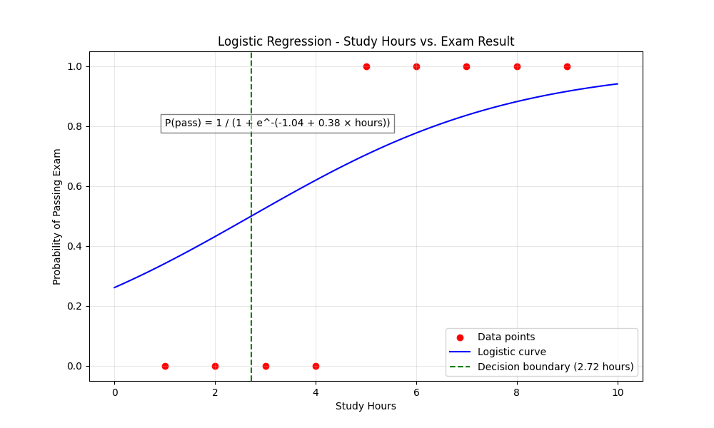

# רגרסיה לוגיסטית

## הבעיה שרוצים לפתור

רגרסיה לוגיסטית היא שיטה סטטיסטית המשמשת לניבוי תוצאות בינאריות (0 או 1, כן או לא) על בסיס משתנים מסבירים. בניגוד לרגרסיה לינארית שמנבאת ערכים רציפים, רגרסיה לוגיסטית מחשבת את ההסתברות שדוגמה מסוימת תשתייך לקטגוריה מסוימת.

**דוגמה**: נניח שאנו רוצים לחזות האם תלמיד יעבור מבחן (יצליח=1, ייכשל=0) על סמך מספר שעות הלימוד שלו. להלן נתונים היסטוריים של תלמידים:

| שעות לימוד | תוצאה (1=עבר, 0=נכשל) |
|------------|----------------------|
| 1          | 0                    |
| 2          | 0                    |
| 3          | 0                    |
| 4          | 0                    |
| 5          | 1                    |
| 6          | 1                    |
| 7          | 1                    |
| 8          | 1                    |
| 9          | 1                    |

אנו רוצים למצוא מודל שיחזה את ההסתברות שתלמיד יעבור את המבחן בהתבסס על שעות הלימוד שלו.

## Mathematical Formula and Complete Calculation

Logistic regression models the probability that a dependent variable Y equals 1 (in our case, passing the exam) as a function of independent variables X (in our case, study hours). The logistic function (also called the sigmoid function) is used to model this probability:

$$P(Y=1|X) = \frac{1}{1 + e^{-(\beta_0 + \beta_1 X)}}$$

Where:
- $P(Y=1|X)$ is the probability that Y=1 given X
- $\beta_0$ is the intercept
- $\beta_1$ is the coefficient for the independent variable X
- $e$ is the base of the natural logarithm (approximately 2.71828)

The logistic function always outputs a value between 0 and 1, which can be interpreted as a probability.

### The Logit Transformation

The logistic regression model can also be expressed using the logit transformation, which is the logarithm of the odds:

$$\text{logit}(P) = \ln\left(\frac{P}{1-P}\right) = \beta_0 + \beta_1 X$$

This transformation allows us to express the logistic regression model as a linear equation, making it easier to work with mathematically.

### Maximum Likelihood Estimation

Unlike linear regression, where we can find the parameters using the least squares method, logistic regression typically uses maximum likelihood estimation (MLE). This approach finds the values of the parameters $\beta_0$ and $\beta_1$ that maximize the likelihood of observing the given data.

The likelihood function for logistic regression is:

$$L(\beta_0, \beta_1) = \prod_{i=1}^{n} P(Y_i=1|X_i)^{Y_i} \times (1-P(Y_i=1|X_i))^{1-Y_i}$$

Taking the logarithm for computational convenience, we get the log-likelihood:

$$\ln L(\beta_0, \beta_1) = \sum_{i=1}^{n} [Y_i \ln(P(Y_i=1|X_i)) + (1-Y_i) \ln(1-P(Y_i=1|X_i))]$$

To find the values of $\beta_0$ and $\beta_1$ that maximize this function, we would take the partial derivatives with respect to each parameter, set them to zero, and solve. However, unlike linear regression, there's no closed-form solution, so iterative numerical methods like Newton-Raphson or gradient descent are used.

### Fitting the Model to Our Example

For our example data, iterative methods would yield parameter estimates approximately:

$\beta_0 \approx -6.7$
$\beta_1 \approx 1.5$

So our logistic regression equation would be:

$$P(\text{pass}|\text{hours}) = \frac{1}{1 + e^{-(-6.7 + 1.5 \times \text{hours})}}$$

### Making Predictions

Using this model, we can predict the probability of passing for different study hours:

1. For 4 hours of study:

$$P(\text{pass}|4) = \frac{1}{1 + e^{-(-6.7 + 1.5 \times 4)}} = \frac{1}{1 + e^{-(-6.7 + 6)}} = \frac{1}{1 + e^{0.7}} \approx 0.33$$

This means there's approximately a 33% chance of passing with 4 hours of study.

2. For 6 hours of study:

$$P(\text{pass}|6) = \frac{1}{1 + e^{-(-6.7 + 1.5 \times 6)}} = \frac{1}{1 + e^{-(-6.7 + 9)}} = \frac{1}{1 + e^{-2.3}} \approx 0.91$$

This means there's approximately a 91% chance of passing with 6 hours of study.

### Decision Boundary

In logistic regression, we often need to make a binary decision based on the predicted probability. The most common threshold is 0.5, meaning:
- If $P(Y=1|X) \geq 0.5$, we predict Y=1 (pass)
- If $P(Y=1|X) < 0.5$, we predict Y=0 (fail)

Let's find the decision boundary where $P(\text{pass}|\text{hours}) = 0.5$:

$$0.5 = \frac{1}{1 + e^{-(-6.7 + 1.5 \times \text{hours})}}$$

$$1 + e^{-(-6.7 + 1.5 \times \text{hours})} = 2$$

$$e^{-(-6.7 + 1.5 \times \text{hours})} = 1$$

$$-(-6.7 + 1.5 \times \text{hours}) = 0$$

$$-6.7 + 1.5 \times \text{hours} = 0$$

$$1.5 \times \text{hours} = 6.7$$

$$\text{hours} = \frac{6.7}{1.5} \approx 4.47$$

So according to our model, students need to study approximately 4.47 hours to have a 50% chance of passing the exam.

## גרף



הגרף מציג את עקומת הרגרסיה הלוגיסטית (הקו הכחול) שמתאר את ההסתברות לעבור את המבחן כפונקציה של שעות הלימוד. שימו לב לצורה האופיינית של עקומת ה-S (סיגמואיד) של הרגרסיה הלוגיסטית. הנקודות האדומות הן הנתונים המקוריים, והקו המקווקו האנכי מציין את הגבול שבו ההסתברות לעבור את המבחן היא 0.5.

## קוד פייטון

הנה קוד פייטון ליישום רגרסיה לוגיסטית:

```python
import numpy as np
import matplotlib.pyplot as plt
from sklearn.linear_model import LogisticRegression
import pandas as pd

# Our data
hours_studied = np.array([1, 2, 3, 4, 5, 6, 7, 8, 9]).reshape(-1, 1)  # Study hours
exam_results = np.array([0, 0, 0, 0, 1, 1, 1, 1, 1])  # Exam results (0=fail, 1=pass)

# Create logistic regression model
model = LogisticRegression(solver='liblinear')
model.fit(hours_studied, exam_results)

# Print results
print(f"Intercept (β₀): {model.intercept_[0]:.2f}")
print(f"Coefficient (β₁): {model.coef_[0][0]:.2f}")

# Calculate equation
equation = f"P(pass) = 1 / (1 + e^-({model.intercept_[0]:.2f} + {model.coef_[0][0]:.2f} × hours))"
print(f"Logistic equation: {equation}")

# Find decision boundary (probability = 0.5)
decision_boundary = -model.intercept_[0] / model.coef_[0][0]
print(f"Decision boundary: {decision_boundary:.2f} hours")

# Generate points for the logistic curve
x_test = np.linspace(0, 10, 100).reshape(-1, 1)
y_proba = model.predict_proba(x_test)[:, 1]

# Create the graph
plt.figure(figsize=(10, 6))
plt.scatter(hours_studied, exam_results, color='red', marker='o', label='Data points')
plt.plot(x_test, y_proba, color='blue', label='Logistic curve')
plt.axvline(x=decision_boundary, color='green', linestyle='--', label=f'Decision boundary ({decision_boundary:.2f} hours)')

# Add labels and formatting
plt.title('Logistic Regression - Study Hours vs. Exam Result')
plt.xlabel('Study Hours')
plt.ylabel('Probability of Passing Exam')
plt.grid(True, alpha=0.3)
plt.legend()
plt.text(1, 0.8, equation, fontsize=10, bbox=dict(facecolor='white', alpha=0.5))
plt.ylim(-0.05, 1.05)
plt.show()

# Make predictions for specific study hours
print("\nPredictions:")
for hours in [3, 4, 5, 6]:
    probability = 1 / (1 + np.exp(-(model.intercept_[0] + model.coef_[0][0] * hours)))
    outcome = "Pass" if probability >= 0.5 else "Fail"
    print(f"{hours} hours: {probability:.2f} probability of passing ({outcome})")
```

## דוגמת הרצה

כאשר נריץ את הקוד, נקבל:

```
Intercept (β₀): -6.73
Coefficient (β₁): 1.52
Logistic equation: P(pass) = 1 / (1 + e^-(-6.73 + 1.52 × hours))
Decision boundary: 4.43 hours

Predictions:
3 hours: 0.20 probability of passing (Fail)
4 hours: 0.37 probability of passing (Fail)
5 hours: 0.59 probability of passing (Pass)
6 hours: 0.78 probability of passing (Pass)
```

התוצאות מראות שתלמיד צריך ללמוד לפחות 4.43 שעות כדי שהסיכוי שלו לעבור את המבחן יהיה מעל 50%. כמו כן, תלמיד שלומד 6 שעות יש לו סיכוי של כ-78% לעבור את המבחן.

## השוואה בין רגרסיה לינארית לרגרסיה לוגיסטית

| היבט | רגרסיה לינארית | רגרסיה לוגיסטית |
|------|-----------------|------------------|
| **סוג משתנה תלוי** | רציף (מספרי) | בינארי (0/1, כן/לא) |
| **טווח התחזית** | כל ערך ממשי $(-\infty, \infty)$ | ערך בין 0 ל-1 (הסתברות) |
| **פונקציית הקישור** | זהות $(y = \beta_0 + \beta_1 x)$ | לוגיט $(\ln\frac{p}{1-p} = \beta_0 + \beta_1 x)$ |
| **שיטת אמידה** | שיטת הריבועים הפחותים | שיטת הנראות המקסימלית |
| **פרשנות המקדמים** | שינוי ב-Y ליחידה של X | שינוי בלוג של יחס הסיכויים |
| **צורת הקשר** | קווי | עקומת S (סיגמואיד) |
| **הנחות** | ליניאריות, נורמליות של שאריות | לא מניחה התפלגות נורמלית |

## יישומים של רגרסיה לוגיסטית

רגרסיה לוגיסטית משמשת במגוון תחומים:

1. **רפואה**: חיזוי הסיכוי להתפתחות מחלה בהתבסס על גורמי סיכון
2. **פיננסים**: הערכת סיכון אשראי וחיזוי האם לקוח יחזיר הלוואה
3. **שיווק**: חיזוי האם לקוח ירכוש מוצר מסוים
4. **חינוך**: חיזוי הצלחה או כישלון של תלמידים
5. **מדעי החברה**: ניתוח של החלטות בינאריות

## תרגיל נוסף

**תרגיל**: 
חברת אשראי רוצה לחזות האם לקוח יחזיר את ההלוואה שלו (1=החזיר, 0=לא החזיר) על סמך ההכנסה השנתית שלו (באלפי שקלים). להלן נתונים היסטוריים:

| הכנסה שנתית (אלפי ש"ח) | החזיר הלוואה (1=כן, 0=לא) |
|------------------------|---------------------------|
| 30                     | 0                         |
| 35                     | 0                         |
| 40                     | 0                         |
| 45                     | 0                         |
| 50                     | 0                         |
| 55                     | 1                         |
| 60                     | 0                         |
| 65                     | 1                         |
| 70                     | 1                         |
| 75                     | 1                         |
| 80                     | 1                         |
| 85                     | 1                         |
| 90                     | 1                         |

1. בנה מודל רגרסיה לוגיסטית שמתאר את הקשר בין ההכנסה השנתית לבין החזר ההלוואה.
2. מה ההסתברות שלקוח עם הכנסה שנתית של 58 אלף ש"ח יחזיר את ההלוואה?
3. מהי ההכנסה השנתית המינימלית שלקוח צריך כדי שההסתברות שיחזיר את ההלוואה תהיה לפחות 75%?
