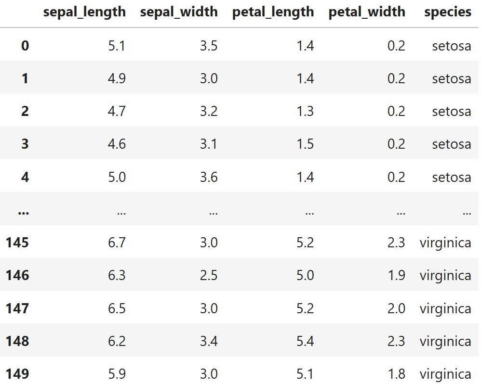

# 🌟 רגרסיה לוגיסטית עם כמה משתנים (Multivariable Logistic Regression)

## 📘 מה זה רגרסיה לוגיסטית?
רגרסיה לוגיסטית היא שיטה סטטיסטית לחיזוי משתנה תלוי בינארי או רב־קטגורי (כמו: כן/לא, סוג פרח), על סמך ערכים של משתנים מסבירים (תכונות).

במקרה של מספר משתנים מסבירים (features), מדובר ברגרסיה לוגיסטית עם **כמה נעלמים**.

---

## ✏️ מושגים בסיסיים:

- **משתנה תלוי (Y):** מה שאנחנו מנסים לחזות (למשל סוג פרח)
- **משתנים בלתי תלויים (X₁, X₂, X₃...):** התכונות שמסבירות את Y (למשל אורך עלי כותרת)
- **β (בטא):** מקדמים שנלמדים על ידי המודל. כל משתנה מקבל β משלו.

---

## 📐 נוסחה מתמטית (Softmax Multiclass):

אם יש לנו \( K \) קטגוריות ו־\( n \) משתנים:

$$
P(y = k \mid x) = \frac{e^{\beta_{k0} + \beta_{k1}x_1 + \beta_{k2}x_2 + \dots + \beta_{kn}x_n}}{\sum_{j=1}^K e^{\beta_{j0} + \beta_{j1}x_1 + \beta_{j2}x_2 + \dots + \beta_{jn}x_n}}
$$

- זוהי פונקציית **Softmax** – ממירה את הציונים להסתברויות.
- כל קטגוריה מקבלת הסתברות, והחזויה היא זו עם ההסתברות הגבוהה ביותר.

---

## 🌸 דוגמה – על בסיס נתוני Iris:




ננסה לחזות את סוג הפרח (setosa, versicolor, virginica) על סמך 4 משתנים:
- sepal length (X₁)
- sepal width (X₂)
- petal length (X₃)
- petal width (X₄)

כל סוג פרח יקבל מקדמים משלו:

למשל:

$$
P(y = \text{setosa}) = \frac{e^{\beta_{0} + \beta_1 x_1 + \beta_2 x_2 + \beta_3 x_3 + \beta_4 x_4}}{\text{sum of all classes}}
$$

### לוגיסטית מרובת משתנים עם softmax

### 🎯 מטרה:
לחזות איזה פרח זה (Setosa / Versicolor / Virginica) לפי התכונות הבאות:

- `x₁` = sepal length = 5.0  
- `x₂` = sepal width = 3.0  
- `x₃` = petal length = 1.5  
- `x₄` = petal width = 0.2  

### 🧠 נניח את המקדמים הבאים:

| Class       | β₀ (bias) | β₁  | β₂  | β₃   | β₄   |
|-------------|-----------|-----|-----|------|------|
| Setosa      | 2.0       | 1.0 | 0.5 | -0.5 | -1.0 |
| Versicolor  | 1.0       | 0.5 | 0.2 |  0.1 |  0.3 |
| Virginica   | -0.5      | 0.3 | 0.1 |  0.8 |  0.9 |

### ✏️ נחשב את הציונים (logits):

$$
z_{setosa} = 2.0 + 1.0 \cdot 5.0 + 0.5 \cdot 3.0 - 0.5 \cdot 1.5 - 1.0 \cdot 0.2 = 7.55
$$

$$
z_{versicolor} = 1.0 + 0.5 \cdot 5.0 + 0.2 \cdot 3.0 + 0.1 \cdot 1.5 + 0.3 \cdot 0.2 = 4.31
$$

$$
z_{virginica} = -0.5 + 0.3 \cdot 5.0 + 0.1 \cdot 3.0 + 0.8 \cdot 1.5 + 0.9 \cdot 0.2 = 2.68
$$

### 🧮 מחשבים softmax:

$$
P(k) = \frac{e^{z_k}}{\sum_j e^{z_j}}
$$

$$
e^{7.55} ≈ 1902.56
$$

$$ 
e^{4.31} ≈ 74.46 
$$

$$ 
e^{2.68} ≈ 14.61 
$$
- סך הכול: \( 1991.63 \)


**הסתברויות לכל פרח:**

Setosa

$$
\frac{1902.56}{1991.63} = **0.955**  
$$

Versicolor

$$
\frac{74.46}{1991.63} = 0.037
$$

Virginica

$$
\frac{14.61}{1991.63} = 0.007
$$

### ✅ מסקנה:

> המודל חוזה שהפרח הוא **Setosa** עם הסתברות של **95.5%**  
> ולכן זה מה שתחזיר הפונקציה `predict` של המודל עבור הפרמטרים הנוכחיים


---

## 🧪 קוד פייתון לדוגמה:

```python
import pandas as pd
from sklearn.linear_model import LogisticRegressionCV
from sklearn.model_selection import train_test_split
from sklearn.preprocessing import StandardScaler
from sklearn.metrics import classification_report

# Load dataset
df = pd.read_csv("iris.csv")
X = df.drop(columns="species")  # Features
y = df["species"]               # Target (3 flower types)

# Train/test split
X_train, X_test, y_train, y_test = train_test_split(X, y, test_size=0.3, random_state=42)

# Normalize features
scaler = StandardScaler()
X_train_scaled = scaler.fit_transform(X_train)
X_test_scaled = scaler.transform(X_test)

# Train logistic regression with multinomial softmax
model = LogisticRegressionCV(
    solver='lbfgs',           # Efficient for multiclass problems
    multi_class='multinomial',# Uses softmax across all classes
    cv=5,
    max_iter=500
)
model.fit(X_train_scaled, y_train)

# Predict and evaluate
y_pred = model.predict(X_test_scaled)
print(classification_report(y_test, y_pred))
