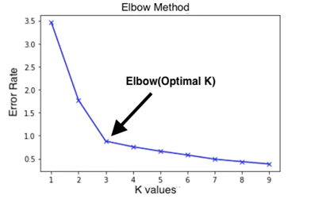
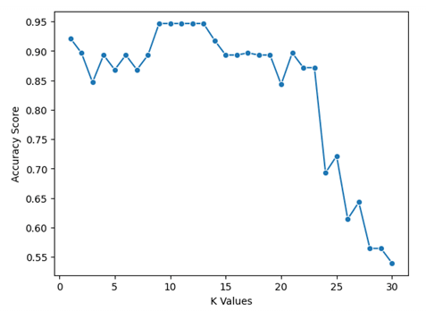

# KNN - תרחישי תיקו ושיטות מתקדמות

## טיפול במקרי תיקו

אחת הבעיות שעלולות להתעורר באלגוריתם KNN היא כאשר קיים תיקו (tie) בין מספר קטגוריות. מצב זה מתרחש כאשר K שכנים מתחלקים באופן שווה בין שתי קטגוריות או יותר

**דוגמה**: נניח שבחרנו K=4 ומצאנו שמתוך ארבעת השכנים הקרובים ביותר, 2 הם תפוחים ו-2 הם תפוזים. איך נחליט לאיזו קטגוריה לסווג את הפרי החדש?

### אסטרטגיות לטיפול בתיקו:

1. **בחירת K אי-זוגי**: השיטה הפשוטה ביותר היא להשתמש ב-K אי-זוגי (3, 5, 7, וכו') כדי למנוע תיקו מלכתחילה. זה עובד היטב עבור בעיות סיווג בינארי (שתי קטגוריות)

2. **שקלול לפי מרחק**: במקום לתת לכל שכן משקל זהה, נשקלל את הקבוצה של הנקודה לפי 1 חלקי d, כאשר d הוא המרחק מהנקודה החדשה. כך, שכנים קרובים יותר מקבלים השפעה גדולה יותר:

$$\text{משקל השכן} = \frac{1}{d(x, x_i)}$$

דוגמה מספרית –לפי 

$$
\frac{1}{d}
$$

נניח שהשתמשנו ב-K=4 והשכנים הקרובים ביותר לפרי חדש הם:

| Neighbor | Class     | Distance from new fruit \( d \) | Weight $\frac{1}{d}$ |
|----------|-----------|-------------------------------|--------------------------|
| 1        | Apple 🍎   | 1.0                           | 1.00                     |
| 2        | Apple 🍎   | 2.0                           | 0.50                     |
| 3        | Orange 🍊  | 3.0                           | 0.33                     |
| 4        | Orange 🍊  | 4.0                           | 0.25                     |

- **תפוח 🍎**:  
  \( 1.00 + 0.50 = 1.50 \)

- **תפוז 🍊**:  
  \( 0.33 + 0.25 = 0.58 \)


**מסקנה:**

למרות שיש תיקו במספר הקטגוריות (2 תפוחים, 2 תפוזים),  
כאשר מבצעים שקלול לפי המרחק – השכנים הקרובים משפיעים יותר,  
ולכן הקטגוריה **תפוח** מנצחת

3. **הורדת K ב-1**: אם מתרחש תיקו, ניתן להקטין את K באופן זמני ב-1 ולבדוק אם התיקו נפתר

4. **העדפת קטגוריה**: אם יש סיבה לוגית להעדיף קטגוריה מסוימת (למשל קטגוריה שכיחה יותר), ניתן להשתמש בה כמכריעה במקרי תיקו

5. **בחירה אקראית**: בחירה אקראית של אחת מהקטגוריות השוות

דוגמת קוד לטיפול בתיקו באמצעות שקלול מרחקים:

```python
def weighted_knn_predict(X_train, y_train, x_new, k):
    # חישוב מרחקים בין הנקודה החדשה לכל נקודות האימון
    distances = []
    for i, x_train in enumerate(X_train):
        dist = np.sqrt(np.sum((x_train - x_new) ** 2))
        distances.append((dist, i))
    
    # מיון המרחקים ובחירת K הקרובים ביותר
    distances.sort()
    k_nearest = distances[:k]
    
    # שקלול הצבעות לפי המרחק
    class_votes = {}
    for dist, idx in k_nearest:
        weight = 1.0 / max(dist, 0.000001)  # מניעת חלוקה באפס
        vote = y_train[idx]
        
        if vote in class_votes:
            class_votes[vote] += weight
        else:
            class_votes[vote] = weight
    
    # בחירת הקטגוריה עם הציון המשוקלל הגבוה ביותר
    return max(class_votes.items(), key=lambda x: x[1])[0]
```

## מדדי הערכה: Precision, Recall, F1, Support

להערכת ביצועי מודל KNN, משתמשים בכמה מדדים סטנדרטיים:

### 1. Precision (דיוק)
מודד את אחוז הניבויים החיוביים שהיו נכונים באמת:

$$\text{Precision} = \frac{TP}{TP + FP}$$

כאשר:
- TP (True Positive): חיזוי חיובי נכון
- FP (False Positive): חיזוי חיובי שגוי

דיוק גבוה משמעותו שכאשר המודל מנבא 'כן', הוא בדרך כלל צודק

### 2. Recall (כיסוי או רגישות)
מודד איזה אחוז מהמקרים החיוביים באמת המודל הצליח לזהות:

$$\text{Recall} = \frac{TP}{TP + FN}$$

כאשר:
- FN (False Negative): חיזוי שלילי שגוי

כיסוי גבוה משמעותו שהמודל מזהה את רוב המקרים החיוביים האמיתיים

### 3. F1 Score
ממוצע הרמוני של Precision ו-Recall, מאזן בין שני המדדים:

$$\text{F1} = 2 \cdot \frac{\text{Precision} \cdot \text{Recall}}{\text{Precision} + \text{Recall}}$$

F1 גבוה משקף איזון טוב בין דיוק לכיסוי.

### 4. Support
מספר המופעים בפועל של כל קטגוריה בקבוצת הבדיקה

### דוגמה מטריצת בלבול (Confusion Matrix):

```               
                  | Predicted: Apple | Predicted: Orange | Predicted: Banana
------------------|------------------|-------------------|-------------------
Actual: Apple     |        14        |         2         |         1
Actual: Orange    |         3        |        16         |         0
Actual: Banana    |         0        |         1         |        13
```

וחישוב המדדים:

```
              precision    recall  f1-score   support
       APPLE      0.82      0.82      0.82        17
       ORANGE     0.84      0.84      0.84        19
       BANANA     0.93      0.93      0.93        14

    accuracy                          0.86        50
   macro avg      0.86      0.86      0.86        50
weighted avg      0.86      0.86      0.86        50
```

הסבר על `macro avg` ו־`weighted avg` בדו"ח סיווג (Classification Report)

כאשר אנו משתמשים בפונקציה `classification_report` מ־Scikit-learn, אנו מקבלים טבלה עם מדדים לכל קטגוריה, כמו:
- **precision** – דיוק התחזיות
- **recall** – יכולת לזהות את המקרים הנכונים
- **f1-score** – the harmonic mean between precision and recall
- **support** – מספר הדוגמאות של כל קטגוריה

מה זה `macro avg`?

- **ממוצע פשוט** של המדדים עבור כל הקטגוריות.
- כל קטגוריה מקבלת **חשיבות שווה**, בלי קשר לגודל שלה.

📌 דוגמה:
אם נחשב את `macro avg` ל־precision:

$$
\text{macro avg precision} = \frac{0.82 + 0.84 + 0.93}{3} = 0.863
$$

מתאים כאשר חשוב לנו להתייחס לכל קטגוריה **באופן שווה**.

מה זה `weighted avg`?

- מחשבים ממוצע של המדדים, אבל כל קטגוריה מקבלת **משקל לפי כמות הדוגמאות שלה (support)**.
- קטגוריה שיש לה יותר דוגמאות תשפיע יותר על הממוצע.

📌 דוגמה:
אם נחשב את `weighted avg` ל־precision:

$$
\text{weighted avg precision} = \frac{(17 \times 0.82) + (19 \times 0.84) + (14 \times 0.93)}{50} = 0.858
$$

מתאים כאשר רוצים לקבל מדד כולל שמייצג **את המציאות של ההתפלגות** בדאטה.

טבלת סיכום:

| סוג ממוצע       | איך מחשבים?                   | מתי מתאים?                         |
|------------------|-------------------------------|-------------------------------------|
| `macro avg`      | ממוצע פשוט של כל הקטגוריות     | כשאתה רוצה לתת חשיבות שווה לכולן   |
| `weighted avg`   | ממוצע משוקלל לפי מספר דוגמאות | כשאתה רוצה לשקף את המציאות בדאטה   |


קוד פייתון להצגת מדדי ביצוע **על חלק הטסט:**

```python
import numpy as np
import pandas as pd
from sklearn.neighbors import KNeighborsClassifier
from sklearn.model_selection import train_test_split
from sklearn.metrics import classification_report, confusion_matrix
import matplotlib.pyplot as plt
import seaborn as sns

colors = np.array([200, 50, 220, 240, 250, 230, 30, 40, 20])
sizes = np.array([7, 7, 6, 9, 8, 9, 12, 13, 11])
weights = np.array([150, 160, 140, 170, 165, 180, 120, 130, 115])
fruit_types = np.array(['apple', 'apple', 'apple', 'orange', 'orange', 'orange', 'banana', 'banana', 'banana'])

# Create feature matrix
X = np.column_stack((colors, sizes, weights))
y = fruit_types

# אימון המודל
X_train, X_test, y_train, y_test = train_test_split(X, y, test_size=0.3, random_state=42)
model = KNeighborsClassifier(n_neighbors=3)
model.fit(X_train, y_train)
y_pred = model.predict(X_test)

# Calculate and display classification report (precision, recall, f1-score, support)
print("Classification Report:")
report = classification_report(y_test, y_pred)
print(report)

# Calculate and display confusion matrix
cm = confusion_matrix(y_test, y_pred)
print("\nConfusion Matrix:")
print(cm)

# Create prettier confusion matrix display with labels
fruit_labels = ['apple', 'orange', 'banana']
cm_df = pd.DataFrame(cm,
                    index=[f'Actual: {label}' for label in fruit_labels],
                    columns=[f'Predicted: {label}' for label in fruit_labels])
print("\nConfusion Matrix (labeled):")
print(cm_df)

# Visualize confusion matrix with heatmap
plt.figure(figsize=(8, 6))
sns.heatmap(cm, annot=True, fmt='d', cmap='Blues',
            xticklabels=fruit_labels,
            yticklabels=fruit_labels)
plt.xlabel('Predicted Label')
plt.ylabel('True Label')
plt.title('Confusion Matrix for Fruit Classification')
plt.tight_layout()
plt.show()
```

## שיטות לבחירת K אופטימלי

### 1. Elbow Method

שיטת ה-Elbow מבוססת על בדיקת שיעור השגיאה של המודל עם ערכי K שונים, וחיפוש נקודת "מרפק" שבה תוספת ערכי K נוספים אינה משפרת משמעותית את הביצועים:

```python
from sklearn.neighbors import KNeighborsClassifier
from sklearn.model_selection import train_test_split
from sklearn.metrics import accuracy_score
import matplotlib.pyplot as plt
import numpy as np

# הכנת הנתונים
X_train, X_test, y_train, y_test = train_test_split(X, y, test_size=0.3, random_state=42)

# בדיקת דיוק עבור ערכי K שונים
k_range = range(1, 31)
scores = []

for k in k_range:
    model = KNeighborsClassifier(n_neighbors=k)
    model.fit(X_train, y_train)
    y_pred = model.predict(X_test)
    scores.append(accuracy_score(y_test, y_pred))  # accuracy = (TP + TN) / (TP + TN + FP + FN)

# הצגת התוצאות בגרף
plt.figure(figsize=(10, 6))
plt.plot(k_range, scores, marker='o')
plt.title('KNN: Accuracy for different K values')
plt.xlabel('K Value')
plt.ylabel('Accuracy')
plt.xticks(k_range[::2])  # הצגת ערכי K זוגיים בלבד לנוחות
plt.grid(True)
plt.show()

# מציאת ערך K האופטימלי
optimal_k = k_range[np.argmax(scores)]
print(f"ערך K האופטימלי הוא: {optimal_k} עם דיוק של: {max(scores):.4f}")
```



בשיטת ה-Elbow, אנו מחפשים את הנקודה שבה השיפור בדיוק מתחיל להתמתן משמעותית, כמו "מרפק" בגרף.

### 2. Cross-Validation (אימות צולב)

אימות צולב מחלק את הנתונים למספר "קיפולים" (folds), ומבצע אימון וניבוי על כל קיפול, ממצע את התוצאות כדי לקבל הערכה מדויקת יותר של ביצועי המודל:

```python
from sklearn.model_selection import cross_val_score

# בדיקת ביצועים עם אימות צולב עבור ערכי K שונים
k_range = range(1, 31)
cv_scores = []

for k in k_range:
    model = KNeighborsClassifier(n_neighbors=k)
    scores = cross_val_score(model, X, y, cv=10, scoring='accuracy')  # 10-fold CV
    # accuracy = (TP + TN) / (TP + TN + FP + FN)
    cv_scores.append(scores.mean())

# הצגת התוצאות בגרף
plt.figure(figsize=(10, 6))
plt.plot(k_range, cv_scores, marker='o')
plt.title('KNN: CV Accuracy for different K values')
plt.xlabel('K Value')
plt.ylabel('CV Accuracy')
plt.xticks(k_range[::2])
plt.grid(True)
plt.show()

# מציאת ערך K האופטימלי
optimal_k_cv = k_range[np.argmax(cv_scores)]
print(f"ערך K האופטימלי (CV) הוא: {optimal_k_cv} עם דיוק ממוצע של: {max(cv_scores):.4f}")
```



### GridSearchCV with KNN – Explanation & Example

`GridSearchCV` from Scikit-learn helps you **find the best parameters** for your model  
by searching through all possible combinations (a "grid") of parameters.

#### 📦 In the context of KNN:

You might want to try different values for:

- `n_neighbors`: Number of neighbors (K)
- `weights`: 
  - `'uniform'` — all neighbors have equal weight  
  - `'distance'` — closer neighbors get more weight
- `metric`: 
  - `'euclidean'` — standard distance  
  - `'manhattan'` — city block distance. It measures the distance between two points by only moving horizontally and vertically, like you would in a city with square blocks
    abs(x1-x2) + abs(y1-y2)

#### ⚙️ How it works:

1. You define a **grid of parameters** to test
2. `GridSearchCV` trains the model using **cross-validation** for each combination
3. It evaluates each setup using a scoring metric (e.g., accuracy)
4. It returns the **best parameter combination** based on results

#### 🧠 Python Example:

```python
from sklearn.model_selection import GridSearchCV
from sklearn.neighbors import KNeighborsClassifier

# Example data (X, y)
# Assume X and y are already defined

# Base model
knn = KNeighborsClassifier()

# Grid of parameters to try
param_grid = {
    'n_neighbors': list(range(1, 31)),
    'weights': ['uniform', 'distance'],
    'metric': ['euclidean', 'manhattan']
}

# Grid Search with 5-fold cross-validation
grid = GridSearchCV(knn, param_grid, cv=5, scoring='accuracy')
grid.fit(X, y)

# Show best results
print("Best parameters:", grid.best_params_)
print("Best accuracy:", grid.best_score_)
```


### כיצד לבחור את K המתאים?

1. **גודל המדגם**: ככל שמדגם האימון גדול יותר, ניתן להשתמש ב-K גדול יותר.
   
2. **רמת הרעש בנתונים**: 
   - לנתונים עם מעט רעש: K קטן יותר (1-5)
   - לנתונים עם הרבה רעש: K גדול יותר (להפחית את השפעת הרעש)

3. **מורכבות הגבולות בין המחלקות**:
   - גבולות פשוטים: K גדול יותר
   - גבולות מורכבים: K קטן יותר

4. **כלל אצבע**: לעתים קרובות מומלץ להתחיל עם $K = \sqrt{n}$ כאשר n הוא מספר הדוגמאות במדגם האימון.

5. **ערכים אי-זוגיים**: עבור בעיות סיווג בינארי, כדאי לבחור ערכי K אי-זוגיים כדי למנוע תיקו.

## יישום מעשי - שימוש בכל השיטות

נסכם את כל מה שלמדנו בדוגמה מעשית מקיפה:

```python
import numpy as np
import pandas as pd
import matplotlib.pyplot as plt
import seaborn as sns
from sklearn.neighbors import KNeighborsClassifier
from sklearn.model_selection import train_test_split, cross_val_score, GridSearchCV
from sklearn.preprocessing import StandardScaler
from sklearn.metrics import classification_report, confusion_matrix, accuracy_score

# טעינת נתונים (לדוגמה נשתמש ב-Iris dataset)
from sklearn.datasets import load_iris
iris = load_iris()
X = iris.data
y = iris.target
feature_names = iris.feature_names
target_names = iris.target_names

# תקנון הנתונים
scaler = StandardScaler()
X_scaled = scaler.fit_transform(X)

# חלוקה לאימון ובדיקה
X_train, X_test, y_train, y_test = train_test_split(X_scaled, y, test_size=0.3, random_state=42, stratify=y)

# חלק 1: בחירת K אופטימלי 
k_range = range(1, 30, 2)  # ערכי K אי-זוגיים עד 30

# שיטה 1: Elbow Method
test_scores = []
for k in k_range:
    knn = KNeighborsClassifier(n_neighbors=k)
    knn.fit(X_train, y_train)
    test_scores.append(accuracy_score(y_test, knn.predict(X_test)))

# שיטה 2: Cross-Validation
cv_scores = []
for k in k_range:
    knn = KNeighborsClassifier(n_neighbors=k)
    scores = cross_val_score(knn, X_scaled, y, cv=10, scoring='accuracy')
    cv_scores.append(scores.mean())

# שיטה 3: GridSearchCV
param_grid = {'n_neighbors': list(k_range)}
grid_search = GridSearchCV(KNeighborsClassifier(), param_grid, cv=10)
grid_search.fit(X_scaled, y)

# הצגת תוצאות בחירת K
plt.figure(figsize=(12, 6))
plt.plot(k_range, test_scores, marker='o', label='Test Accuracy')
plt.plot(k_range, cv_scores, marker='s', label='CV Accuracy')
plt.axvline(x=k_range[np.argmax(test_scores)], color='r', linestyle='--', 
            label=f'Best K (Test): {k_range[np.argmax(test_scores)]}')
plt.axvline(x=k_range[np.argmax(cv_scores)], color='g', linestyle='--', 
            label=f'Best K (CV): {k_range[np.argmax(cv_scores)]}')
plt.axvline(x=grid_search.best_params_['n_neighbors'], color='m', linestyle='--', 
            label=f"Best K (GridSearch): {grid_search.best_params_['n_neighbors']}")
plt.title('Finding Optimal K Value')
plt.xlabel('K Value')
plt.ylabel('Accuracy')
plt.legend()
plt.grid(True)
plt.show()

# חלק 2: טיפול בתיקו - שימוש במשקולות מרחק
best_k = grid_search.best_params_['n_neighbors']
knn_uniform = KNeighborsClassifier(n_neighbors=best_k, weights='uniform')
knn_distance = KNeighborsClassifier(n_neighbors=best_k, weights='distance')

# נדגים את ההבדל בדיוק בין שני המודלים
knn_uniform.fit(X_train, y_train)
knn_distance.fit(X_train, y_train)

y_pred_uniform = knn_uniform.predict(X_test)
y_pred_distance = knn_distance.predict(X_test)

print("Uniform Weights Accuracy:", accuracy_score(y_test, y_pred_uniform))
print("Distance Weights Accuracy:", accuracy_score(y_test, y_pred_distance))

# חלק 3: מדדי הערכה מפורטים
print("\nClassification Report (Distance Weights):")
print(classification_report(y_test, y_pred_distance, target_names=target_names))

# הצגת מטריצת הבלבול
plt.figure(figsize=(8, 6))
cm = confusion_matrix(y_test, y_pred_distance)
sns.heatmap(cm, annot=True, fmt='d', cmap='Blues', 
            xticklabels=target_names, 
            yticklabels=target_names)
plt.title('Confusion Matrix')
plt.ylabel('Actual')
plt.xlabel('Predicted')
plt.show()

# חלק 4: ויזואליזציה של החלטות הסיווג
# רק עם שני ממדים לצורך הויזואליזציה (2 מאפיינים ראשונים)
X_2d = X_scaled[:, :2]
y_2d = y

# חלוקה לאימון ובדיקה
X_2d_train, X_2d_test, y_2d_train, y_2d_test = train_test_split(X_2d, y_2d, test_size=0.3, random_state=42)

# אימון המודל
knn_2d = KNeighborsClassifier(n_neighbors=best_k, weights='distance')
knn_2d.fit(X_2d_train, y_2d_train)

# יצירת רשת לויזואליזציה
h = 0.02  # גודל צעד בגריד
x_min, x_max = X_2d[:, 0].min() - 1, X_2d[:, 0].max() + 1
y_min, y_max = X_2d[:, 1].min() - 1, X_2d[:, 1].max() + 1
xx, yy = np.meshgrid(np.arange(x_min, x_max, h),
                     np.arange(y_min, y_max, h))

# חיזוי עבור כל נקודה ברשת
Z = knn_2d.predict(np.c_[xx.ravel(), yy.ravel()])
Z = Z.reshape(xx.shape)

# הצגת אזורי ההחלטה
plt.figure(figsize=(10, 8))
plt.contourf(xx, yy, Z, alpha=0.3, cmap=plt.cm.coolwarm)

# הצגת נקודות האימון
scatter = plt.scatter(X_2d[:, 0], X_2d[:, 1], c=y, edgecolors='k', 
                    s=80, cmap=plt.cm.coolwarm)

plt.title(f'KNN Decision Boundaries with K={best_k}')
plt.xlabel(feature_names[0])
plt.ylabel(feature_names[1])
plt.legend(*scatter.legend_elements(), title="Classes", loc="upper right")
plt.show()

# חלק 5: הדגמת טיפול בתיקו - מציאת נקודות עם תיקו פוטנציאלי
def find_potential_ties(X, y, k):
    """מציאת נקודות עם תיקו פוטנציאלי - כלומר נקודות שאם היינו מסווגים אותן עם K שכנים
    היה נוצר תיקו בין שתי קטגוריות או יותר"""
    potential_ties = []
    
    for i, x in enumerate(X):
        # חישוב מרחקים מכל הנקודות האחרות
        distances = []
        for j, other_x in enumerate(X):
            if i != j:  # לא כולל את הנקודה עצמה
                dist = np.sqrt(np.sum((x - other_x) ** 2))
                distances.append((dist, j))
        
        # מיון המרחקים ובחירת K הקרובים ביותר
        distances.sort()
        k_nearest = distances[:k]
        
        # ספירת הקטגוריות
        class_counts = {}
        for _, idx in k_nearest:
            label = y[idx]
            if label in class_counts:
                class_counts[label] += 1
            else:
                class_counts[label] = 1
        
        # בדיקה אם יש תיקו (שתי קטגוריות או יותר עם אותו מספר שכנים)
        values = list(class_counts.values())
        if len(values) > 1 and values.count(max(values)) > 1:
            potential_ties.append((i, class_counts))
    
    return potential_ties

# מציאת נקודות עם תיקו פוטנציאלי על קבוצת האימון
k_to_check = 4  # K זוגי, יותר סיכוי לתיקו
potential_ties = find_potential_ties(X_2d, y_2d, k_to_check)

if potential_ties:
    print(f"\nמצאנו {len(potential_ties)} נקודות עם תיקו פוטנציאלי כאשר K={k_to_check}")
    
    # מדגים את 3 הנקודות הראשונות עם תיקו
    for i, (idx, counts) in enumerate(potential_ties[:3]):
        print(f"נקודה {idx}: {dict(counts)}")
        
        # ויזואליזציה של נקודה עם תיקו
        plt.figure(figsize=(8, 6))
        
        # הצגת כל הנקודות
        plt.scatter(X_2d[:, 0], X_2d[:, 1], c=y_2d, cmap=plt.cm.coolwarm, alpha=0.3)
        
        # הדגשת הנקודה עם התיקו
        plt.scatter(X_2d[idx, 0], X_2d[idx, 1], color='black', s=100, marker='*')
        
        # מציאת השכנים הקרובים
        distances = []
        for j, other_x in enumerate(X_2d):
            if idx != j:
                dist = np.sqrt(np.sum((X_2d[idx] - other_x) ** 2))
                distances.append((dist, j))
        
        distances.sort()
        k_nearest = distances[:k_to_check]
        
        # הדגשת השכנים הקרובים ביותר
        for dist, neighbor_idx in k_nearest:
            plt.scatter(X_2d[neighbor_idx, 0], X_2d[neighbor_idx, 1], 
                      color='red', s=80, alpha=0.6, edgecolors='k')
            
            # ציור קו מהנקודה לשכן
            plt.plot([X_2d[idx, 0], X_2d[neighbor_idx, 0]], 
                   [X_2d[idx, 1], X_2d[neighbor_idx, 1]], 'k--', alpha=0.3)
        
        # הוספת מעגל המדגיש את אזור השכנים הקרובים
        max_dist = k_nearest[-1][0]
        circle = plt.Circle((X_2d[idx, 0], X_2d[idx, 1]), max_dist, 
                          fill=False, color='blue', linestyle='-')
        plt.gca().add_patch(circle)
        
        plt.title(f'Tie Example {i+1}: Point {idx} with K={k_to_check}')
        plt.xlabel(feature_names[0])
        plt.ylabel(feature_names[1])
        plt.show()
else:
    print(f"לא נמצאו נקודות עם תיקו פוטנציאלי כאשר K={k_to_check}")
```

## סיכום

בחירת ערך K האופטימלי היא מפתח להצלחת אלגוריתם KNN:

1. **שיטות מומלצות לבחירת K**:
   - עבור מדגמים קטנים: אימות צולב (cross-validation)
   - עבור מדגמים גדולים: שיטת Elbow או GridSearchCV
   - שימוש ב-K אי-זוגי למניעת תיקו בבעיות בינאריות

2. **טיפול במקרי תיקו**:
   - שימוש במשקולות מרחק (`weights='distance'`)
   - בחירת K אי-זוגי
   - הפחתת K או הגדלתו במקרה הצורך

3. **טיפים לשיפור ביצועי KNN**:
   - תקנון נתונים הוא קריטי!
   - סילוק מאפיינים לא רלוונטיים (feature selection)
   - שקילת שימוש בשיטות הפחתת ממדים (כמו PCA)
   - התאמת מדד מרחק לסוג הנתונים (מנהטן, יוקלידי, מינקובסקי)

## תרגיל

**תרגיל**: חברת אשראי משתמשת באלגוריתם KNN לניבוי סיכון הלוואות. הנתונים כוללים 100 לקוחות. בניסיון לקבוע את ערך K האופטימלי, התקבלו התוצאות הבאות:

| K | דיוק (Accuracy) | Precision | Recall | F1 Score |
|---|----------------|-----------|--------|----------|
| 1 | 0.82           | 0.75      | 0
