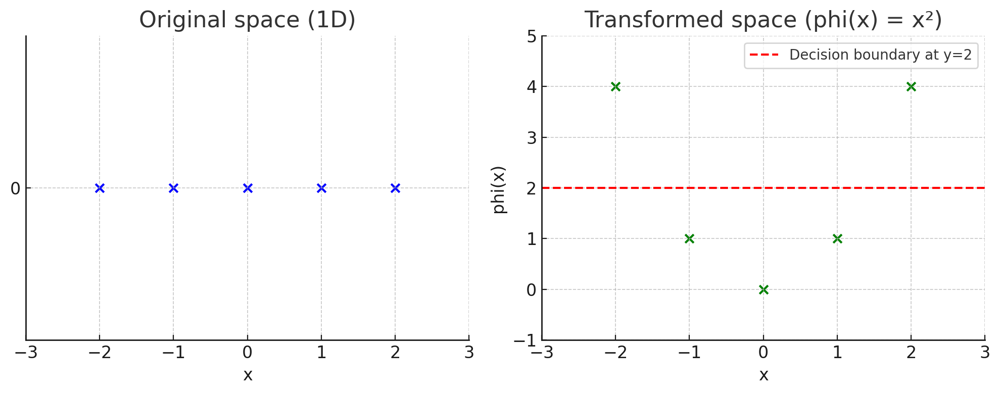

# הגדרות SVM, Kernel, Kernel Function, ו-Kernel Trick
  
## Support Vector Machine (SVM)
SVM הוא אלגוריתם למידה מונחית (supervised learning) המשמש לסיווג (classification) ורגרסיה (regression). האלגוריתם מחפש היפרפלן אופטימלי (מישור הפרדה) שיפריד בין קבוצות שונות של נתונים. היפרפלן אופטימלי הוא זה שיוצר את המרווח (margin) המרבי בין הנקודות הקרובות ביותר מכל קבוצה, הידועות כווקטורי תמיכה (support vectors).
  
מתמטית, עבור נתונים לינאריים, המודל מיוצג על ידי:
- 
- כאשר  הוא וקטור המשקלות
- x הוא וקטור תכונות הקלט
- b הוא ערך ההסטה (bias)
- הנוסחא מתאימה להרבה מימדים ולא רק לדו-מימד
  
# איך מוצאים את וקטור המשקלים  ב־SVM
  
## 🎯 המטרה של SVM
למצוא את הקו (או ההיפר־פליין) שמפריד הכי טוב בין שתי קבוצות, כך שהמרחק מהנקודות הקרובות ביותר מכל צד (ה־**support vectors**) אל הקו יהיה **הכי גדול שאפשר**.
  
---
  
## 🔢 איך מוצאים את ?
המודל מגדיר בעיה מתמטית של **אופטימיזציה** (מציאת מקסימום/מינימום)
  
### 1. נוסחת ההיפר־פליין:
<p align="center"></p>  
  
  
אם:
  
<p align="center"></p>  
  
  
→ הדגימה שייכת למחלקה החיובית (label = +1)
  
<p align="center"></p>  
  
  
→ הדגימה שייכת למחלקה השלילית (label = -1)
  
---
  
### 2. תנאי ההפרדה:
לכל דוגמה Xi Yi:
  
<p align="center"></p>  
  
  
**מה זה Yi**
  
ה- Yi זה התווית (label) של הדוגמה ה־ i
  
כל Xi הוא וקטור
  
כל Yi הוא מספר שאומר לאיזה קבוצה שייכת הדוגמא, לקבוצה החיובית או לקבוצה השלילית
  
  
### 3. פונקציית המטרה (Objective Function):
כדי למקסם את המרחק בין הקבוצות, נמזער את גודל :
  
<p align="center"></p>  
  
  
תחת ההגבלה:
  
<p align="center"></p>  
  
  
## ❓ למה צריך להקטין את  ב־SVM?
  
  
## ✨ ההסבר: כל הסוד נמצא ב־**Margin** – המרווח בין הקבוצות
  
### המרחק של נקודה מהמישור:
לפי הנוסחה:
  
<p align="center"></p>  
  
  
### המטרה של SVM:
למצוא מישור שמפריד בין הקבוצות עם **המרחק הכי גדול מהנקודות הקרובות ביותר** — כלומר, מרווח (margin) מקסימלי.
  
### תנאי ההפרדה:
  
<p align="center"></p>  
  
  
הנקודות הכי קרובות למישור הן ה־**Support Vectors**, שמקיימות:
  
<p align="center"></p>  
  
  
## ✅ המרחק שלהן מהמישור:
  
<p align="center"></p>  
  
  
  
### ולכן:
- ככל ש־ **קטן יותר**, המרווח **גדול יותר**.
- כלומר: אם נקטין את , אנחנו **מרחיקים** את המישור מהנקודות הקרובות ביותר — וזה בדיוק מה שאנחנו רוצים!
  
---
  
## 🧠 ולכן בפונקציית המטרה של SVM:
אנחנו **ממזערים** את:
  
<p align="center"></p>  
  
  
  
כדי למצוא את ההיפר־פליין עם **margin מקסימלי** ולוודא הפרדה טובה בין הקבוצות.
  
## ❓ למה ממזערים את 
  
<p align="center"></p>  
  
  
ולא פשוט את 
  
<p align="center"></p>  
  
  
ב־SVM?
  
---
  
## ✅ המטרה המקורית:
אנחנו רוצים למקסם את המרווח (**margin**) בין שתי הקבוצות.
  
### המרווח מוגדר כ:
  
<p align="center"></p>  
  
  
כדי **למקסם** את המרווח — צריך **למזער** את:
  
<p align="center"></p>  
  
  
---
  
אז למה ממזערים דווקא את 
  
<p align="center"></p>  
  
  
?
  
### סיבות מתמטיות:
  
**נגזרות פשוטות יותר**:
  
אם נגדיר את פונקציית המטרה כך:
  
<p align="center"></p>  
  
  
אז הנגזרת שלה היא פשוט 
  
<p align="center"></p>  
  
  
ואין צורך בשורשים או נגזרות מורכבות
  
ה 1/2 הוא רק קיצור דרך הוא לא משפיע על פתרון האופטימיזציה — זה רק מקל על החישוב
  
---
  
## 💡 סיכום:
- **מזעור** 
  
<p align="center"></p>  
  
  
= הגדלת המרווח.
  
- **אבל בפועל ממזערים** 
  
<p align="center"></p>  
  
  
כי זה הרבה יותר נוח מבחינה מתמטית.
  
- והפתרון שמתקבל זהה — אז זה חכם ויעיל יותר 💙
  
  
---
  
  
  
## 🤖 איך פותרים את זה בפועל?
  
1. משתמשים בשיטה מתמטית בשם **Lagrange Multipliers**.
2. פותרים את הבעיה הכפולה (Dual Problem).
3. הפתרון מבוסס רק על ה־**Support Vectors** (הנקודות הכי קרובות להיפר־פליין).
4. מהם מחשבים את  כך:
  
<p align="center"></p>  
  
  
  
כאשר:
  
<p align="center"></p>  
  
  
-  הם פרמטרים שקובעים את חשיבות כל דוגמה
- רק עבור ה־support vectors יש alpha שונה מאפס
  
---
  
## 💡 סיכום
- אנחנו לא מחשבים את  ישירות, אלא פותרים בעיית אופטימיזציה.
- המטרה היא למצוא את הקו שמפריד הכי טוב בין הקבוצות עם **margin** מקסימלי.
- התוצאה: משוואה שמבוססת רק על ה־support vectors.
  
  
  
  
  
  
  
  
  
---
---
---
  
## 🧠 איך SVM מתמודד עם יותר משתי קבוצות?
  
---
  
### 🎯 הבעיה:
SVM "קלאסי" נועד לבעיה של **שני סוגים בלבד**:
- מחלקה חיובית: 
- מחלקה שלילית: 
  
אבל מה עושים כשיש **שלוש קבוצות או יותר**? (למשל A, B, C)
  
---
  
## ✅ פתרונות נפוצים:
  
### 1. One-vs-Rest (OvR) – "אחד מול כל השאר"
  
- אם יש 3 קבוצות (A, B, C) → נבנה 3 מודלים:
  - מודל 1: A מול (B ו־C)
  - מודל 2: B מול (A ו־C)
  - מודל 3: C מול (A ו־B)
  
- כל מודל מאמן SVM בינארי.
- כשבודקים דוגמה חדשה:
  - מריצים את שלושת המודלים.
  - בוחרים את הקבוצה עם הציון הגבוה ביותר.
  
---
  
### 2. One-vs-One (OvO) – "כל זוג מול זוג"
  
- נבנה SVM עבור כל **זוג קבוצות**.
- לדוגמה, עבור קבוצות A, B, C → נבנה:
  - A מול B
  - A מול C
  - B מול C
- עבור  קבוצות יש:
  
  
<p align="center"></p>  
  
  
  מודלים שונים.
  
- כשבודקים דוגמה חדשה:
  - כל מודל נותן "הצבעה".
  - הקבוצה שזוכה בהכי הרבה הצבעות היא הזוכה.
  
---
  
## 🤖 בפועל – עם Scikit-learn:
- אם תשתמש ב־`SVC` (ספריית `sklearn.svm`) — אין צורך לטפל בזה ידנית!
- כברירת מחדל, האלגוריתם מפעיל **One-vs-One** באופן אוטומטי.
  
---
  
## 💡 סיכום:
  
| מס' קבוצות | פתרון SVM               |
|------------|-------------------------|
| 2          | SVM רגיל                |
| >2         | One-vs-Rest או One-vs-One |
  
  
  
---
  
## דוגמא בפייתון עבור 3 קבוצות
  
```python
import numpy as np
import matplotlib.pyplot as plt
from sklearn import svm
from sklearn.preprocessing import StandardScaler
from itertools import combinations
  
# Create a dataset for apples, bananas, and oranges
# Features: sweetness (x-axis) and weight (y-axis)
apples = np.array([[3, 150], [4, 130], [2, 160], [3, 140], [3.5, 145]])
bananas = np.array([[7, 120], [6, 110], [8, 115], [7.5, 125], [6.5, 118]])
oranges = np.array([[5, 180], [4.5, 195], [5.5, 185], [6, 175], [4.8, 190]])
  
# Combine features and create labels (0 for apples, 1 for bananas, 2 for oranges)
X = np.vstack([apples, bananas, oranges])
y = np.array([0, 0, 0, 0, 0, 1, 1, 1, 1, 1, 2, 2, 2, 2, 2])
  
# Scale the features (important for SVM)
scaler = StandardScaler()
X_scaled = scaler.fit_transform(X)
  
# Create and train the SVM model
# For multiclass problems, SVM creates multiple binary classifiers (one-vs-one by default)
clf = svm.SVC(kernel='linear', C=1000, decision_function_shape='ovr')
clf.fit(X_scaled, y)
  
# Create a test point
test_point = np.array([[5, 150]])  # A point with sweetness=5, weight=150
test_point_scaled = scaler.transform(test_point)
prediction = clf.predict(test_point_scaled)[0]
class_names = ["Apple", "Banana", "Orange"]
predicted_class = class_names[prediction]
  
print(f"Test point: Sweetness={test_point[0][0]}, Weight={test_point[0][1]}")
print(f"Predicted class: {predicted_class}")
```
  

  
Output:
```
Test point: Sweetness=5, Weight=150
Predicted class: Apple
  
Decision function values for test point:
Apple: 2.15989923461655
Banana: -0.18143598271709815
Orange: 1.071382786408734
  
the negative value for Banana simply indicates that the binary classifier for "Banana vs. not-Banana" believes your test point is in the "not-Banana" category (rest)
because we are using One-vs-Rest (OvR)
```
  
  
# 📚 מושגים בסיסיים בלמידת מכונה – טרנספורמציות ו-SVM
  
---
  
## 🧠 מה זה טרנספורמציה?
  
**טרנספורמציה** (Transformation) היא פעולה מתמטית שמעבירה נקודה ממקום אחד למקום אחר – לרוב ממימד מסוים **למימד גבוה יותר**.
  
במילים פשוטות:  
זה כמו לקחת נקודה במרחב פשוט (למשל קו ישר – חד־מימדי), ולהעביר אותה למרחב עשיר יותר (למשל מישור או מרחב תלת־מימדי), כדי שיהיה לנו **יותר קל לעשות דברים כמו הפרדה בין קבוצות**
  

  
---
  
## ✨ למה צריך טרנספורמציה?
  
לפעמים, הקבוצות שאנחנו רוצים להפריד **לא ניתנות להפרדה ליניארית** במרחב המקורי.  
אבל אם נעלה למימד גבוה יותר – אולי כן נצליח להפריד ביניהן עם קו ישר (או מישור).
  
---
  
## 📌 דוגמה פשוטה:
  
### בעיה:
יש לנו נקודות על ציר , במימד אחד (1D):
  
- נקודות שליליות: 
- נקודה חיובית אחת: 
  
אין דרך לשים **קו אחד בציר** שיפריד בין הקבוצות בצורה טובה.
  
---
  
### טרנספורמציה:
  
נעשה טרנספורמציה פשוטה:
  
<p align="center"></p>  
  
  
כלומר – ממפים את כל הנקודות מ־1D ל־2D, כך שהמימד החדש הוא 
  
---
  
### מה קורה עכשיו?
  
x = -2  →  phi(x) = 4  
x = -1  →  phi(x) = 1  
x =  0  →  phi(x) = 0  
x =  1  →  phi(x) = 1  
x =  2  →  phi(x) = 4  
  
פתאום, כל הנקודות שליליות הן רחוקות מהאפס, והנקודה החיובית  נשלחת ל־0.
  
✅ עכשיו אפשר להפריד בין הקבוצות בעזרת קו פשוט ב־2D (או אפילו ב־1D של ).
  
---
  
## 💬 סיכום:
  
- טרנספורמציה היא שינוי ייצוג של הנתונים.
- אנחנו משתמשים בה כדי להפוך בעיה שקשה לפתור (לא ליניארית) – לבעיה שקל לפתור (ליניארית).
- לא תמיד צריך לממש את הטרנספורמציה – לפעמים נשתמש בקרנל שיחשב את מה שצריך בלי לעבור למרחב בפועל.
  
  
  
  
  
## Kernel (גרעין)
קרנל הוא פונקציה מתמטית המאפשרת ל-SVM לטפל בנתונים לא-לינאריים. הוא מאפשר חישוב של מכפלת הנקודות במרחב תכונות גבוה-ממדי מבלי לחשב במפורש את הטרנספורמציה של וקטורי הקלט למרחב זה
  
## Kernel Function (פונקציית גרעין)
פונקצית הקרנל, המסומנת לרוב כ-
  

  
מחשבת את מכפלת הנקודות (dot product) של שני וקטורים x ו-y לאחר שעברו טרנספורמציה למרחב תכונות גבוה יותר, מבלי לחשב במפורש את הטרנספורמציה עצמה:
  

  
כאשר  היא פונקציית הטרנספורמציה למרחב הגבוה יותר
  
### דוגמה פשוטה:
בואו נתאר מקרה של נתונים שלא ניתנים להפרדה לינארית, כמו בעיית XOR (או בעיית המעגל - נקודות בתוך מעגל מול נקודות מחוץ למעגל):
  
1. במרחב המקורי (הדו-ממדי) אין אפשרות למצוא קו ישר שיפריד בין שתי הקבוצות
2. אם נשתמש בטרנספורמציה כמו , אנחנו ממפים את הנתונים למרחב תלת-ממדי
3. במרחב התלת-ממדי הזה, ניתן להפריד את הנתונים באמצעות מישור (היפרפלן)
  
4. במקום לחשב במפורש את הטרנספורמציה הזו, אנחנו יכולים להשתמש ב-Kernel (לדוגמה Gaussian Kernel) שמשיג את אותה תוצאה
  
### 🧠 איך קרנל משיג את אותה תוצאה מבלי לחשב את הטרנספורמציה?
---
  
### ✨ מה עושה הקרנל?
  
הקרנל עוקף את הצורך לחשב את הטרנספורמציה עצמה. במקום זה, הוא עושה משהו חכם:
  
#### שלבים פשוטים:
  
1. **לא מחושב את המיקום החדש של כל נקודה** (לא מחשב את phi(x))
2. **בודק רק את הדמיון** בין נקודות:
   שואל: "כמה דומה x לנקודה אחרת x_i אם היינו מעבירים את שתיהן למרחב הגבוה?"
3. הקרנל נותן את התשובה לשאלה הזו – הוא מחשב את הדמיון **כאילו בוצעה טרנספורמציה**, בלי לעשות אותה בפועל.
4. האלגוריתם של SVM משתמש רק בדמיון הזה כדי להחליט אם נקודה חדשה שייכת לקבוצה החיובית או השלילית.
  
---
  
### 📦 דימוי פשוט:
  
זה כאילו אתה רוצה לדעת כמה דומות שתי תמונות —  
במקום לעבור על כל הפיקסלים ולחשב אחד אחד, אתה שואל מישהו שמבין חזותית והוא פשוט אומר לך "מאוד דומות" או "לא דומות בכלל".
  
---
  
## ✅ ואז באה הנוסחה:
  
המודל של SVM משתמש בדמיון שהקרנל נותן (בין נקודות) כדי לחזות לאיזו קבוצה שייכת נקודה חדשה.
  
  
  
  
### Common types of Kernel Functions:
  

  
1. **Linear Kernel**:
   
  
2. **Polynomial Kernel**:
   
   where , , and  is an integer representing the degree of the polynomial.
  
3. **Radial Basis Function (RBF) or Gaussian Kernel**:
   
   where , typically .
  
4. **Sigmoid Kernel**:
   
   where  and .
  
# Kernel Functions with Examples
  
**What is γ (Gamma)?**
  
Gamma is a hyperparameter that appears in several kernel functions, including the Polynomial kernel, RBF/Gaussian kernel, and Sigmoid kernel. It controls different aspects of the kernel's behavior:
  
**The "exp"** in the RBF/Gaussian kernel formula refers to the exponential function, which is commonly written as "exp" in mathematics and programming
  
The exponential function exp(x) is equivalent to e^x, where "e" is Euler's number (approximately 2.71828...), a mathematical constant that forms the base of natural logarithms
  
## 1. Linear Kernel
**Formula**: 
  
**Example**:
For two 2D vectors  and :
  

  
**Use case**: Linear kernels work well when the data is already linearly separable. They're computationally efficient but cannot handle non-linear relationships in data.
  
## 2. Polynomial Kernel
**Formula**: 
  
where , , and  is the polynomial degree.
  
**Example**:
For vectors  and , with , , and :
  

  
**Use case**: Polynomial kernels are useful for problems where training data is not linearly separable. The degree  determines the flexibility of the decision boundary. Common choices are  (quadratic) or  (cubic).
  
## 3. Radial Basis Function (RBF) / Gaussian Kernel
**Formula**: 
  
where , typically .
  
**Example**:
For vectors  and  with :
  
1. Calculate the squared Euclidean distance: 
   
  
2. Apply the RBF formula:
   
  
**Use case**: RBF kernels are versatile and work well for most types of data. They're especially effective when the relationship between classes is non-linear. The parameter  controls the "reach" of a single training example's influence.
  
## 4. Sigmoid Kernel
**Formula**: 
  
tanh = Hyperbolic Tangent 
  
where  and .
  
**Example**:
For vectors  and , with  and :
  

  
**Use case**: The sigmoid kernel comes from neural networks (it's similar to using a neural network with one hidden layer). It's less commonly used in SVMs than RBF kernels but can be effective for specific problems.
  
## Choosing the Right Kernel
  
The choice of kernel depends on the specific problem:
  
- **Linear kernel**: When data is linearly separable
- **Polynomial kernel**: When you need a more flexible decision boundary with clear degree of separation
- **RBF kernel**: Most versatile, works well for most datasets when properly tuned
- **Sigmoid kernel**: Works for specific types of problems, often related to neural networks
  
In practice, it's common to try different kernels and use cross-validation to determine which one performs best for your specific dataset.
  
## Visual Intuition
  
To understand how kernels transform data:
  
1. **Linear**: Data remains in the same space, separated by a straight line
2. **Polynomial**: Data is mapped to a higher-dimensional space where curved boundaries in original space become linear boundaries
3. **RBF**: Essentially creates a "bump" around each data point, with the width controlled by 
4. **Sigmoid**: Creates a decision boundary similar to that of a neural network
  
The kernel trick allows us to compute these separations without explicitly transforming the data to higher dimensions, making SVMs computationally efficient even for complex decision boundaries.
  
## Kernel Trick (טריק הגרעין)
ה-Kernel Trick הוא הטכניקה שמאפשרת ל-SVM להתמודד עם בעיות סיווג לא-לינאריות מבלי לחשב במפורש את הטרנספורמציה למרחב גבוה-ממדי. הרעיון הבסיסי הוא:
  
1. במקום להפעיל טרנספורמציה  על כל וקטור קלט  ו- בנפרד
2. ואז לחשב את מכפלת הנקודות שלהם 
3. אנחנו מחשבים ישירות את  שנותן את אותה תוצאה
  
זה חוסך זמן חישוב משמעותי, במיוחד כאשר מרחב התכונות הגבוה-ממדי יכול להיות אינסופי (כמו ב-RBF Kernel).
  
### היתרונות של Kernel Trick:
- מאפשר ל-SVM להתמודד עם נתונים לא לינאריים
- חוסך בזמן חישוב ובשימוש בזיכרון
- מאפשר עבודה במרחבי תכונות אינסופיים
- משפר את הדיוק בבעיות סיווג מורכבות
  
  
ה-Kernel Trick מאפשר לנו לעבוד עם מרחבים בעלי ממדים גבוהים, לעתים אפילו אינסופיים, מבלי לשלם את המחיר החישובי של עבודה במרחבים אלו.
  
  
  
# 📘 איך SVM בוחר את נקודות התמיכה (Support Vectors)
  
---
  
## 1. המטרה של SVM
  
בשלב האימון, המודל מנסה למצוא **את המישור שמפריד הכי טוב** בין שתי הקבוצות, כך שהמרחק מהנקודות הקרובות ביותר (ה־margin) יהיה הכי גדול שאפשר.
  
---
  
## 2. הנוסחה המתמטית
  
האלגוריתם פותר בעיית אופטימיזציה:
  
- ממזער את:
  
  (1/2) * ||w||²
  
- תחת תנאים של הפרדה:
  
  לכל נקודה מהאימון:  
  yᵢ * (wᵀ * xᵢ + b) ≥ 1
- **x_i** — נקודה מהסט של האימון
- **y_i** — הסיווג של x_i (או +1 או -1)
  
---
  
## 3. שימוש ב־Lagrange Multipliers
  
כדי לפתור את זה, SVM משתמש בשיטה שנקראת *שיטת לגראנז'* (Lagrange multipliers).  
היא מוסיפה משתנים חדשים: αᵢ (alpha_i) — אחד לכל נקודה.
  
הפתרון של הבעיה מוביל לנוסחה עבור וקטור w:
  
w = Σ (αᵢ * yᵢ * xᵢ)
  
אבל — ברוב הנקודות יוצא:
  
αᵢ = 0
  
- **x_i** — נקודה מהסט של האימון
- **y_i** — הסיווג של x_i (או +1 או -1)
- **alpha_i** — כמה חשובה הנקודה הזו במודל, נקבע באימון
  
רק נקודות ש־**alpha_i > 0** משתתפות בפועל — אלו הן נקודות התמיכה (Support Vectors).
  
---
  
  
## 4. מי נקודת תמיכה?
  
נקודה הופכת להיות Support Vector אם:
  
- יש לה αᵢ > 0
- כלומר — היא **יושבת בדיוק על גבול הרווח (margin)**
  
רק הנקודות שנמצאות בדיוק "על הקצה" — הכי קרובות למישור — הן אלו שבאמת משפיעות על צורת ההפרדה.
  
---
  
## 5. כל השאר? נזרקות הצידה
  
אם נקודה רחוקה מהמישור, SVM מזהה שהיא לא באמת משנה את ההחלטה –  
אז הוא נותן לה αᵢ = 0, והיא לא תשתתף בחישובים של המודל.
  
---
  
## 💡 לכן:
  
- **Support Vectors הן הנקודות שקובעות את המיקום של המישור**
- והן היחידות ש"מושכות" או "דוחפות" את הקו בעת החיזוי
  
  
  
  
# 🧠 איפה עובר הקו המפריד ב-SVM?
  
---
  
## ✨ המטרה של SVM
  
SVM מחפש מישור (קו) שמפריד בין שתי קבוצות — אבל לא סתם כל קו.  
אלא כזה שנמצא **בדיוק באמצע** בין שתי הקבוצות, עם **מרחק מקסימלי** לשתי הקבוצות.
  
---
  
## ✅ שלושת הקווים ש-SVM משתמש בהם:
  
1. **המישור המרכזי (הקלאסי):**
  
    זה הקו שמפריד בפועל:
    ```
    wᵀ x + b = 0
    ```
  
2. **קווי ה-margin (הקווים שנוגעים בנקודות התמיכה):**
  
    - עבור הקבוצה החיובית:  
      ```
      wᵀ x + b = +1
      ```
  
    - עבור הקבוצה השלילית:  
      ```
      wᵀ x + b = -1
      ```
  
---
  
## 📏 איפה עובר הקו המפריד?
  
הקו המפריד עובר בדיוק באמצע בין שני קווי ה-margin,  
כלומר בין הקווים:
  
  