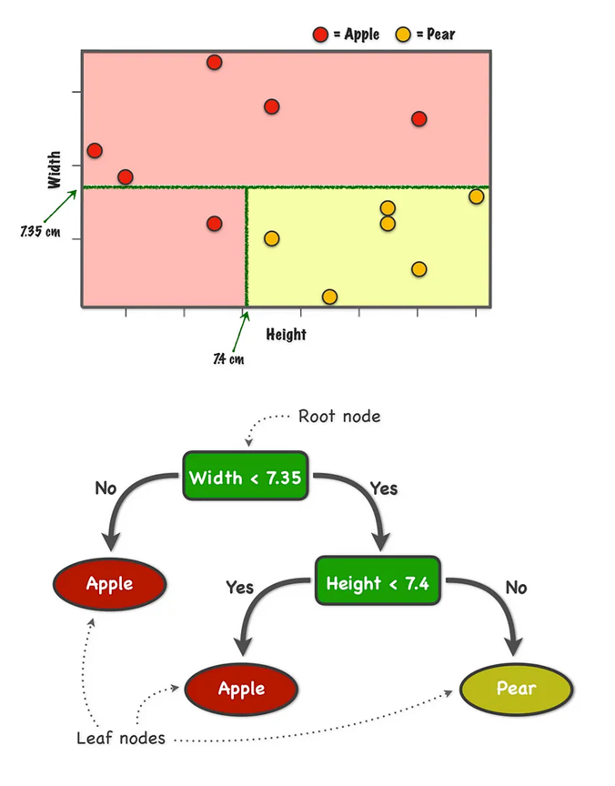

# עץ החלטה (Decision Tree)

עץ החלטה הוא אלגוריתם למידה מונחית (Supervised Learning) המדמה תהליך קבלת החלטות אנושי. האלגוריתם מחלק את הנתונים למקטעים קטנים יותר ויותר על בסיס תכונות ספציפיות (features), ויוצר מבנה דמוי עץ.

בעץ החלטה:
- צמתים פנימיים מייצגים תכונות (features) של קבוצת הנתונים
- הענפים מייצגים את כללי ההחלטה
- עלים (צמתים סופיים) מייצגים את התוצאה או התחזית

היתרון העיקרי של עצי החלטה הוא הפשטות שלהם והיכולת לפרש ולהציג אותם בצורה ויזואלית. החיסרון העיקרי הוא הנטייה שלהם ל-overfitting (התאמת יתר לנתוני האימון), דיוק נמוך בתחזיות, והטיה בטיפול בקבוצות נתונים לא מאוזנות.



# Decision Tree Terminology

## Basic Components

### NODE
A node is an entity that contains a value or data and can be connected by links to other nodes. In a decision tree, a node typically represents a feature or an outcome.

```
┌─────────┐
│  Node   │
└─────────┘
```

### PARENT AND CHILD
A node which is divided into sub-nodes is called a parent of those sub-nodes, whereas the sub-nodes are the children of that parent node. Parent nodes represent decision points based on features.

```
       ┌─────────┐
       │  Parent │
       └────┬────┘
            │
    ┌───────┴───────┐
    │               │
┌───▼───┐       ┌───▼───┐
│ Child1│       │ Child2│
└───────┘       └───────┘
```

### ROOT
The top node in a tree, with no parent (no nodes above it). The root is the first node in the tree, and all other nodes are its descendants. The root node represents the first decision in the tree.

```
       ┌─────────┐
       │  Root   │
       └────┬────┘
            │
    ┌───────┴───────┐
    │               │
┌───▼───┐       ┌───▼───┐
│ Node1 │       │ Node2 │
└───────┘       └───────┘
```

### LEAF
A node which does not have any child node is called a leaf node. Leaf nodes represent the final outcomes or predictions of the decision tree.

```
       ┌─────────┐
       │  Node   │
       └────┬────┘
            │
    ┌───────┴───────┐
    │               │
┌───▼───┐       ┌───▼───┐
│ Leaf1 │       │ Leaf2 │
└───────┘       └───────┘
```

### EDGE
The connection between one node and another. Edges represent the flow from one decision to another, or from a decision to an outcome.

```
       ┌─────────┐
       │  Node1  │
       └────┬────┘
            │
            │ ← Edge
            │
       ┌────▼────┐
       │  Node2  │
       └─────────┘
```

### HEIGHT OF A NODE
The length of the longest downward path to a leaf from that node. The height of a node is the number of edges on the longest path from that node to a leaf.

```
       ┌─────────┐
       │  Node   │ → Height = 2 
       └────┬────┘    (longest path has 2 edges)
            │
    ┌───────┴───────┐
    │               │
┌───▼───┐       ┌───▼───┐
│ Node  │       │ Node  │ → Height = 1
└───┬───┘       └───┬───┘
    │               │
┌───▼───┐       ┌───▼───┐
│ Leaf  │       │ Leaf  │ → Height = 0
└───────┘       └───────┘
```

### DEPTH OF THE NODE
The length of the path from the root to that node. The depth of a node is the number of edges from the root to that node.

```
       ┌─────────┐
       │  Root   │ → Depth = 0
       └────┬────┘
            │
    ┌───────┴───────┐
    │               │
┌───▼───┐       ┌───▼───┐
│ Node  │       │ Node  │ → Depth = 1
└───┬───┘       └───┬───┘
    │               │
┌───▼───┐       ┌───▼───┐
│ Node  │       │ Node  │ → Depth = 2
└───────┘       └───────┘
```

### SUBTREE
A subtree represents the descendants of a node. It is a tree that consists of a node and all its descendants in the original tree.

```
Full Tree:
       ┌─────────┐
       │  Root   │
       └────┬────┘
            │
    ┌───────┴───────┐
    │               │
┌───▼───┐       ┌───▼───┐
│ NodeA │       │ NodeB │
└───┬───┘       └───┬───┘
    │               │
┌───▼───┐       ┌───▼───┐
│ LeafA │       │ LeafB │
└───────┘       └───────┘

Subtree of NodeB:
┌───────┐
│ NodeB │
└───┬───┘
    │
┌───▼───┐
│ LeafB │
└───────┘
```

## Tree Structure Properties

### TREE DEPTH
The depth of a tree is the maximum level of any node in the tree, or equivalently, the depth of the deepest node. It's the length of the longest path from the root to any leaf.

```
       ┌─────────┐
       │  Root   │ ← Level 0
       └────┬────┘
            │
    ┌───────┴───────┐
    │               │
┌───▼───┐       ┌───▼───┐
│ Node  │       │ Node  │ ← Level 1
└───┬───┘       └───┬───┘
    │               │
┌───▼───┐       ┌───▼───┐
│ Leaf  │       │ Leaf  │ ← Level 2
└───────┘       └───────┘

Tree Depth = 2
```

### TREE HEIGHT
The height of a tree is the height of its root node. It represents the length of the longest path from the root to any leaf in the tree.

```
       ┌─────────┐
       │  Root   │ → Height = 2
       └────┬────┘
            │
    ┌───────┴───────┐
    │               │
┌───▼───┐       ┌───▼───┐
│ Node  │       │ Node  │ → Height = 1
└───┬───┘       └───┬───┘
    │               │
┌───▼───┐       ┌───▼───┐
│ Leaf  │       │ Leaf  │ → Height = 0
└───────┘       └───────┘

Tree Height = 2
```

### PRUNING
Pruning is a technique in machine learning that reduces the size of decision trees by removing sections that provide little power to classify instances. The goal is to reduce complexity and prevent overfitting.

When a subtree is pruned, it's typically replaced with a leaf node that represents the average value (for regression) or the majority class (for classification) of the original subtree's leaves.

```
Before Pruning:
       +-------+
       |  Root |
       +---+---+
           |
     +-----+-----+
     |           |
+----+----+  +---+----+
| NodeA   |  | NodeB  |
+----+----+  +---+----+
     |           |
+----+----+  +---+----+
|LeafA: 2 |  |LeafB: 6|
+---------+  +--------+

For regression:
LeafB' = avg(2, 6) = 4

For classification:
LeafB' = majority class

After Pruning (NodeB's subtree is pruned):
       +-------+
       |  Root |
       +---+---+
           |
     +-----+-----+
     |           |
+----+----+  +---+-----+
| NodeA   |  |LeafB': 4| <- Replaced with average/majority value
+----+----+  +---------+
     |           
+----+----+  
|LeafA: 2 |  
+---------+  
```

## Measure of Impurity

### GINI IMPURITY
Gini impurity is a measure of how often a randomly chosen element from the set would be incorrectly labeled if it was randomly labeled according to the distribution of labels in the subset. It's used as a criterion to decide how to split nodes in decision trees.

The formula for Gini impurity is:
```
Gini(T) = 1 - ∑(p_i)²
```
where p_i is the probability of an object being classified to a particular class.

For binary classification:
- A node with perfect purity (all elements belong to one class) has Gini impurity = 0
- A node with worst purity (elements equally distributed between classes) has Gini impurity = 0.5

```
Pure Node (All Samples of One Class):
┌───────────────┐
│ Class A: 100% │ → Gini = 1 - (1)² = 0
│ Class B: 0%   │
└───────────────┘

Impure Node (Equal Distribution):
┌───────────────┐
│ Class A: 50%  │ → Gini = 1 - [(0.5)² + (0.5)²] = 0.5
│ Class B: 50%  │
└───────────────┘

Partially Pure Node:
┌───────────────┐
│ Class A: 70%  │ → Gini = 1 - [(0.7)² + (0.3)²] = 0.42
│ Class B: 30%  │
└───────────────┘
```

When building a decision tree, the algorithm chooses the feature and split point that minimizes the Gini impurity at each step, aiming to create nodes that are as pure as possible.