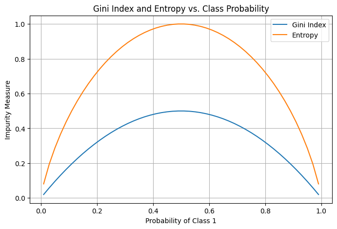
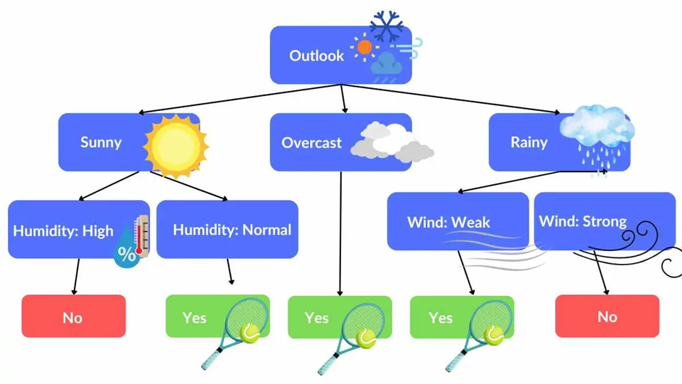
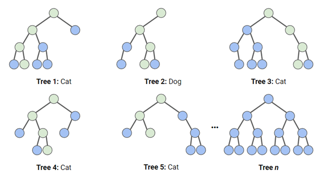

# השוואה בין Gini Impurity ל-Entropy

## מטרת המדדים:
- **Gini Impurity** ו-**Entropy** הם מדדים שמודדים **"חוסר טוהר"** או **מידת ערבוב** בקבוצה.
- משתמשים בהם בעצי החלטה (**Classification Trees**) כדי לבחור את הפיצול הכי טוב.

## נוסחאות:

### 1. Gini Impurity:

\[
Gini = 1 - \sum_{i=1}^{k} p_i^2
\]

- \(p_i\) זה ההסתברות של כל מחלקה (class).
- הערך המקסימלי מתקבל כשהמחלקות מעורבבות שווה בשווה.

### 2. Entropy:

\[
Entropy = - \sum_{i=1}^{k} p_i \cdot \log_2(p_i)
\]

- גם פה \(p_i\) זה ההסתברות של כל מחלקה.
- ערך גבוה יותר אומר יותר ערבוב (חוסר טוהר).

## דוגמה:

נניח שיש לך קבוצה עם 4 דוגמאות:

- 2 דוגמאות בקטגוריה A.
- 2 דוגמאות בקטגוריה B.

### חישוב Gini Impurity:

\[
Gini = 1 - (p_A^2 + p_B^2) = 1 - (0.5^2 + 0.5^2) = 1 - (0.25 + 0.25) = 0.5
\]

### חישוב Entropy:

\[
Entropy = - (p_A \cdot \log_2(p_A) + p_B \cdot \log_2(p_B)) = - (0.5 \cdot \log_2(0.5) + 0.5 \cdot \log_2(0.5)) = 1
\]

## השוואה כללית:

| מאפיין              | Gini Impurity            | Entropy                |
|----------------------|---------------------------|------------------------|
| נוסחה               | \(1 - \sum p_i^2\)       | \(- \sum p_i \log_2 p_i\) |
| ערך מקסימלי (2 מחלקות) | 0.5                      | 1                      |
| חישוב               | פשוט ומהיר יותר          | איטי יותר (יש לוגים)   |
| פרשנות              | מדד חוסר טוהר             | מדד חוסר טוהר (מידע)  |

 
## מתי להשתמש?
  
| מאפיין            | Gini Impurity           | Entropy                  |
|-------------------|-------------------------|--------------------------|
| חישוביות          | מהיר יותר (ללא לוגריתם) | איטי יותר (יש לוגריתם)   |
| רגישות            | פחות רגיש להבדלים קטנים | יותר רגיש להבדלים קטנים  |
| מתי לבחור         | כשחשובה מהירות          | כשחשובה דיוק/מידע         |
| שימוש נפוץ        | Decision Tree (CART)    | Decision Tree (ID3, C4.5)|
  
**המלצה כללית:**
- אם יש לך הרבה נתונים או אתה צריך חישוב מהיר → **Gini**  
- אם אתה רוצה להיות רגיש יותר לאי-ודאות → **Entropy**
  
- **Gini** is more commonly used in decision trees like **CART** (Classification And Regression Tree) because of its simpler computation
- **Entropy** is often used when information gain is meaningful, such as in the ID3 tree

---  
  
## סוגי עצי החלטה

## 1. CART (Classification and Regression Trees)

**דוגמה**  
- סיווג: חיזוי אם אדם יאושר להלוואה לפי גיל והכנסה  
- רגרסיה: חיזוי מחיר דירה לפי שטח ומספר חדרים

**מאפיין עיקרי**  
- יוצר תמיד **עץ בינארי** (כל צומת מתפצל לשני ענפים בלבד)  
- מתאים גם לבעיות **סיווג** וגם לבעיות **רגרסיה**

**מדד חלוקה**  
- **Gini impurity** (לבעיות סיווג)  
- **Mean Squared Error (MSE)** (לבעיות רגרסיה)

### מה זה Mean Squared Error (MSE) בעצי החלטה?

**מדד חלוקה** שנמצא בשימוש בעצי החלטה מסוג **רגרסיה**  
המטרה של המדד היא להעריך **כמה טוב הפיצול מנבא את הערכים הרציפים** (כמו מחיר, גיל, משקל)  
ככל שה-MSE קטן יותר, כך הפיצול נחשב **טוב יותר**  

##### הנוסחה של MSE

$$
MSE = \frac{1}{n} \sum_{i=1}^{n} (y_i - \hat{y})^2
$$

- \(n\) – מספר הדגימות בצומת  
- \(y_i\) – הערך האמיתי של דגימה \(i\)  
- \(\hat{y}\) – ממוצע הערכים בצומת (תחזית העץ)

##### איך זה עובד?

1. בכל צומת בעץ, העץ שוקל **פיצולים אפשריים** (למשל: האם לפצל לפי גיל גדול מ-30 או לא)  
2. עבור כל פיצול אפשרי, העץ מחשב את ה-MSE בכל תת-קבוצה שנוצרת  
3. העץ בוחר את הפיצול שמביא ל**ירידה הכי גדולה ב-MSE הכולל** (כלומר, שמקטין את השגיאה הכי הרבה)

##### דוגמה פשוטה

נניח שיש לנו את הנתונים הבאים (ננסה לנבא **מחיר דירה** לפי **שטח**):

| שטח (מ"ר) | מחיר (אלפי ₪) |
|------------|---------------|
| 50         | 1000          |
| 60         | 1200          |
| 70         | 1300          |
| 80         | 1500          |

##### צומת ראשי (לפני פיצול):

- ממוצע המחירים:  
$$
\hat{y} = \frac{1000 + 1200 + 1300 + 1500}{4} = 1250
$$

- חישוב ה-MSE:  
$$
MSE = \frac{1}{4} \left( (1000 - 1250)^2 + (1200 - 1250)^2 + (1300 - 1250)^2 + (1500 - 1250)^2 \right)  
$$
$$
MSE = \frac{1}{4} (62500 + 2500 + 2500 + 62500) = \frac{130000}{4} = 32500
$$

##### אחרי פיצול (למשל לפי שטח גדול מ-65):

- קבוצה 1 (שטח ≤ 65):  
  - דירות: 50 מ"ר (1000), 60 מ"ר (1200)  
  - ממוצע: 1100  
  - MSE:  
  $$
  \frac{1}{2} \left( (1000 - 1100)^2 + (1200 - 1100)^2 \right) = \frac{1}{2} (10000 + 10000) = 10000
  $$

- קבוצה 2 (שטח > 65):  
  - דירות: 70 מ"ר (1300), 80 מ"ר (1500)  
  - ממוצע: 1400  
  - MSE:  
  $$
  \frac{1}{2} \left( (1300 - 1400)^2 + (1500 - 1400)^2 \right) = \frac{1}{2} (10000 + 10000) = 10000
  $$

- MSE כולל אחרי פיצול:  
  $$
  \frac{2}{4} \cdot 10000 + \frac{2}{4} \cdot 10000 = 10000
  $$

##### סיכום:

- לפני פיצול: **MSE = 32500**  
- אחרי פיצול: **MSE = 10000**

מכאן שהפיצול **שיפר את הדיוק** (כי ה-MSE ירד)

## 2. ID3 (Iterative Dichotomiser 3)

**דוגמה**  
- סיווג אם לשחק טניס לפי תנאי מזג האוויר (תכונות כמו "שמשי", "גשום", "לח")

**מאפיין עיקרי**  
- עובד טוב עם **נתונים קטגוריים בלבד** – תכונות שמחולקות לקבוצות ברורות כמו צבע או מזג אוויר  
- **נתונים רציפים** (כמו גיל או הכנסה) דורשים **חלוקה לטווחים** לפני השימוש
- יוצר **עץ לא בהכרח בינארי** (כל צומת יכול להתפצל גם ליותר משני ענפים)  

**מדד חלוקה**  
- **Information Gain** (מבוסס על **Entropy**)

### מה זה Information Gain?

**מדד חלוקה** שמשמש בעצי החלטה (בעיקר **ID3** ו-**C4.5**)  
המטרה של IG היא למדוד **כמה אי-סדר (אנטרופי)** הצלחנו **להפחית** בעזרת פיצול נתונים לפי תכונה מסוימת  
ככל שה-IG **גבוה יותר**, הפיצול נחשב **טוב יותר** כי הוא עושה את הקבוצות **טהורות** יותר

##### למה צריך את זה?

בכל שלב בבניית עץ החלטה, צריך לבחור **איזו תכונה הכי משתלם לפצל לפיה**  
- תכונה עם **IG גבוה** תביא לחלוקה שבה הקבוצות הרבה יותר **אחידות**  
- תכונה עם **IG נמוך** לא תעזור לנו לסדר את הדאטה, והקבוצות ישארו **מעורבבות**

איי גיי עוזר לנו לבחור את **התכונה הכי טובה** לפיצול בכל צומת

##### איך מחשבים את זה?

1. מחשבים את ה-**Entropy** של הקבוצה לפני הפיצול:

$$
Entropy(S) = -\sum_{i=1}^{c} p_i \log_2(p_i)
$$

- \(S\) – הקבוצה הנוכחית  
- \(c\) – מספר הקבוצות (קטגוריות)  
- \(p_i\) – הסיכוי של כל קבוצה (למשל, אחוז ה-Yes וה-No)

2. מחשבים את ה-**Entropy הממוצע אחרי הפיצול** (Weighted Average):

$$
Entropy_{after} = \sum_{j=1}^{k} \frac{|S_j|}{|S|} Entropy(S_j)
$$

- \(k\) – מספר תתי הקבוצות שנוצרו מהפיצול  
- \(S_j\) – כל תת-קבוצה  
- \(|S_j|\) – גודל תת-הקבוצה  
- \(|S|\) – גודל הקבוצה המקורית

3. מחשבים את ה-**Information Gain**:

$$
IG = Entropy_{before} - Entropy_{after}
$$

##### דוגמה

נתונים:  
| Outlook  | Play Tennis |
|----------|-------------|
| Sunny    | No          |
| Sunny    | No          |
| Overcast | Yes         |
| Rain     | Yes         |
| Rain     | Yes         |
| Rain     | No          |
| Overcast | Yes         |
| Sunny    | Yes         |
| Sunny    | Yes         |
| Rain     | Yes         |
| Sunny    | No          |
| Overcast | Yes         |
| Overcast | Yes         |
| Rain     | No          |

##### 1. מחשבים Entropy לפני הפיצול (כל הדאטה):

- **Yes** = 9, **No** = 5

$$
Entropy(S) = -\left( \frac{9}{14} \log_2 \frac{9}{14} + \frac{5}{14} \log_2 \frac{5}{14} \right)  \approx 0.940
$$

##### 2. מחשבים Entropy אחרי פיצול לפי Outlook:

- **Sunny** (5 דגימות): 2 Yes, 3 No → Entropy ≈ 0.971  
- **Overcast** (4 דגימות): 4 Yes, 0 No → Entropy = 0  
- **Rain** (5 דגימות): 3 Yes, 2 No → Entropy ≈ 0.971

- Weighted Entropy after split:

$$
Entropy_{after} = \frac{5}{14} \cdot 0.971 + \frac{4}{14} \cdot 0 + \frac{5}{14} \cdot 0.971  \approx 0.693
$$

##### 3. מחשבים Information Gain:

$$
IG = 0.940 - 0.693 = 0.247
$$

## 3. C4.5

**דוגמה**  
- חיזוי אם לקוח יקנה מחשב לפי גיל (רציף), תעסוקה (קטגוריה), והכנסה (רציף)

**מאפיין עיקרי**  
- **תומך בנתונים רציפים** – מסוגל להתמודד עם מספרים כמו גיל או הכנסה בלי לחלק לטווחים  
- **תומך בערכים חסרים** – יכול לעבוד גם אם חסר מידע בחלק מהפיצ'רים  
- כולל **גיזום (Pruning)** – קיצור העץ כדי למנוע **אוברפיטינג**
- יוצר **עץ לא בהכרח בינארי** (כל צומת יכול להתפצל גם ליותר משני ענפים)  

**מדד חלוקה**  
- **Gain Ratio** (שיפור של Information Gain)

### מה זה Gain Ratio?

  מדד חלוקה בעצי החלטה (למשל בעץ **C4.5**)  
המטרה שלו היא **לשפר** את **Information Gain** ולפתור את הבעיה שבה Information Gain **מעדיף תכונות עם הרבה ערכים שונים** (כמו ת"ז או מזהה ייחודי)  
**Gain Ratio** מתקן את זה על ידי חלוקה ב-**Split Information** (מידע על פיזור הפיצולים)

##### למה צריך את Gain Ratio?

- **איי גיי** יכול להעדיף תכונות שיש להן **המון ערכים ייחודיים**, גם אם זה **לא עוזר לסיווג**  
- **ראטיו גיין** בודק גם **כמה הפיצול מתפזר** – אם הפיצול מפזר את הנתונים להרבה קבוצות קטנות, הוא מעניש אותו

##### איך מחשבים Gain Ratio?

1. מחשבים את **Information Gain (IG)**:

$$
IG(S, A) = Entropy(S) - \sum_{i=1}^{k} \frac{|S_i|}{|S|} \cdot Entropy(S_i)
$$

2. מחשבים את **Split Information**:

$$
SplitInfo(S, A) = -\sum_{i=1}^{k} \frac{|S_i|}{|S|} \cdot \log_2 \left( \frac{|S_i|}{|S|} \right)
$$

3. מחשבים את **Gain Ratio**:

$$
GainRatio(S, A) = \frac{IG(S, A)}{SplitInfo(S, A)}
$$

##### דוגמה

נניח שיש תכונה אחת עם **3 ערכים** (למשל: Low, Medium, High)  
ותכונה אחרת עם **14 ערכים שונים** (כמו ת"ז)

- **איי גיי** עשוי לבחור את ת"ז כי הוא רואה שכל דגימה נכנסת לקבוצה נפרדת (כלומר, הפיצול מאוד חד)  
- אבל **גיין ראטיו** יסתכל גם על **כמה התפזרו הדגימות** בין הקבוצות  
- הוא יעניש פיצולים שמפזרים את הנתונים ליותר מדי קבוצות קטנות, ולכן יעדיף את התכונה עם Low/Medium/High

## 4. Random Forest

**דוגמה**  
- חיזוי **נטישת לקוחות** (למשל אם לקוח יעזוב חברת סלולר) לפי דפוסי שימוש, היסטוריית תשלומים ופניות לשירות לקוחות

**מאפיין עיקרי**  
- יער של **עצים אקראיים**  
  - כל עץ נבנה על **מדגם אקראי** של הנתונים (Random Sampling עם החזרה)  
  - בכל פיצול בעץ נבחרת **קבוצת תכונות אקראית** לבדיקה (Random Feature Selection)  
- משפר **דיוק** ומפחית **אוברפיטינג** ע"י שילוב תחזיות של עצים רבים

**מדד חלוקה**  
- כל עץ בתוך היער הוא לרוב **CART** – משתמש ב-**Gini impurity** (לסיווג) או **MSE** (לרגרסיה)

---

  
## השוואה קצרה:
  
### השוואה קצרה:

| תכונה                | CART            | ID3                 | C4.5           | Random Forest                       |
|-----------------------|-----------------|---------------------|----------------|-------------------------------------|
| **שימוש**            | סיווג ורגרסיה   | סיווג בלבד          | סיווג בלבד    | סיווג ורגרסיה                      |
| **מדד חלוקה**        | Gini / MSE      | Entropy + Info Gain | Gain Ratio     | Gini / MSE בכל עץ (כמו CART)       |
| **תומך במספרים רציפים** | כן             | לא                  | כן             | כן                                  |
| **תומך בנתונים חסרים של פיצ'ר** | כן              | לא                  | כן             | כן                                  |
| **סוג הפיצול**       | בינארי בלבד     | לא חייב בינארי      | לא חייב בינארי | בינארי בכל עץ (כמו CART), אבל שילוב ביחד שיטת אנסמבל |

  
  
  