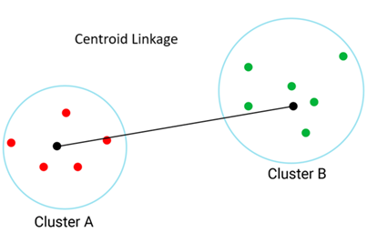

# Hierarchical Clustering

למידה לא מונחית מסוג **אשכול היררכי** היא שיטה שמבצעת חלוקה של דאטה לקבוצות לפי היררכיה  
כל נקודת דאטה מתחילה כקבוצה בפני עצמה, ובהדרגה מאחדים קבוצות קרובות יותר  
זה שונה מקיי-מינס כי לא חייבים להחליט מראש מה מספר הקבוצות – אפשר "לחתוך" את ההיררכיה איפה שרוצים

# Agglomerative vs Divisive

יש שתי גישות עיקריות:

- **Agglomerative** (תחתית-למעלה) – כל נקודה מתחילה בקבוצה נפרדת ומאחדים אותן לפי מרחקים
- **Divisive** (מעל-למטה) – מתחילים מקבוצה אחת ומפצלים אותה בהדרגה

שיטה זו מאוד אינטואיטיבית ומסבירה טוב את הקשרים בין הנקודות,  
אבל היא דורשת הרבה חישובים, במיוחד בדאטה עם הרבה נקודות או מאפיינים

# Dendrogram

הצורה הכי מקובלת לייצוג של אשכול היררכי היא בעזרת **דנדרוגרמה**  
זו תרשים עץ שמראה מתי ואיך נקודות התחברו לקבוצות  
בציר ה־X יש את כל הנקודות, ובציר ה־Y רואים את המרחקים שבהם הן התאחדו

🔸 ככל שהקו שמחבר שתי נקודות גבוה יותר – כך הן רחוקות זו מזו

# Interpreting the Dendrogram

אפשר "לחתוך" את הדנדרוגרמה בגובה מסוים כדי לקבוע את מספר הקבוצות  
אם נראה שקבוצות מתחברות בקפיצה גבוהה – זה סימן ששם כדאי לעצור ולחתוך

# Distance Calculation

בשלב הראשון האלגוריתם מחשב את המרחקים בין כל נקודה לנקודה  
המרחק הנפוץ ביותר הוא **מרחק אוקלידי**, שמבוסס על משפט פיתגורס

הנוסחה:

**D = sqrt((x1 - y1)^2 + (x2 - y2)^2 + ... + (xn - yn)^2)**

📌 ככל שהמרחק קטן יותר – הנקודות דומות יותר

# Cluster Distance Methods

כאשר אנחנו מאחדים קבוצות (ולא רק נקודות בודדות), חשוב להחליט איך נמדוד את המרחק בין הקבוצות  
יש כמה גישות, וכל אחת נותנת תוצאה שונה – לכן בחירה נכונה תתאים למבנה הנתונים שלך

כשמתחילים לאחד קבוצות שלמות (ולא רק נקודות בודדות) – יש כמה דרכים לחשב מרחק בין קבוצות:

- **Single Linkage** – המרחק הכי קצר בין שתי נקודות (אחת מכל קבוצה)
- **Complete Linkage** – המרחק הכי ארוך בין שתי נקודות
- **Average Linkage** – הממוצע של כל המרחקים בין כל זוגות הנקודות
- **Centroid Linkage** – המרחק בין המרכזים של הקבוצות (כמו בקיי-מינס)

## Single Linkage

מסתכל רק על **המרחק הכי קצר בין שתי קבוצות**  
זה אומר שיכול להיות שרוב הנקודות רחוקות, אבל **שתי נקודות בלבד** (אחת מכל קבוצה) קרובות – וזה מספיק בשביל לאחד את הקבוצות

📌 דוגמה:  
קבוצה A: (1,1), (2,1)  
קבוצה B: (5,5), (6,6)  
המרחק הכי קצר הוא בין (2,1) ל־(5,5) ≈ 5.0

💡 אז מתי זה טוב?

- **כשקבוצות הן מוארכות או מפוזרות**  
  לפעמים הקלאסטרים לא "עגולים" אלא נמרחים לאורך כיוון מסוים  
  Single Linkage מאפשר לקלוט את הקשר הזה גם אם רוב הנקודות רחוקות, כי הוא לא "דורש" שכל הקבוצה תהיה צפופה

- **כשאתה מחפש חיבורים נקודתיים**  
  נניח שיש שתי קבוצות, אבל יש ביניהן נקודה אחת שמחברת ביניהן (כמו גשר)  
  Single Linkage יתפוס את זה מיד

- **כשרוצים לאחד קבוצות על בסיס קשר "חלש"**  
  לא אכפת לך אם הרוב לא קרוב – מספיק שיש נקודה אחת קרובה  
  זה כמו להגיד: "אם יש מישהו אחד שמכיר – נחבר את הקבוצות"

⚠️ חסרון: עלול ליצור **שרשראות ארוכות ולא צפופות** – כלומר קלאסטרים שבהם הנקודות מחוברות רק בקשר עקיף ונקודתי

## Complete Linkage

קומפליט לינקאג' עושה את ההפך סינגל – הוא מסתכל על **המרחק הכי רחוק** בין כל זוג של נקודות – אחת מכל קבוצה  
הקבוצות יתאחדו רק אם כל הנקודות שלהן קרובות אחת לשנייה

📌 דוגמה:  
קבוצה A: (1,1), (2,1)  
קבוצה B: (5,5), (6,6)  
המרחק הכי רחוק הוא בין (1,1) ל־(6,6) ≈ 7.07

💡 אז מתי זה טוב?

- **כשאתה רוצה קבוצות צפופות ומהודקות**  
  אתה רוצה להבטיח שכל נקודה בתוך קבוצה לא תהיה רחוקה מדי מאף אחת אחרת

- **כשאתה מונע "זליגה" של נקודות רחוקות**  
  אפילו אם יש נקודה אחת שמתרחקת מהקבוצה – Complete Linkage ידחה את האיחוד עד שהקבוצות באמת קרובות כולן

- **כשרוצים קלאסטרים קטנים ומוגדרים היטב**  
  לדוגמה: אם אתה מחפש לקוחות עם התנהגות מאוד דומה, בלי חריגים

⚠️ חסרון: רגיש מאוד לנקודות קצה – כל נקודה קיצונית תגדיל את המרחק המקסימלי בין הקבוצות

## Average Linkage

אואריג' לינקאג' מחשבת את כל המרחקים האפשריים בין נקודות של שתי קבוצות – ולוקחת את **הממוצע**  
זו שיטה "מאוזנת" בין סינגל קומפליט ל- 

📌 דוגמה:  
נקודות:
- A: (1,1), (2,1)  
- B: (5,5), (6,6)

המרחקים האפשריים הם:  
(1,1)-(5,5), (1,1)-(6,6), (2,1)-(5,5), (2,1)-(6,6)  
מחשבים את כולם ואז עושים ממוצע – נגיד ≈ 6.0

💡 אז מתי זה טוב?

- **כשרוצים פשרה בין חיבור נקודתי לצפיפות**  
  לא דורש שכל הנקודות יהיו קרובות כמו Complete, אבל גם לא מסתפק רק בזוג הכי קרוב כמו Single

- **כשיש קצת רעש או פיזור בדאטה**  
  ממוצע מפחית השפעה של נקודה אחת קיצונית, ולכן נותן תוצאה יציבה יותר

- **כשרוצים קלאסטרים טבעיים**  
  מתאים לדאטה גאומטרי או התנהגותי שיש בו דמיון כללי – לא בהכרח קשר קיצוני

⚠️ חסרון: פחות יעיל בדאטה עם קבוצות מאוד שונות בגודל או מבנה

## Centroid Linkage

Centroid Linkage מסתכל רק על **המרכז של כל קבוצה** – הצנטרואיד  
הוא מחשב את הממוצע של כל הנקודות בכל קבוצה, ואז מודד את המרחק בין שני המרכזים

📌 דוגמה:  
צנטרואיד של A = (1.5, 1)  
צנטרואיד של B = (5.5, 5.5)  
המרחק ביניהם ≈ 5.7

💡 אז מתי זה טוב?

- **כשרוצים גישה דומה לקיי-מינס**  
  השיטה מתנהגת כמו קיי-מינס בכך שהיא מתעלמת מהפרטים ומסתכלת רק על "מיקום כללי" של כל קבוצה

- **כשהקבוצות סימטריות ונקיות מרעש**  
  המרכז מייצג טוב את הקבוצה רק כשהקבוצה עצמה לא פוזרת ולא רועשת

- **כשרוצים חישוב מהיר ופשוט**  
  השיטה הכי קלה למימוש מבחינה מתמטית, כי כל מה שצריך זה לחשב ממוצעים

⚠️ חסרון: יכול לאחד קבוצות שרחוקות מאוד זו מזו – אם במקרה הצנטרואידים שלהן קרובים  
הדבר הזה עלול להטעות ולגרום לאיחוד בין קבוצות שלא באמת קשורות
📌 שים לב:  
- כל שיטה תבנה דנדרוגרמה שונה  
- הבחירה הנכונה תלויה אם אתה רוצה קלאסטרים מהודקים, גמישים, או איזון ביניהם  
- מומלץ לנסות כמה שיטות ולראות איזו הכי מייצגת את המבנה האמיתי של הדאטה
