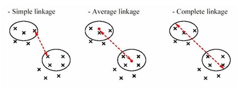

# Hierarchical Clustering

למידה לא מונחית מסוג **אשכול היררכי** היא שיטה שמבצעת חלוקה של דאטה לקבוצות לפי היררכיה  
כל נקודת דאטה מתחילה כקבוצה בפני עצמה, ובהדרגה מאחדים קבוצות קרובות יותר  
זה שונה מקיי-מינס כי לא חייבים להחליט מראש מה מספר הקבוצות – אפשר "לחתוך" את ההיררכיה איפה שרוצים

# Agglomerative vs Divisive

יש שתי גישות עיקריות:

- **Agglomerative** (תחתית-למעלה) – כל נקודה מתחילה בקבוצה נפרדת ומאחדים אותן לפי מרחקים
- **Divisive** (מעל-למטה) – מתחילים מקבוצה אחת ומפצלים אותה בהדרגה

שיטה זו מאוד אינטואיטיבית ומסבירה טוב את הקשרים בין הנקודות,  
אבל היא דורשת הרבה חישובים, במיוחד בדאטה עם הרבה נקודות או מאפיינים

# Dendrogram

הצורה הכי מקובלת לייצוג של אשכול היררכי היא בעזרת **דנדרוגרמה**  
זו תרשים עץ שמראה מתי ואיך נקודות התחברו לקבוצות  
בציר ה־X יש את כל הנקודות, ובציר ה־Y רואים את המרחקים שבהם הן התאחדו

🔸 ככל שהקו שמחבר שתי נקודות גבוה יותר – כך הן רחוקות זו מזו

# Interpreting the Dendrogram

אפשר "לחתוך" את הדנדרוגרמה בגובה מסוים כדי לקבוע את מספר הקבוצות  
אם נראה שקבוצות מתחברות בקפיצה גבוהה – זה סימן ששם כדאי לעצור ולחתוך

# Distance Calculation

בשלב הראשון האלגוריתם מחשב את המרחקים בין כל נקודה לנקודה  
המרחק הנפוץ ביותר הוא **מרחק אוקלידי**, שמבוסס על משפט פיתגורס

הנוסחה:

**D = sqrt((x1 - y1)^2 + (x2 - y2)^2 + ... + (xn - yn)^2)**

📌 ככל שהמרחק קטן יותר – הנקודות דומות יותר

# Cluster Distance Methods

כאשר אנחנו מאחדים קבוצות (ולא רק נקודות בודדות), חשוב להחליט איך נמדוד את המרחק בין הקבוצות  
יש כמה גישות, וכל אחת נותנת תוצאה שונה – לכן בחירה נכונה תתאים למבנה הנתונים שלך

כשמתחילים לאחד קבוצות שלמות (ולא רק נקודות בודדות) – יש כמה דרכים לחשב מרחק בין קבוצות:

- **Single Linkage** – המרחק הכי קצר בין שתי נקודות (אחת מכל קבוצה)
- **Complete Linkage** – המרחק הכי ארוך בין שתי נקודות
- **Average Linkage** – הממוצע של כל המרחקים בין כל זוגות הנקודות
- **Centroid Linkage** – המרחק בין המרכזים של הקבוצות (כמו בקיי-מינס)

## Single Linkage  
המרחק הכי קצר בין שתי נקודות – אחת מכל קבוצה  
כלומר: מחפשים את **הזוג הקרוב ביותר** בין שתי הקבוצות, וזה המרחק שנחשב

📌 דוגמה:  
קבוצה A: (1,1), (2,1)  
קבוצה B: (5,5), (6,6)  
המרחק הכי קצר הוא בין (2,1) ל־(5,5) ≈ 5.0

🟢 מתי להשתמש:  
- כשיש קלאסטרים מאורכים או מפוזרים  
- כשאתה רוצה לאחד קבוצות לפי **חיבורים נקודתיים**  
- מתאים למצבים שבהם מספיק שיהיה קשר "חלש" בין קבוצות כדי לאחד אותן

⚠️ חסרון: נוטה ליצור **שרשראות ארוכות** (effect chaining)

## Complete Linkage  
המרחק הכי ארוך בין שתי נקודות – אחת מכל קבוצה  
כלומר: מחפשים את **הזוג הכי רחוק** בין שתי הקבוצות, וזה המרחק שנחשב

📌 דוגמה:  
קבוצה A: (1,1), (2,1)  
קבוצה B: (5,5), (6,6)  
(1,1) מול (6,6) ≈ 7.07

🟢 מתי להשתמש:  
- כשאתה רוצה **קבוצות צפופות וסגורות**  
- מונע "זליגה" של נקודות מרוחקות  
- טוב כשרוצים שמרחק מרבי בתוך קבוצה יהיה קטן

⚠️ חסרון: רגיש לנקודות קצה

## Average Linkage  
מחשבים את המרחק בין **כל זוגות הנקודות** בין הקבוצות ולוקחים את **הממוצע**

📌 דוגמה:  
זוגות:  
(1,1)-(5,5), (1,1)-(6,6), (2,1)-(5,5), (2,1)-(6,6)  
מחשבים את כל המרחקים → ואז ממוצע ≈ 6.0

🟢 מתי להשתמש:  
- כשאתה רוצה **פתרון מאוזן** בין Single ל־Complete  
- מפחית השפעה של קצוות קיצוניים  
- נותן מבנה קלאסטרים טבעי יותר לרוב הדאטה

## Centroid Linkage  
מחשבים את המרכז (ממוצע) של כל קבוצה, ואז מודדים את המרחק בין שני המרכזים

📌 דוגמה:  
מרכז של A = (1.5, 1)  
מרכז של B = (5.5, 5.5)  
המרחק ביניהם ≈ 5.7

🟢 מתי להשתמש:  
- כשקבוצות סימטריות ובעלות מבנה גאומטרי פשוט  
- עובד טוב בדאטה "עגול" או "מרוכז"  
- דומה לקיי-מינס בגישה

⚠️ חסרון: לפעמים עלול להוביל לאיחוד קבוצות שלא באמת קרובות (כי המרכזים קרובים)

📌 שים לב:  
- כל שיטה תבנה דנדרוגרמה שונה  
- הבחירה הנכונה תלויה אם אתה רוצה קלאסטרים מהודקים, גמישים, או איזון ביניהם  
- מומלץ לנסות כמה שיטות ולראות איזו הכי מייצגת את המבנה האמיתי של הדאטה
