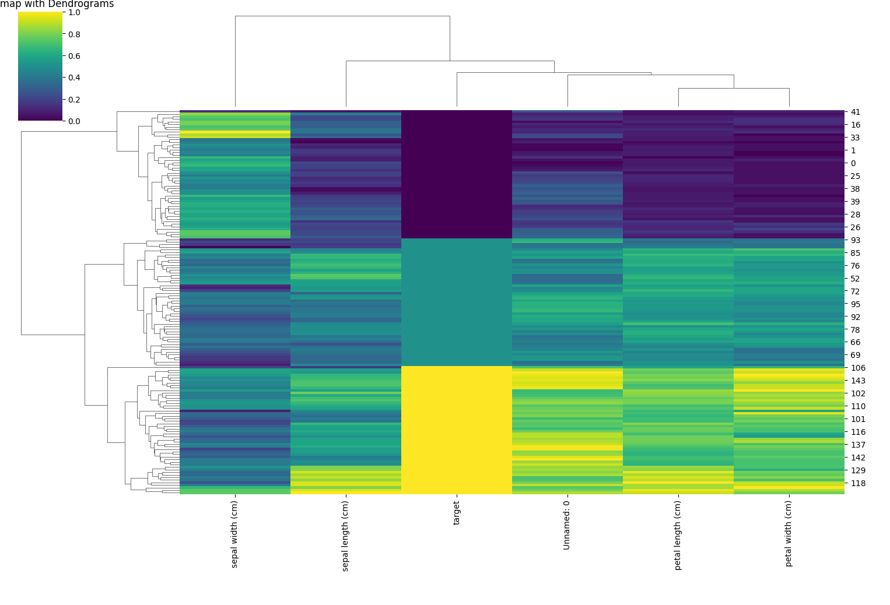

# Hierarchical Clustering 

# דוגמא בפייתון

```python
import pandas as pd
import seaborn as sns
import matplotlib.pyplot as plt
from sklearn.preprocessing import MinMaxScaler
from sklearn.cluster import AgglomerativeClustering
from scipy.cluster.hierarchy import linkage, dendrogram

# 1. טוענים את הדאטה
df = pd.read_csv("iris_unlabaled.csv")

# 2. מנקים רק עמודות מספריות
df_numeric = df.select_dtypes(include=['float64', 'int64'])

# 3. סקיילינג (נרמול) עם MinMaxScaler
scaler = MinMaxScaler()
df_scaled = pd.DataFrame(scaler.fit_transform(df_numeric), columns=df_numeric.columns)

# 4. clustermap עם דנדרוגרמות
sns.clustermap(df_scaled, cmap="viridis", figsize=(10, 8))
plt.title("Clustermap with Dendrograms")
plt.show()

# 5. מטריצת קורלציה ו-heatmap
corr_matrix = df_scaled.corr()
sns.heatmap(corr_matrix, annot=True, cmap="coolwarm")
plt.title("Correlation Matrix")
plt.show()

# 6. מוצאים את שתי התכונות עם הקורלציה הכי גבוהה
top_corr = corr_matrix.where(~(corr_matrix == 1)).unstack().sort_values(ascending=False).dropna().reset_index()
top_corr.columns = ['Feature1', 'Feature2', 'Correlation']
top_pair = top_corr.iloc[0]

# 7. בונים לינקג' עם שיטת ward
linkage_matrix = linkage(df_scaled, method='ward')

# 8. מציירים דנדרוגרמה
plt.figure(figsize=(12, 6))
dendrogram(linkage_matrix)
plt.title("Dendrogram (Ward Linkage)")
plt.xlabel("Data Point Index")
plt.ylabel("Distance")
plt.show()

# 9. מבצעים clustering היררכי עם 3 קבוצות
model = AgglomerativeClustering(n_clusters=3)
df['Cluster'] = model.fit_predict(df_scaled)

# 10. מציירים פיזור של הקלאסטרים לפי שתי התכונות הכי מתואמות
plt.figure(figsize=(8, 6))
sns.scatterplot(data=df, x=top_pair['Feature1'], y=top_pair['Feature2'], hue='Cluster', palette='Set2')
plt.title("Clusters Based on Most Correlated Features")
plt.xlabel(top_pair['Feature1'])
plt.ylabel(top_pair['Feature2'])
plt.grid(True)
plt.show()
```



## מפת חום עם דנדרוגרמות – הסבר מלא

### 🟦 מה זה בכלל?

זאת **מפת חום (heatmap)** עם **דנדרוגרמות** משני הצדדים – גם לשורות וגם לעמודות  
כל שורה מייצגת **דוגמה (פרח)**  
כל עמודה מייצגת **מאפיין** – למשל:
- `sepal length (cm)`
- `sepal width (cm)`
- `petal length (cm)`
- `petal width (cm)`
- `target`
- `Unnamed: 0` (כנראה אינדקס שנשמר בקובץ בטעות)

והצבעים מייצגים ערכים בין 0 ל־1 (אחרי נרמול עם MinMaxScaler)

### 🌈 מה הצבעים אומרים?

- **צהוב = ערך גבוה** (קרוב ל־1)  
- **סגול כהה = ערך נמוך** (קרוב ל־0)  
- **ירוק-כחול באמצע = ערכים בינוניים**

ככה אפשר בקלות לראות דפוסים חוזרים  
למשל:  
👀 שים לב שבצד ימין למטה יש הרבה **צהוב בעמודת petal length** – סימן שהקבוצה הזו כוללת פרחים עם עלי כותרת ארוכים

### 🌿 ומה עם הדנדרוגרמות?

הקווים הלבנים בצדדים למעלה ושמאל מראים **איך הפרחים קובצו** על פי הדמיון ביניהם  
זה קלאסטרינג היררכי – והוא מראה אילו פרחים דומים באותם המאפיינים

🧠 ככל ששני פריטים מתחברים **מוקדם (למטה)** – הם מאוד דומים  
אם הם מתחברים רק **מאוחר (למעלה)** – הם שונים יותר


### ✅ מה זה הקווים בצד שמאל?

הם מייצגים **תצפיות (שורות בדאטה)** – כל שורה במפה היא פרח מסוים, כלומר תצפית  
הקווים הלבנים בצד שמאל בונים **דנדרוגרמה** – מין "עץ" של חיבורים בין פרחים לפי כמה שהם דומים  
הם מראים **איך תצפיות מקובצות** על בסיס כל העמודות (המאפיינים)

🔹 כל ענף מייצג תהליך של חיבור בין תצפיות  
🔹 ככל שהחיבור בין תצפיות מתבצע **נמוך יותר בעץ** – הן **מאוד דומות**  
🔹 ככל שהחיבור מתבצע **גבוה יותר** – הן **פחות דומות**

לדוגמה:
- אם שתי שורות קרובות מאוד ונפגשות בעץ ממש למטה → הן כמעט זהות  
- אם הן מתחברות רק אחרי שהרבה דברים כבר התמזגו → הן שונות

---

### ✅ ומה זה הקווים למעלה?

זה בדיוק אותו עיקרון – רק שפה מדובר על **עמודות (features)**  
כל עמודה מייצגת מאפיין כמו:
- אורך עלי כותרת  
- רוחב עלי גביע  
- target  
- וכו'

הקווים למעלה מראים **אילו מאפיינים דומים בהתנהגות שלהם** לאורך הדאטה

לדוגמה:
- אם `petal length` ו־`petal width` מתנהגות דומה אצל כל הפרחים – הן יהיו קרובות בעץ  
- אם `sepal width` שונה לגמרי – היא תתחבר אליהן רק מאוחר

---

### 🧠 סיכום בטבלה:

| חלק | מתייחס ל־ | מראה את הדמיון בין |
|------|-------------|----------------------|
| הקווים בצד שמאל | שורות (תצפיות / פרחים) | פרחים שונים |
| הקווים למעלה | עמודות (מאפיינים) | משתנים בדאטה |

### 📌 איך זה עוזר לי?

- אתה יכול לראות **קבוצות ברורות של פרחים** – גם אם לא כתוב לך מי מהן זה סטוסה, ורסיקולור וכו'  
- אתה רואה **איזה מאפיינים מבדילים בין הקבוצות** (כמו petal length ו־width)  
