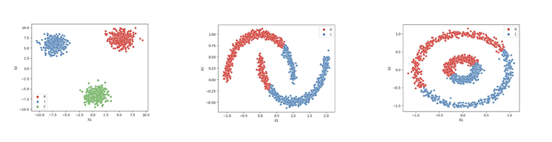

## DBSCAN - Python Example

### Epsilon (ε)
קובע את הרדיוס סביב כל נקודה. משפיע על כמה נקודות ייכנסו לאותה "שכונה":
- ערך קטן = הרבה נקודות יסווגו כרעש
- ערך גדול = כל הנקודות יהפכו לאותה קבוצה

### MinPts
המספר המינימלי של נקודות בשכונה (רדיוס ε) כדי שזאת תיחשב כנקודת ליבה (Core Point)
- MinPts קטן = הרבה קבוצות, מעט רעש
- MinPts גדול = מעט קבוצות, הרבה רעש

### מציאת פרמטרים אופטימליים
ניתן להשתמש ב־**שיטת המרפק** כדי למצוא את ערך ε האופטימלי על פי מספר האאוטליירים המוגדר מראש (לדוגמה: נרצה 3 אאוטליירים)
- מבצעים מספר הרצות עם ערכי ε שונים ובודקים באיזה ערך בדיוק מתקבלים 3 אאוטליירים
- ניתן לחזור על אותו רעיון גם עבור MinPts
- כלל אצבע: MinPts = 2 × מספר התכונות

---

## קוד Python DBSCAN

דוגמה לשימוש ב־DBSCAN על שלושה קבצים:
- `cluster_blobs.csv`
- `cluster_moons.csv`
- `cluster_circles.csv`



לכל קובץ יש שתי תכונות בלבד (X1 ו־X2) וניתן לבחון את צורת הקלאסטרים הנוצרים

```python
import pandas as pd
import numpy as np
import matplotlib.pyplot as plt
from sklearn.cluster import DBSCAN
from sklearn.preprocessing import StandardScaler
from sklearn.metrics import pairwise_distances_argmin_min

# פונקציה לציור תוצאת המודל
def display_categories(X, labels, title):
    plt.figure(figsize=(6, 4))
    plt.scatter(X[:, 0], X[:, 1], c=labels, cmap='Set1', s=40)
    plt.title(title)
    plt.xlabel("X1")
    plt.ylabel("X2")
    plt.grid(True)
    plt.show()

# טוענים קובץ לדוגמה
file = 'cluster_two_blobs_outliers.csv'
df = pd.read_csv(file)
X = df.values

# נורמליזציה
scaler = StandardScaler()
X_scaled = scaler.fit_transform(X)

# DBSCAN ברירת מחדל (e=0.5, minPts=5)
db_default = DBSCAN(eps=0.5, min_samples=5)
labels_default = db_default.fit_predict(X_scaled)
display_categories(X_scaled, labels_default, "DBSCAN - Default")

# בדיקת אפקט של ערכים שונים של Epsilon
epsilons = np.linspace(0.05, 1.0, 20)
outliers_count = []
for eps in epsilons:
    db = DBSCAN(eps=eps, min_samples=5)
    labels = db.fit_predict(X_scaled)
    count = np.sum(labels == -1)
    outliers_count.append(count)

# גרף של מספר האאוטליירים לפי epsilon
plt.plot(epsilons, outliers_count, marker='o')
plt.title("Outliers vs Epsilon")
plt.xlabel("Epsilon")
plt.ylabel("Number of Outliers")
plt.grid(True)
plt.show()

# בדיקה דומה עבור MinPts
minpts_values = range(2, 20)
outliers_per_minpts = []
for minpts in minpts_values:
    db = DBSCAN(eps=0.3, min_samples=minpts)
    labels = db.fit_predict(X_scaled)
    count = np.sum(labels == -1)
    outliers_per_minpts.append(count)

plt.plot(minpts_values, outliers_per_minpts, marker='o')
plt.title("Outliers vs MinPts")
plt.xlabel("MinPts")
plt.ylabel("Number of Outliers")
plt.grid(True)
plt.show()
```


