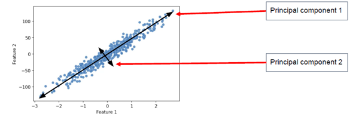

## PCA - Principal Component Analysis

שיטת **PCA** (ניתוח רכיבים עיקריים) היא שיטה נפוצה בלמידת מכונה וסטטיסטיקה שנועדה לבצע **צמצום ממדים** – כלומר, להפוך דאטה עם הרבה תכונות (Features) לדאטה עם פחות תכונות, מבלי לאבד יותר מדי מידע חשוב.

פי.סי.איי יוצרת **ציר חדש** שמורכב משילוב של התכונות המקוריות – הציר הזה נקרא **רכיב עיקרי** (Principal Component) – והוא משמר את מירב השונות בדאטה.

### למה להשתמש ב־PCA?

- דאטה עם הרבה תכונות גורם לבעיות: **עומס חישובי**, **קושי בויזואליזציה**, ו־**הסתברות לאוברפיטינג**
- PCA מצמצם את מספר התכונות, אבל שומר על כמה שיותר **שונות** מהדאטה המקורי

שונות (Variance) היא מדד שמראה **עד כמה ערכים מתרחקים מהממוצע שלהם**
כלומר – כמה הנתונים "מתפזרים" סביב הממוצע

## PCA and Unsupervised Learning

ב־Unsupervised Learning אין לנו תוויות (labels), ולכן אין דרך לדעת איזו תכונה הכי חשובה
PCA מאפשרת לצמצם תכונות **באופן חכם ולא מפוקח** – בלי לדעת מה חשוב למה

המטרה היא להקרין את הדאטה למרחב חדש עם פחות ממדים, תוך כדי שמירה על כמה שיותר מהמידע (variance)

### שים לב:
פי.סי.איי לא בוחר תכונות קיימות – הוא מייצר **חדשות** שהן שילובים ליניאריים של הישנות

## Principal Components

הרכיבים העיקריים הם צירים חדשים שנוצרים משילוב של התכונות המקוריות
כל רכיב הוא **ציר אורתוגונלי** לרכיבים האחרים, ומכיל כמה שיותר שונות (variance)



### Explained Variance

מספר שמציין **כמה שונות** (variance) נשמרת ע״י כל רכיב עיקרי.
רכיב עם Explained Variance גבוה → יותר מידע נשמר

משמש להחלטה כמה רכיבים לשמור (למשל: מספיק לי 2 רכיבים אם הם שומרים 90% מהשונות)

### Eigenvalues

ה־Eigenvalue (ערך עצמי) של כל רכיב מציין כמה שונות הוא תורם לדאטה
ככל שהערך גבוה → הרכיב הזה חשוב יותר

### Eigenvectors

וקטורים שמתארים את **הכיוון** של כל רכיב עיקרי
הם בעצם השילוב של התכונות הישנות ליצירת הרכיב החדש

### Covariance Matrix

מטריצה שמתארת את הקשר (קו-וריאציה) בין כל שני פיצ'רים
PCA משתמשת במטריצה הזו כדי להבין אילו תכונות משתנות יחד ולמצוא את הצירים החדשים

## Explained Variance

כשאנחנו עושים PCA, אנחנו רוצים לדעת כמה מידע (שונות) נשאר אחרי שהפכנו את הדאטה למשהו פשוט יותר

שונות (Variance) היא מדד שמראה **עד כמה ערכים מתרחקים מהממוצע שלהם**
כלומר – כמה הנתונים "מתפזרים" סביב הממוצע

### הנוסחא של שונות:

$$
\text{Variance} = \frac{1}{n} \sum_{i=1}^{n} (x_i - \bar{x})^2
$$

זו בעצם **הממוצע של ריבועי המרחקים מהממוצע**

אקספיריאנס ואריאנס זה כמה מתוך כל השונות בדאטה נשמרה בכל רכיב חדש שיצרנו
אם רכיב עיקרי מסביר הרבה שונות – זה אומר שהוא שומר הרבה מידע מהדאטה המקורי

### דוגמה:
נניח שיש לנו ציונים של 100 תלמידים במתמטיקה, אנגלית ומדעים  
PCA יוצר רכיבים חדשים במקום שלושת המקצועות – כדי לייצג את התלמידים עם פחות מידע

### האם יוצרים רכיב אחד במקום שלושה ציונים?

כן! PCA יכול לקחת שלושה ציונים (למשל: מתמטיקה, אנגלית, מדעים) ולהמיר אותם לרכיב אחד חדש בלבד  
המטרה היא לייצג את ההבדלים בין התלמידים בצורה פשוטה, בלי לאבד הרבה מידע

### איך זה עובד?

במקום לרשום לכל תלמיד את שלושת הציונים שלו:
- מתמטיקה: 85  
- אנגלית: 90  
- מדעים: 80  

פי.סי.איי יוצר רכיב חדש שהוא שילוב מתמטי של שלושת הציונים האלו, למשל:  
**0.5 × מתמטיקה + 0.3 × אנגלית + 0.2 × מדעים = 85.2**

### למה זה טוב?

- כי הרכיב החדש שומר את עיקר ההבדלים בין התלמידים  
- זה עוזר לצמצם ממדים ולעבוד עם פחות נתונים  
- קל יותר לנתח ולהציג גרפים  
- מאפשר קלאסטרינג או חיזוי מדויק יותר

### חשוב לדעת:

- לפעמים מספיק לשמור **רכיב אחד** שמכיל למשל 90% מהשונות  
- לפעמים שומרים 2 או 3 רכיבים – תלוי כמה מידע רוצים לשמר


## Eigenvalues (ערכים עצמיים)

זה מספר שאומר **כמה מידע (שונות) יש על כל כיוון חדש** ש־PCA יצר

כאשר PCA יוצר כיוונים חדשים (רכיבים), הוא מחשב כמה שונות יש על כל כיוון – זו ה־Eigenvalue של אותו כיוון
ככל שה־Eigenvalue יותר גבוה – הכיוון הזה שומר יותר מידע ולכן חשוב יותר

### איך זה נראה מתמטית?
אם נפרוס את השונות על צירים חדשים – אז סכום כל ה־Eigenvalues יהיה סך כל השונות בדאטה

### דוגמה:
אם יש לי דאטה עם שתי תכונות:
- הציר החדש הראשון קיבל ערך עצמי 4.8
- הציר השני קיבל 1.2
אז הציר הראשון שומר פי 4 יותר מידע מהשני – ולכן נשמור רק אותו

## Eigenvectors (וקטורים עצמיים)

וקטור עצמי הוא **הכיוון** שאליו אנחנו מסתכלים בדאטה החדש
כל רכיב עיקרי (Principal Component) הוא וקטור שמראה **איך לשלב את התכונות המקוריות** כדי לייצר כיוון חדש שבו הפיזור (variance) הכי גדול

### הכוונה ל"איך נראה הציר החדש":
אם ניקח שני פיצ'רים – נגיד אורך ועלים בצמח – אז במקום להסתכל עליהם בנפרד, PCA יוצר ציר חדש
למשל:
- רכיב ראשון = 0.6 × אורך + 0.8 × עלים

זה אומר שהרכיב הראשון הוא קו חדש שעובר במרחב, והוא שילוב של שני הפיצ'רים
ה־Eigenvector הוא אותו שילוב – הכיוונים של הפיצ'רים ביצירת הציר

### דוגמה:
אם ה־eigenvector של רכיב ראשון הוא:
$$
[0.7,\ 0.7]
$$
אז זה אומר שהציר החדש בנוי מ־70% מהפיצ'ר הראשון ו־70% מהשני (בנורמליזציה)

## Covariance Matrix (מטריצת קווריאציה)

זאת טבלה (מטריצה) שמראה את הקשר בין כל שני פיצ'רים – האם הם משתנים ביחד או לא

- אם שני פיצ'רים משתנים יחד (כמו גובה ומשקל) → הקשר חיובי
- אם אחד עולה והשני יורד → הקשר שלילי
- אם אין קשר → הקשר אפסי

PCA משתמש במטריצה הזו כדי לגלות **על איזה כיוון יש הכי הרבה שונות** – ולבנות את הצירים החדשים

### דוגמה מספרית:
אם נבנה מטריצה ל־3 פיצ'רים: גיל, גובה, משקל – יתקבל:
```
       גיל   גובה   משקל
גיל     1    0.6     0.5
גובה  0.6     1      0.8
משקל  0.5    0.8      1
```
ה־1ים על האלכסון מראים את הקשר של כל פיצ'ר עם עצמו (תמיד 1)
שאר הערכים מראים את הקשרים בין הפיצ'רים – ואלו משפיעים על איך ייראו הרכיבים החדשים של PCA

### מסקנה:
ה־Covariance Matrix היא הבסיס שממנו מחשבים את ה־Eigenvalues וה־Eigenvectors – וזה מה שמאפשר לפצל את הדאטה לצירים עם הכי הרבה מידע

### דוגמה:
אם בקובץ יש גובה ומשקל, והם תמיד עולים יחד (למשל בילדים) – אז הקווריאציה ביניהם תהיה גבוהה  
PCA יקח את זה בחשבון וייצר רכיב חדש שמבוסס על שניהם


## כיצד PCA פועל בפועל?

1. מנרמלים את הדאטה (סקיילינג)
2. מחשבים מטריצת קווריאציה
3. מחשבים את ה־Eigenvalues וה־Eigenvectors
4. בוחרים את הרכיבים עם הערכים הגבוהים ביותר (שמכילים את מירב השונות)
5. מקרינים את הדאטה למרחב החדש
