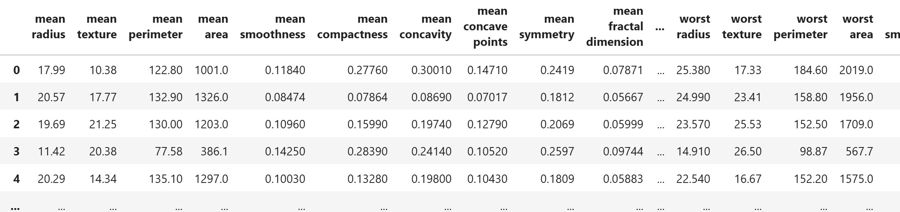
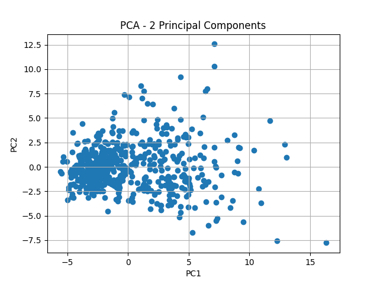

# 📉 תהליך צמצום מימדים עם PCA

### 1. טעינת הנתונים
יש לנו קובץ נתונים עם 20 פיצ'רים שונים. נרצה לבדוק אם אפשר לצמצם את כמות הפיצ'רים מבלי לאבד מידע מהותי



### 2. פיצ'ר סקיילינג

נשתמש ב- StandardScaler 

### 3. הפעלת PCA עם 2 רכיבים
נבצע ניתוח PCA על הדאטה תוך שמירה על 2 רכיבים בלבד
המטרה היא לבדוק האם שני הרכיבים מצליחים לשמר חלק משמעותי מהשונות (המידע) של הדאטה

נציג את הנתונים בעזרת תרשים פיזור (Scatter Plot) כדי להבין איך הם מתפלגים במרחב



### 4. מדידת שונות מוסברת (Explained Variance)
נבדוק כמה מהשונות הכוללת בדאטה נשמרת על ידי שני הרכיבים
אם השונות גבוהה (למשל מעל 80%) — ייתכן שאין צורך ביותר מ-2 רכיבים

### 5. העלאת כמות הרכיבים
נריץ את PCA שוב, הפעם עם כמות משתנה של רכיבים (3, 4, ..., 20)  
בכל פעם נמדוד את **השונות המצטברת** שנשמרת

### 6. שרטוט שונות מוסברת מצטברת
נציג גרף של "כמות רכיבים" מול "שונות מוסברת מצטברת" כדי לזהות את נקודת המפנה (elbow point)  
כך נוכל לבחור את מספר הרכיבים האופטימלי שמסביר מספיק מהמידע תוך שמירה על פשטות


---

## הקוד

```python
# Step 1: Load the data
import pandas as pd
from sklearn.decomposition import PCA
from sklearn.preprocessing import StandardScaler
import matplotlib.pyplot as plt

df = pd.read_csv('tumor_data_features.csv')

# Step 2: Feature scaling
scaler = StandardScaler()
scaled_data = scaler.fit_transform(df)

# Step 3: PCA with 2 components
pca = PCA(n_components=2)
pca_result = pca.fit_transform(scaled_data)

# Step 4: Scatter plot of the PCA result
plt.scatter(pca_result[:, 0], pca_result[:, 1])
plt.title('PCA - 2 Principal Components')
plt.xlabel('PC1')
plt.ylabel('PC2')
plt.grid(True)
plt.show()

# Step 5: View the PCA components
print("PCA Components:")
print(pca.components_)

# Step 6: View the explained variance ratio
print("Explained Variance Ratio:")
print(pca.explained_variance_ratio_)

# Step 7: Calculate explained variance for different number of components
explained = []
for i in range(1, 31):  # assuming there are 30 original features
    pca = PCA(n_components=i)
    pca.fit(scaled_data)
    explained.append(sum(pca.explained_variance_ratio_))

# Step 8: Line plot of explained variance vs number of components
plt.plot(range(1, 31), explained, marker='o')
plt.title('Explained Variance vs Number of Components')
plt.xlabel('Number of Principal Components')
plt.ylabel('Cumulative Explained Variance')
plt.grid(True)
plt.show()

```