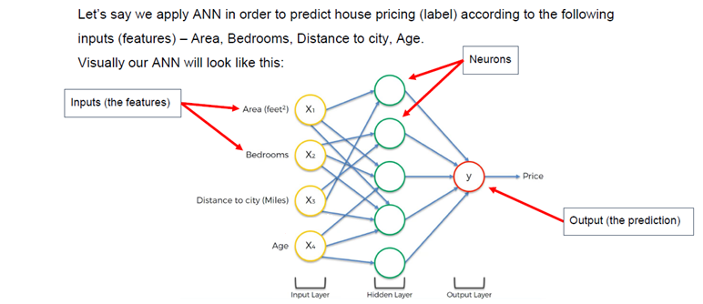

## למידה עמוקה (Deep Learning)

למידה עמוקה היא תחום בתוך למידת מכונה שמתמקד באלגוריתמים שמדמים את מבנה ותפקוד המוח האנושי – ובעיקר רשתות עצביות מלאכותיות
המטרה היא לגרום למחשב ללמוד בצורה היררכית מתוך הדאטה, מבלי שנצטרך להגדיר ידנית את המאפיינים החשובים

### דוגמה:

במקום להגדיר שכל תמונה של חתול כוללת שפם, אוזניים וזנב – המחשב לומד לבד את המאפיינים שמבדילים חתול מכלב

### מה זה אומר בפועל?

* רשתות עצביות עמוקות לומדות באופן הדרגתי – כל שכבה מזהה תבניות מורכבות יותר
* המודל לומד מתוך כמויות עצומות של דאטה, תוך כדי התאמה עצמאית של המשקלים
* תהליכי הלמידה כוללים סיווג (classification), חיזוי (regression) ואשכולים (clustering)

## שימושים בלמידה עמוקה

### 🎨 זיהוי תמונות

רשתות מסוג **CNN** מצליחות לזהות אובייקטים, פרצופים וסצנות – ברמת דיוק כמעט אנושית

### 🗣️ זיהוי דיבור

מערכות כמו **Siri**, **Google Assistant** ו־**Alexa** מבוססות למידה עמוקה כדי להבין ולנתח שפה מדוברת

### 📝 עיבוד שפה טבעית (NLP)

משימות כמו תרגום, סיכום טקסטים, ניתוח רגשות – מתבצעות על ידי מודלים עמוקים כמו **טרנספורמרים**

 **טרנספורמרים** סוג של ארכיטקטורת רשת עצבית שנועדה לעבד טקסטים בצורה חכמה ומדויקת
הוא שונה ממודלים קודמים בכך שהוא לא קורא מילה־אחר־מילה אלא מסתכל על כל המשפט בו זמנית

איך זה עובד?
הטרנספורמר משתמש במנגנון שנקרא **Attention** – כלומר "קשב"
במקום להתייחס לכל מילה באותה צורה, הוא שם יותר תשומת לב למילים החשובות בהקשר של המשפט

דוגמה במשפט:

"החתול רדף אחרי העכבר כי הוא היה רעב"

הטרנספורמר יכול להבין ש־"הוא" מתייחס ל־"החתול" ולא לעכבר כי הוא לומד את ההקשרים בתוך המשפט ולא רק את הסדר

למה זה חזק?

אפשר לאמן טרנספורמרים על כמויות עצומות של טקסט

הם עובדים מעולה גם בתרגום, גם בסיכום, וגם בהשלמת טקסט

המודלים הכי מתקדמים היום – כמו BERT, GPT, T5 – מבוססים על טרנספורמרים

**T5 Text-To-Text Transfer Transformer** 
מדובר בטרנספורמר מתקדם שפותח על ידי גוגל, שמבצע המון משימות שונות על טקסט 

### 🏥 בריאות

זיהוי מחלות מתמונות רנטגן, ניתוח MRI, ובניית תוכניות טיפול מותאמות אישית

### 🚗 רכבים אוטונומיים

רכבים חכמים משתמשים בלמידה עמוקה כדי לזהות תמרורים, הולכי רגל, כבישים ולנווט באופן עצמאי

## רשת עצבית מלאכותית (ANN - Artificial Neural Network)

רשת עצבית מלאכותית מדמה את פעולת הנוירונים במוח – כל **נוירון ברשת** מקבל קלטים, משקלות, מפעיל פונקציה ומעביר פלט
הרשת בנויה מכמה שכבות שכל אחת מהן אחראית על שלב אחר בעיבוד

### שלוש שכבות עיקריות:

* **שכבת קלט (Input Layer)** – מקבלת את הנתונים (features)
* **שכבה מוסתרת (Hidden Layer)** – מכילה את נוירוני הרשת שמבצעים את החישוב בפועל
* **שכבת פלט (Output Layer)** – מחזירה את התוצאה הסופית של המודל

### דוגמה:

תחזית מחירי דירות לפי שטח, מספר חדרים, מרחק מהעיר וגיל הדירה

## נוירון ברשת

### 🍖 מהו נוירון ביולוגי?

* נוירון במוח מקבל אותות חשמליים / כימיים ומעביר אותם הלאה
* המוח הוא "קופסה שחורה" שלא מבינה כלום בלי הקלטים מהנוירונים

### 🧠 מהו נוירון ברשת?

נוירון ברשת (Node) הוא יחידה בסיסית שמעבירה מידע בשכבות של הרשת
הוא מקבל קלטים (input), מחבר אותם עם משקלות (weights), מפעיל פונקציה, ומחזיר פלט

## רכיבי נוירון ברשת

### 📥 קלטים (Inputs)

כל נוירון ברשת מקבל ערכים מהשכבה הקודמת או מהדאטה עצמו

### ⚖️ משקלות (Weights)

לכל קלט יש משקל – כלומר כמה הוא חשוב
המודל לומד את המשקלות תוך כדי תהליך הלמידה

### 🔀 פונקציית הפעלה (Activation Function)

פונקציה מתמטית שמוסיפה עיקול (לא לינאריות) למודל
היא מאפשרת למודל ללמוד תבניות מורכבות

## סוגי בעיות לפי סוג הפלט

* 🔢 בעיה רציפה → פלט מספרי רציף (כמו מחיר)
* ❓ בעיה בינארית → פלט של כן / לא (0 או 1)
* 🧮 בעיה קטגורית → פלט מסוג מסוים (למשל: צבע = אדום, ירוק, כחול)

## שלבי הפעולה של נוירון ברשת

### 🔁 בכל איטרציה:

1. קבלת קלטים עם משקלות
2. כפל כל קלט במשקל שלו
3. סכימה של כל הקלטים הכפולים
4. הפעלת פונקציית הפעלה על התוצאה
5. הפלט מועבר לשכבה הבאה או מהווה תחזית סופית

💡 חשוב לבצע **נירמול** (Normalization) לקלטים כדי לשפר את ביצועי המודל

## איך נקבעים המשקלות הראשוניים?

המשקלות נבחרים אקראית בתחילת הדרך
שתי שיטות עיקריות:

* 🎲 התפלגות אחידה (Uniform): טווח אקראי כמו בין ‎-1 ל־1
* 🎲 התפלגות נורמלית (Normal): ממוצע 0 וסטיית תקן קטנה

💡 גם אם נזין לכל הנוירונים ברשת את אותם הקלטים – הם יפיקו פלטים שונים בגלל משקלות שונים

## פונקציית הפעלה (Activation Function)

כדי שהנוירון ברשת יוכל לזהות דפוסים מורכבים בדאטה, הוא צריך פונקציית הפעלה – שהיא בעצם פונקציה מתמטית שמוסיפה **לא־לינאריות** לפלט של הנוירון
אם לא נשתמש בפונקציית הפעלה, כל הרשת תתנהג כמו רגרסיה ליניארית פשוטה, ולא תוכל לפתור בעיות מורכבות

### 🎯 למה זה חשוב?

כי העולם לא לינארי – ולכן גם המודלים שלנו צריכים להכיל עקומות ודפוסים לא ישרים

## סוגים של פונקציות הפעלה

### ✅ Threshold Function

מוציאה ערכים של 0 או 1 לפי סף מסוים (למשל 0)

* אם סכום המשקלים והקלטים גדול או שווה ל־0 → הפלט יהיה 1
* אחרת → הפלט יהיה 0

### ✅ Sigmoid Function

הפונקציה הלוגיסטית – ממירה כל מספר לפלט רציף בין 0 ל־1
מצוינת למודלים של סיווג בינארי, כי אפשר להבין את הפלט כסבירות (הסתברות)

### ✅ ReLU (Rectified Linear Unit)

הכי נפוצה ברשתות עמוקות – מחזירה את הקלט אם הוא חיובי, ואם לא אז 0
פשוטה ומהירה – ולכן נפוצה בשכבות נסתרות

### ✅ Tanh (Hyperbolic Tangent)

ממירה את הקלט לפלט בין ‎-1 ל־1 – כלומר מרכז את הקלט סביב 0
מתאימה לדאטה שמכיל גם ערכים שליליים

### ✅ Softmax

ממירה את כל הפלטים של שכבת הפלט **להסתברויות** כך שהסכום שלהן יהיה 1
מצוינת לסיווג רב־קטגורי (Multi-Class Classification)

### ✅ Linear

משאירה את הפלט כמו שהוא – משמשת לרוב ברגרסיה (כאשר הפלט הוא מספר רציף ולא קטגוריה)

## תהליך למידה אחורית (Backpropagation)

### 🧠 מה זה בעצם?

אחרי שהרשת מנסה לנבא משהו – היא בודקת כמה היא טעתה, ואז חוזרת אחורה ומעדכנת את המשקלים כדי לטעות פחות בפעם הבאה
זה כמו מורה שמתקן את עצמו לפי התוצאה של הבחינה

### ✏️ איך זה עובד בפועל?

1. מחשבים את הפלט של הנוירון כמו שלמדנו (סכום קלטים × משקלים → פונקציית הפעלה)
2. מחשבים את **שגיאת התחזית** (כמה רחוק הפלט מהתוצאה הנכונה)
3. מחשבים **נגזרת** של פונקציית העלות לפי כל משקל → כדי לדעת באיזה כיוון צריך לשנות אותו
4. מעדכנים את המשקלים בהתאם למהירות הלמידה (learning rate)
5. חוזרים על זה שוב ושוב עם כל הדאטה

### 💡 דוגמה:

אם אנחנו חוזים ציון מבחן של תלמיד לפי גיל וימי למידה – המודל ינסה לצמצם את השגיאה בין הציון שחזה לציון האמיתי

x = 17

## סוגי פונקציות עלות (Cost Functions)

* 🔢 בעיה רציפה (רגרסיה) → משתמשים ב־**MSE (Mean Squared Error)**
* 🧮 בעיה קטגורית (סיווג) → משתמשים ב־**Categorical Cross-Entropy**

💡 כל נוירון ברשת עושה לעצמו backpropagation – אבל כל הרשת מתעדכנת בצורה **מתואמת** כדי לצמצם את הטעות הכוללת

## שיטות עדכון משקלות

* 🔁 Batch Gradient Descent → מחשב את הטעות על כל הדאטה ואז מעדכן
* 🔀 Stochastic Gradient Descent (SGD) → מעדכן משקלות כל פעם אחרי דוגמה אחת בלבד
* ⚖️ Mini-Batch Gradient Descent → פשרה בין השניים – מחשב על קבוצות קטנות בכל פעם

