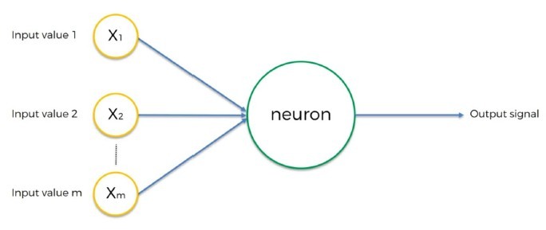

## למידה עמוקה (Deep Learning)

למידה עמוקה היא תחום בתוך למידת מכונה שמתמקד באלגוריתמים שמדמים את מבנה ותפקוד המוח האנושי – ובעיקר רשתות עצביות מלאכותיות
המטרה היא לגרום למחשב ללמוד בצורה היררכית מתוך הדאטה, מבלי שנצטרך להגדיר ידנית את המאפיינים החשובים

### דוגמה:

במקום להגדיר שכל תמונה של חתול כוללת שפם, אוזניים וזנב – המחשב לומד לבד את המאפיינים שמבדילים חתול מכלב

### מה זה אומר בפועל?

* רשתות עצביות עמוקות לומדות באופן הדרגתי – כל שכבה מזהה תבניות מורכבות יותר
* המודל לומד מתוך כמויות עצומות של דאטה, תוך כדי התאמה עצמאית של המשקלים
* תהליכי הלמידה כוללים סיווג (classification), חיזוי (regression) ואשכולים (clustering)

## שימושים בלמידה עמוקה

### 🎨 זיהוי תמונות

רשתות מסוג **CNN** מצליחות לזהות אובייקטים, פרצופים וסצנות – ברמת דיוק כמעט אנושית

### 🗣️ זיהוי דיבור

מערכות כמו **Siri**, **Google Assistant** ו־**Alexa** מבוססות למידה עמוקה כדי להבין ולנתח שפה מדוברת

### 📝 עיבוד שפה טבעית (NLP)

משימות כמו תרגום, סיכום טקסטים, ניתוח רגשות – מתבצעות על ידי מודלים עמוקים כמו **טרנספורמרים**

### 🏥 בריאות

זיהוי מחלות מתמונות רנטגן, ניתוח MRI, ובניית תוכניות טיפול מותאמות אישית

### 🚗 רכבים אוטונומיים

רכבים חכמים משתמשים בלמידה עמוקה כדי לזהות תמרורים, הולכי רגל, כבישים ולנווט באופן עצמאי

## רשת עצבית מלאכותית (ANN - Artificial Neural Network)

רשת עצבית מלאכותית מדמה את פעולת הנוירונים במוח – כל **נוירון ברשת** מקבל קלטים, משקלות, מפעיל פונקציה ומעביר פלט
הרשת בנויה מכמה שכבות שכל אחת מהן אחראית על שלב אחר בעיבוד

### שלוש שכבות עיקריות:

* **שכבת קלט (Input Layer)** – מקבלת את הנתונים (features)
* **שכבה מוסתרת (Hidden Layer)** – מכילה את נוירוני הרשת שמבצעים את החישוב בפועל
* **שכבת פלט (Output Layer)** – מחזירה את התוצאה הסופית של המודל

### דוגמה:

תחזית מחירי דירות לפי שטח, מספר חדרים, מרחק מהעיר וגיל הדירה

## נוירון ברשת

### 🍖 מהו נוירון ביולוגי?

* נוירון במוח מקבל אותות חשמליים / כימיים ומעביר אותם הלאה
* המוח הוא "קופסה שחורה" שלא מבינה כלום בלי הקלטים מהנוירונים

### 🧠 מהו נוירון ברשת?

נוירון ברשת (Node) הוא יחידה בסיסית שמעבירה מידע בשכבות של הרשת
הוא מקבל קלטים (input), מחבר אותם עם משקלות (weights), מפעיל פונקציה, ומחזיר פלט

## רכיבי נוירון ברשת

### 📥 קלטים (Inputs)

כל נוירון ברשת מקבל ערכים מהשכבה הקודמת או מהדאטה עצמו

### ⚖️ משקלות (Weights)

לכל קלט יש משקל – כלומר כמה הוא חשוב
המודל לומד את המשקלות תוך כדי תהליך הלמידה

### 🔀 פונקציית הפעלה (Activation Function)

פונקציה מתמטית שמוסיפה עיקול (לא לינאריות) למודל
היא מאפשרת למודל ללמוד תבניות מורכבות

## סוגי בעיות לפי סוג הפלט

* 🔢 בעיה רציפה → פלט מספרי רציף (כמו מחיר)
* ❓ בעיה בינארית → פלט של כן / לא (0 או 1)
* 🧮 בעיה קטגורית → פלט מסוג מסוים (למשל: צבע = אדום, ירוק, כחול)

## שלבי הפעולה של נוירון ברשת

### 🔁 בכל איטרציה:

1. קבלת קלטים עם משקלות
2. כפל כל קלט במשקל שלו
3. סכימה של כל הקלטים הכפולים
4. הפעלת פונקציית הפעלה על התוצאה
5. הפלט מועבר לשכבה הבאה או מהווה תחזית סופית

💡 חשוב לבצע **נירמול** (Normalization) לקלטים כדי לשפר את ביצועי המודל

## איך נקבעים המשקלות הראשוניים?

המשקלות נבחרים אקראית בתחילת הדרך
שתי שיטות עיקריות:

* 🎲 התפלגות אחידה (Uniform): טווח אקראי כמו בין ‎-1 ל־1
* 🎲 התפלגות נורמלית (Normal): ממוצע 0 וסטיית תקן קטנה

💡 גם אם נזין לכל הנוירונים ברשת את אותם הקלטים – הם יפיקו פלטים שונים בגלל משקלות שונים
