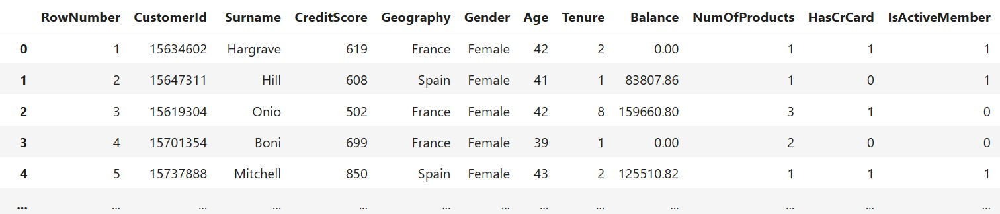

# מה זה TensorFlow


טנסר-פלואו היא ספריית קוד פתוח מבית Google  
היא נועדה לעזור לנו לבנות מודלים של למידת מכונה ובעיקר רשתות נוירונים  
הספרייה מאוד חזקה וגמישה ומשמשת הרבה מאוד בתחומים כמו ראיית מחשב, עיבוד שפה, חיזוי ועוד

---

## למה להשתמש ב־TensorFlow

- מאפשרת לבנות רשתות נוירונים בצורה קלה או מתקדמת  
- תומכת גם ב־CPU וגם ב־GPU כך שאפשר לעבוד מהר יותר  
- מתחברת בצורה נוחה עם ספריות אחרות כמו NumPy  
- יש לה קהילה מאוד גדולה והמון מדריכים ודוגמאות באינטרנט  
- אפשר להריץ את המודלים גם על מובייל וגם על שרתים

## איך מתקינים את TensorFlow

בשורת הפקודה או ב־Jupyter מריצים

```
pip install tensorflow
```

לאחר ההתקנה אפשר לבדוק שהספרייה קיימת בעזרת

```python
import tensorflow as tf
print(tf.__version__)
```

## איך מתחילים לעבוד עם TensorFlow

לרוב אנחנו נשתמש בממשק שנקרא `Keras` שנמצא בתוך TensorFlow  
הממשק הזה מאפשר לנו לבנות מודלים בצורה פשוטה ונוחה גם למתחילים

אנחנו יכולים ליצור רשת נוירונים על ידי הגדרה של שכבות  
למשל רשת פשוטה עם שכבת קלט אחת שכבת חבויה אחת ושכבת פלט אחת תיראה כך

**מה זה Keras**

ממשק עבודה גבוה לבניית רשתות נוירונים
הוא חלק מתוך TensorFlow ומאפשר ליצור מודלים בצורה פשוטה ומובנת  
הממשק מתאים במיוחד למתחילים וגם למפתחים מתקדמים שרוצים לעבוד מהר

המודל נותן לנו את היכולת לבנות מודלים בצורה של בלוקים  
כל שכבה שאנחנו מוסיפים היא פשוט שורה אחת של קוד  
לא צריך לכתוב נוסחאות מתמטיות ולא צריך לנהל את המודל בצורה ידנית

**יתרונות של Keras**

- ממשק נוח מאוד לקריאה ולהבנה גם בלי רקע מתמטי עמוק  
- אפשר לבנות רשתות פשוטות או מורכבות תוך שליטה על כל שלב  
- קיים אינטגרציה מושלמת עם TensorFlow  
- קהילה רחבה והמון דוגמאות מוכנות באינטרנט  
- תומך בכל סוגי הבעיות כמו סיווג רגרסיה ניתוח תמונה או טקסט

### Keras Models

יש שני סוגים עיקריים של בניית מודלים ב־Keras

- **Sequential API**

הדרך הפשוטה ביותר  
בונים את המודל כשכבה אחרי שכבה בסדר קווי

```python
from tensorflow.keras.models import Sequential
from tensorflow.keras.layers import Dense

model = Sequential()  # Create an empty sequential model
model.add(Dense(10, activation='relu'))  # Hidden layer with 10 neurons using ReLU activation function
model.add(Dense(1, activation='sigmoid'))  # Output layer with 1 neuron using sigmoid activation function
```

- **Functional API**

מאפשר חיבור יותר גמיש בין שכבות
מתאים לרשתות מורכבות עם הסתעפויות או כניסות מרובות

**מה הכוונה לרשתות מורכבות עם הסתעפויות או כניסות מרובות**

כאשר אנחנו בונים מודל פשוט בעזרת Sequential  
כל שכבה באה אחת אחרי השנייה בצורה ישרה וקווית אבל לפעמים אנחנו רוצים לבנות רשת מתקדמת יותר עם מבנה גמיש יותר  
בדיוק בשביל זה נשתמש בממשק שנקרא Functional API

**הסתעפויות בתוך הרשת (Branches)**

לפעמים אנחנו רוצים שהרשת תתפצל למספר מסלולים למשל שהפלט של שכבה אחת יועבר לשתי שכבות שונות  
כל שכבה תעבד את המידע בצורה שונה ואז נחבר ביניהן שוב בהמשך

אפשר לחשוב על זה כמו כביש שמתפצל לשניים וכל מסלול לומד משהו אחר אחר כך מחברים את כל הידע ביחד לשכבה אחת משותפת

**כניסות מרובות (Multiple Inputs)**

לפעמים יש לנו יותר מסוג קלט אחד למשל ייתכן שיש לנו גם מידע טקסטואלי וגם מידע מספרי  
אנחנו רוצים לעבד כל סוג של מידע בצורה שונה לכן כל קלט ייכנס לרשת אחרת, עם שכבות שמתאימות לו  
ובהמשך נחבר את שתי הרשתות לתוצאה אחת משותפת

**דוגמה מעשית**

מערכת שמנסה לחזות התנהגות של לקוחות בבנק  
- קלט ראשון הוא פרטים דמוגרפיים כמו גיל מגדר והכנסה  
- קלט שני הוא היסטוריה של עסקאות שביצע הלקוח  
כל אחד עובר דרך שכבות נפרדות ואז מתאחדים לרשת אחת כך כל חלק מהרשת מתמקצע בסוג נתונים אחר

**מתי משתמשים בזה**

- כשיש נתונים מטקסט ותמונות ביחד  
- כשיש צורך במודל שמבצע מספר משימות במקביל  
- כשבונים רשתות מתקדמות כמו ResNet או Inception  
- כשיש מבנה נתונים מורכב שלא מתאים למודל פשוט קווי

**נספח - קוד לדוגמא**

```python
from tensorflow.keras.layers import Input, Dense, Concatenate
from tensorflow.keras.models import Model

# כניסה ראשונה – פרטי לקוח (4 מאפיינים)
input_a = Input(shape=(4,), name='customer_info')
x = Dense(8, activation='relu')(input_a)

# כניסה שנייה – היסטוריית רכישות (10 ערכים)
input_b = Input(shape=(10,), name='purchase_history')
y = Dense(8, activation='relu')(input_b)

# שילוב של שני הפלטים
combined = Concatenate()([x, y])
z = Dense(4, activation='relu')(combined)
output = Dense(1, activation='sigmoid')(z)

# בניית המודל
model = Model(inputs=[input_a, input_b], outputs=output)
model.compile(optimizer='adam', loss='binary_crossentropy', metrics=['accuracy'])
```

## תהליך עבודה כללי עם TensorFlow

### שלב 1 – טעינת הנתונים והכנה

אנחנו מתחילים בטעינה של קובץ הנתונים אל תוך pandas  
לאחר מכן מבצעים פעולות ניקוי כמו המרת עמודות טקסט לערכים מספריים  
בנוסף מבצעים סטנדרטיזציה כדי שכל הערכים יהיו בטווח אחיד

### שלב 2 – בניית המודל

אנחנו יוצרים את המודל באמצעות מחלקת `Sequential`  
ומוסיפים לו שכבות `Dense` עם מספר נוירונים ופונקציית הפעלה לכל שכבה

### שלב 3 – קומפילציה של המודל

כאן אנחנו קובעים איך המודל ילמד  
אנחנו בוחרים optimizer כמו `sgd` או `adam`  
וגם פונקציית הפסד כמו `binary_crossentropy` או `mse` לפי סוג הבעיה

ראה הסבר בהמשך ל `binary_crossentropy` 

**מה זה Optimizer ברשת נוירונים**

אופטימייזר הוא החלק במודל שאחראי **לשפר את המשקלים** של הנוירונים במהלך האימון  
המטרה שלו היא לגרום למודל לטעות פחות בכל איטרציה  
הוא עושה את זה בעזרת חישוב של נגזרות (שיפועים) והתאמות קטנות לערכים של המשקלים

**מה זה SGD**

 קיצור של Stochastic Gradient Descent  
זוהי הגרסה הבסיסית ביותר של אופטימייזר

- בכל איטרציה הוא מחשב את השגיאה של המודל  
- מחשב את השיפוע (gradient) של פונקציית ההפסד  
- מעדכן את המשקלים של הנוירונים כדי להקטין את ההפסד

הוא פשוט מהיר וקל להבנה אבל לפעמים הוא קופץ יותר מדי או נתקע במקומות לא טובים

**מה זה Adam**

 קיצור של Adaptive Moment Estimation  
הוא נחשב לאחד האופטימייזרים הכי טובים ומתקדמים לשימוש כללי

- הוא שומר על ממוצע של השיפועים הקודמים  
- וגם על "זיכרון" של כמה השיפועים היו חזקים בעבר  
- הוא מתאים אוטומטית את גודל הצעד (learning rate) בכל כיוון

התוצאה היא אופטימיזציה הרבה יותר **יציבה מהירה וחכמה** לרוב כשלא יודעים במה לבחור – פשוט מתחילים עם Adam

**מתי לבחור מה**

- אם רוצים להבין לעומק איך אופטימיזציה עובדת – תתחילו עם SGD  
- אם רוצים תוצאות טובות מהר – תשתמשו ב־Adam  
- אם המודל לא לומד טוב תנסו להחליף בין האופטימייזרים ולראות הבדל


### שלב 4 – אימון המודל

אנחנו מאמנים את המודל באמצעות הפונקציה `fit`  
קובעים כמה שורות יהיו בכל חבילה באמצעות `batch_size`  
וגם כמה פעמים המודל יעבור על כל הנתונים באמצעות `epochs`

**מה זה batch_size**

כשאנחנו מאמנים רשת נוירונים אנחנו לא נותנים לה את כל הנתונים בבת אחת  
במקום זה אנחנו מחלקים את הנתונים **לחבילות קטנות יותר** שנקראות Batches  
כל חבילה כזאת מכילה מספר מסוים של שורות מהנתונים

המספר הזה נקרא `batch_size`

**דוגמה**

אם יש לנו 10,000 שורות נתונים  
ו־batch_size שלנו הוא 32  
אז בכל פעם המודל יראה רק 32 שורות  
יחשב את השגיאה רק עליהן  
ויעשה עדכון קטן למשקלים  
ורק אז יעבור ל־32 הבאות

הוא יחזור על זה שוב ושוב עד שעבר על כל ה־10,000 שורות  
וזה נקרא **Epoch** אחד

**למה לא נותנים את כל הנתונים ביחד**

- כדי לחסוך בזיכרון  
- כדי לאפשר למודל ללמוד בהדרגה  
- כדי להכניס אקראיות לתהליך הלמידה ולשפר תוצאות

**איך בוחרים batch_size**

- ערכים נפוצים הם 32, 64 או 128  
- ערכים קטנים (למשל 16) יכולים לשפר דיוק אבל להאט את הלמידה  
- ערכים גדולים (למשל 256) יגרמו ללמידה מהירה יותר אבל פחות מדויקת לפעמים

**כמה epochs צריך?**

התשובה היא – זה תלוי

אם נעצור מוקדם מדי המודל לא ילמד מספיק (נקרא underfitting)

אם נמשיך יותר מדי המודל ילמד "יותר מדי טוב" ויתחיל לזכור את הדוגמאות (נקרא overfitting)

**אז איך בוחרים מספר נכון**

- מתחילים מערך בסיסי כמו 50 או 100  
- עוקבים אחרי הביצועים של המודל על קבוצת הטסט  
- אם הדיוק על הטסט מתחיל לרדת – עוצרים את האימון  
- אפשר להשתמש ב־EarlyStopping שעוצר את האימון אוטומטית כשהמודל מפסיק להשתפר

**כלל אצבע**

- מודלים פשוטים עובדים טוב עם 10–100 epochs  
- מודלים עמוקים או דאטה גדול יכולים להזדקק ל־200 ואפילו יותר  
- תמיד עדיף להתחיל עם מספר בינוני (למשל 100) ולעקוב אחרי הגרפים


### שלב 5 – בדיקה וחיזוי

לאחר סיום האימון נבחן את הביצועים של המודל על קבוצת הטסט  
נשתמש במדדים כמו `accuracy` או `confusion matrix`  
נוכל גם להזין למודל לקוחות חדשים ולראות את התחזית שהוא מחזיר

---

# דוגמה של בניית מודל ANN בפייתון

### קובץ הנתונים – Churn_Modelling.csv

מדובר בקובץ שמכיל מידע על לקוחות של בנק  
לכל שורה יש מידע כמו גיל מגדר מדינה אם יש לו כרטיס אשראי יתרה ועוד  
יש גם עמודה בשם `Exited` שאומרת אם הלקוח עזב את הבנק או נשאר  
המטרה שלנו היא לחזות בעזרת רשת נוירונים אם לקוח עתידי יעזוב את הבנק או לא



## שלב 1 – בניית קבוצות של נתונים

אנחנו מפרידים את הנתונים לשתי קבוצות עיקריות  
X זה כל הנתונים שמהם המודל ילמד  
y זו העמודה שאנחנו מנסים לחזות  
כמו כן אנחנו מוחקים עמודות מזהות שלא עוזרות ללמידה כמו מספר שורה ושם משפחה

```python
import pandas as pd

# Load the dataset
df = pd.read_csv('Churn_Modelling.csv')

# Drop the 'RowNumber' column as it's not needed
df = df.drop('RowNumber', axis=1)

# Display the first few rows
df.head()

# Create feature dataset (X) and target variable (y)
X = df.drop(['CustomerId', 'Surname', 'Exited'], axis=1)
y = df['Exited']
```

## שלב 2 – טיפול בעמודות קטגוריות

יש עמודות שמכילות טקסטים כמו מגדר או מדינה  
בשביל שמכונה תוכל להבין את זה אנחנו ממירים את הטקסטים למספרים  
זה נקרא One Hot Encoding – הופכים כל ערך בעמודה לעמודה חדשה עם ערכים 0 או 1

לדוגמה  
המגדר Male הופך לעמודה Gender_Male  
המדינות France Spain יהפכו לשתי עמודות נפרדות

```python
# Handle categorical variables using one-hot encoding
X = pd.get_dummies(X, columns=['Gender'], drop_first=True)  # Convert 'Gender' to numerical (Male=1, Female=0)
X = pd.get_dummies(X, columns=['Geography'], drop_first=False)  # Keep all categories for 'Geography'
```

## שלב 3 – פיצול ל־Train ו־Test

אנחנו מחלקים את הנתונים לשני חלקים  
Train זו הקבוצה שעליה המודל לומד  
Test זו הקבוצה שעליה בודקים את הביצועים של המודל

```python
# Import necessary libraries
from sklearn.model_selection import train_test_split
from sklearn.preprocessing import StandardScaler

# Split the dataset into training and testing sets (70% train, 30% test)
X_train, X_test, y_train, y_test = train_test_split(X, y, test_size=0.3, random_state=42)
```

## שלב 4 – סטנדרטיזציה

לפני שמתחילים לבנות את המודל עושים סטנדרטיזציה לנתונים  
כלומר ממירים את הערכים כך שיהיו בממוצע אפס וסטיית תקן אחת  
זה חשוב מאוד ברשתות נוירונים כדי לאזן את השפעת כל פיצ'ר

```python
# Initialize the StandardScaler
scaler = StandardScaler()

# Standardize the training and test sets
scaled_X_train = scaler.fit_transform(X_train)
scaled_X_test = scaler.transform(X_test)
```

**למה לא משתמשים ב־Min-Max ברשתות נוירונים**

**מה זה Min-Max Normalization**

שיטה שמביאה את כל הערכים של העמודות **לטווח קבוע**, לרוב בין 0 ל־1  
הנוסחה היא:

$$
x_{\text{normalized}} = \frac{x - \min}{\max - \min}
$$

**למה זה נשמע טוב**

- כל הערכים באותו טווח  
- מתאים מאוד למודלים שמבוססים על מרחקים כמו KNN או SVM  
- עובד יפה כשאין קיצוניים בנתונים

**אז למה זה פחות טוב לרשתות נוירונים**

**1. רגיש מאוד לערכים קיצוניים (Outliers)**

אם יש ערך אחד חריג בטירוף ה־min וה־max יזוזו חזק  
וכל שאר הנתונים יתכווצו ויהיו כמעט זהים רשתות נוירונים יתקשו ללמוד מהם

**2. אין מרכז סביב אפס**

רוב פונקציות ההפעלה כמו ReLU, Tanh או Sigmoid מגיבות **אחרת לערכים שליליים וחיוביים**  
סטנדרטיזציה (StandardScaler) מביאה את הנתונים לממוצע אפס וסטיית תקן 1  
זה עוזר מאוד לפונקציות ההפעלה ללמוד בצורה יציבה

**3. ה- Gradient Descent עובד טוב יותר סביב אפס**

ב־Min-Max הערכים תמיד חיוביים זה עלול לגרום ללמידה איטית או תקועה  
סטנדרטיזציה עוזרת לגרדיאנט לזוז יותר טוב בכיוונים חיוביים ושליליים

**אז מתי כן נשתמש ב־Min-Max**

- אם אנחנו בטוחים שאין ערכים קיצוניים בכלל  
- אם אנחנו עובדים עם רשתות פשוטות יחסית  
- אם אנחנו נדרשים לעבוד עם טווח של 0 עד 1 (למשל קלט של תמונות)  
- כשמשתמשים ב־Neural Networks בלי פונקציית הפעלה רגישות לאפס

**המלצה כללית**

ברשתות נוירונים מודרניות  
עדיף להשתמש ב־**StandardScaler** שמביא את הנתונים לממוצע 0 וסטיית תקן 1  
זה מתאים גם ל־SGD וגם לפונקציות הפעלה כמו ReLU ו־Tanh


## שלב 5 – בניית רשת הנוירונים ANN

הרשת מורכבת משכבות  
שכבת קלט מעבירה את המידע הגולמי  
שכבת חבויה מבצעת את הלמידה והחישובים  
שכבת פלט נותנת את התוצאה אם הלקוח יעזוב

במקרה הזה  
יש שכבת חבויה אחת עם עשרה נוירונים  
פונקציית ההפעלה שלה היא ReLU שמתאימה ללמידה כללית  
שכבת הפלט מכילה נוירון אחד עם פונקציית הפעלה Sigmoid שמתאימה לסיווג בינארי

```python
# Import necessary libraries
import tensorflow as tf
from tensorflow.keras.models import Sequential
from tensorflow.keras.layers import Dense

# Initialize the ANN model
ann = tf.keras.models.Sequential()

# First layer - Input layer
ann.add(tf.keras.layers.Dense(units=10))

# Second layer - Hidden layer
ann.add(tf.keras.layers.Dense(units=10, activation='relu'))

# Third layer - Output layer
ann.add(tf.keras.layers.Dense(units=1, activation='sigmoid'))
```

## שלב 6 – קומפילציה של המודל

אנחנו צריכים להגדיר למודל שלושה דברים  
Optimizer זה האלגוריתם שמעדכן את המשקלים לדוגמה SGD  
Loss זו פונקציית הפסד שהמודל מנסה למזער לדוגמה binary_crossentropy  
Metrics אלו מדדים שבודקים את הביצועים של המודל לדוגמה accuracy

```python
# Compile the ANN model
ann.compile(optimizer='sgd', loss='binary_crossentropy', metrics=['accuracy'])
```

### מה זה binary_crossentropy

פונקציית הפסד (loss function)  
היא משמשת אותנו כשאנחנו פותרים **בעיה של סיווג בינארי**  
כלומר בעיה שבה יש רק שתי תשובות אפשריות דוגמה – האם לקוח יעזוב את הבנק או יישאר  
0 = לא עזב  
1 = כן עזב

**מה התפקיד של הפונקציה**

המטרה של הפונקציה היא למדוד כמה המודל טעה  
ככל שהטעות גדולה יותר – הערך של הפונקציה גבוה יותר  
המודל מנסה למזער את הפונקציה הזאת במהלך האימון

**איך זה עובד**

אם המודל חוזה שהסיכוי הוא 0.9 ובלמעשה זה באמת 1  
אז זה נחשב טוב  
אבל אם המודל חוזה 0.1 וזה בעצם צריך להיות 1  
אז זו טעות גדולה וה־loss יהיה גבוה

**הנוסחה**

$$
\text{Loss} = - \left[ y \cdot \log(\hat{y}) + (1 - y) \cdot \log(1 - \hat{y}) \right]
$$

- \( y \) זה הערך האמיתי (0 או 1)  
- \( \hat{y} \) זה הניבוי של המודל (בין 0 ל־1)

**למה דווקא זו הפונקציה המתאימה**

- היא מתאימה במיוחד כשמשתמשים ב־sigmoid בשכבת הפלט  
- היא יודעת להתייחס נכון לפלט שהוא הסתברות  
- היא מענישה ניבויים בטוחים אבל שגויים (כמו 0.01 כשהאמת היא 1)

**מתי משתמשים ב־binary_crossentropy**

- סיווג של דוא"ל כספאם או לא  
- חיזוי אם לקוח יעזוב  
- בדיקת אם משתמש ילחץ על פרסומת

## שלב 7 – אימון Training

המודל מתאמן על הנתונים למשך מספר איטרציות שנקראות epochs  
בכל איטרציה הוא מעדכן את המשקלים ומנסה לדייק יותר  
אנחנו בוחרים גם גודל חבילה batch_size כלומר כמה שורות יתעדכנו יחד בכל פעם  
במקרה הזה batch_size שווה ל־32 ו־epochs שווה ל־100

שים פה את התמונה משקף 29 כדי לראות את תהליך האימון בלוגים

```python
# Train the ANN model
ann.fit(scaled_X_train, y_train, batch_size=32, epochs=100)
```

## שלב 8 – חיזוי על טסט חדש

בסיום האימון בודקים איך המודל חוזה תוצאות על קבוצת הטסט  
הוא נותן ערכים בין אפס לאחת שמייצגים הסתברות  
כדי לקבל תשובה בינארית אמיתית קובעים סף לרוב 0.5  
אם הערך מעל זה נחשב לאחד אחרת זה אפס

```python
# Import necessary libraries
from sklearn.metrics import accuracy_score, confusion_matrix, classification_report

# Predict on the test set
y_pred = (ann.predict(scaled_X_test) > 0.5)

# Print evaluation metrics
print(accuracy_score(y_test, y_pred))
print(confusion_matrix(y_test, y_pred))
```

## שלב 9 – חיזוי על לקוח חדש

אפשר להזין למודל גם לקוח חדש שמעולם לא ראה  
מכינים שורה עם ערכי הלקוח כמו גיל מגדר יתרה וכדומה  
עושים עליה סטנדרטיזציה באותו אופן שעשינו קודם  
מפעילים את המודל ומקבלים ניבוי אם הלקוח יעזוב או לא

```python
# Predicting on new customer data
new_customer_details = [[600, 40, 3, 60000, 2, 1, 1, 50000, 1, 1, 0, 0]]

# Scale the new data
scaled_customer_details = scaler.transform(new_customer_details)

# Predict whether the customer will exit (1) or stay (0)
ann.predict(scaled_customer_details) > 0.5
```

---
## הקוד כולו

```python
import pandas as pd

# Load the dataset
df = pd.read_csv('Churn_Modelling.csv')

# Drop the 'RowNumber' column as it's not needed
df = df.drop('RowNumber', axis=1)

# Display the first few rows
df.head()

# Create feature dataset (X) and target variable (y)
X = df.drop(['CustomerId', 'Surname', 'Exited'], axis=1)
y = df['Exited']

# Handle categorical variables using one-hot encoding
X = pd.get_dummies(X, columns=['Gender'], drop_first=True)  # Convert 'Gender' to numerical (Male=1, Female=0)
X = pd.get_dummies(X, columns=['Geography'], drop_first=False)  # Keep all categories for 'Geography'
print(X.head())

# Import necessary libraries
from sklearn.model_selection import train_test_split
from sklearn.preprocessing import StandardScaler

# Split the dataset into training and testing sets (70% train, 30% test)
X_train, X_test, y_train, y_test = train_test_split(X, y, test_size=0.3, random_state=42)

# Initialize the StandardScaler
scaler = StandardScaler()

# Standardize the training and test sets
scaled_X_train = scaler.fit_transform(X_train)
scaled_X_test = scaler.transform(X_test)

# Import necessary libraries
import tensorflow as tf
from tensorflow.keras.models import Sequential
from tensorflow.keras.layers import Dense

# Initialize the ANN model
ann = tf.keras.models.Sequential()

# First layer - Input layer
ann.add(tf.keras.layers.Dense(units=10))

# Second layer - Hidden layer
ann.add(tf.keras.layers.Dense(units=10, activation='relu'))

# Third layer - Output layer
ann.add(tf.keras.layers.Dense(units=1, activation='sigmoid'))

# Compile the ANN model
ann.compile(optimizer='sgd', loss='binary_crossentropy', metrics=['accuracy'])

# Train the ANN model
ann.fit(scaled_X_train, y_train, batch_size=32, epochs=100)

# Import necessary libraries
from sklearn.metrics import accuracy_score, confusion_matrix, classification_report

# Predict on the test set
y_pred = (ann.predict(scaled_X_test) > 0.5)

# Print evaluation metrics
print(accuracy_score(y_test, y_pred))
print(confusion_matrix(y_test, y_pred))

# Predicting on new customer data
new_customer_details = [[600, 40, 3, 60000, 2, 1, 1, 50000, 1, 1, 0, 0]]

# Scale the new data
scaled_customer_details = scaler.transform(new_customer_details)

# Predict whether the customer will exit (1) or stay (0)
ann.predict(scaled_customer_details) > 0.5
```