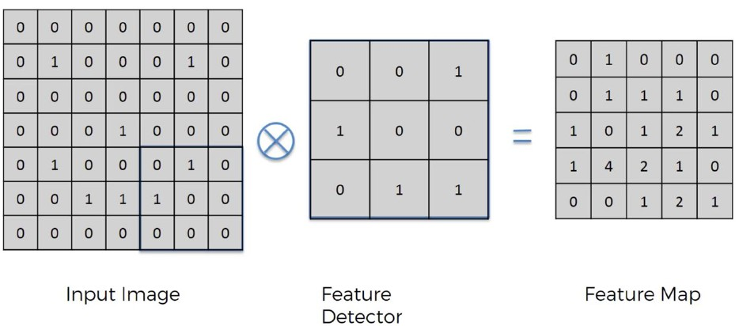
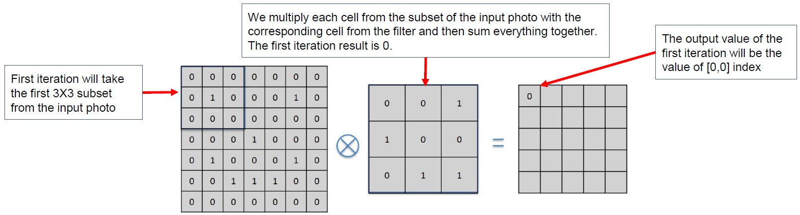

## רשת עצבית קונבולוציונית (CNN - Convolutional Neural Network)

 רשת עצבית עמוקה שמתמחה בעיבוד תמונות ווידאו
במקום לסרוק את כל התמונה כמו רשת רגילה, CNN מתמקדת בחלקים חשובים מתוך התמונה דרך מסננים (filters) שמחפשים תבניות כמו קווים, צורות, או טקסטורות

### איך זה עובד?

1. **שכבת קלט** → מקבלת את פיקסלי התמונה כערכים מספריים (שחור-לבן או צבעוני)
2. **שכבה קונבולוציונית** → מפעילה מסננים שמזהים מאפיינים שונים בתמונה
3. **פונקציית הפעלה (ReLU)** → מבטלת ערכים שליליים ושומרת רק את החשובים
4. **שכבת Pooling** → מקטינה את גודל התמונה מבלי לאבד מידע חשוב
5. **Flattening** → ממירה את כל הפלטים לשורה אחת ארוכה
6. **שכבה צפופה (Fully Connected)** → שכבה רגילה של ANN שמבצעת את הסיווג הסופי


## ייצוג תמונה במחשב

תמונה היא מטריצה דו-ממדית של פיקסלים
בתמונות צבעוניות כל פיקסל מיוצג ב־3 ערוצים: אדום, ירוק, כחול (RGB)

### דוגמה:


תמונה בגודל 2x2 תיוצג כך:

```python
image = [
  [[255, 0, 0], [0, 255, 0]],
  [[0, 0, 255], [255, 255, 255]]
]
```

## מהי פעולת קונבולוציה?

קונבולוציה היא פעולה מתמטית שבה מחליקים פילטר קטן על כל אזור בתמונה ומבצעים חישוב מקומי
למשל, פילטר בגודל 3x3 מוכפל באיזור תואם בתמונה וכל הערכים מסוכמים לנקודה אחת חדשה


### למה זה חשוב?

הקונבולוציה עוזרת למצוא תבניות בתמונה כמו קווים או מעברים בין צבעים

## יצירת Feature Map

התוצאה של קונבולוציה היא "מפת מאפיינים" (Feature Map) – תמונה מוקטנת עם מידע חשוב בלבד

1. המסנן מחליק על התמונה
2. כל פעם הוא מחשב תוצאה נקודתית
3. נוצרת תמונה חדשה (Feature Map)



### 🔁 איך מתבצעת פעולת הקונבולוציה?

לוקחים לדוגמא חתיכה בגודל 3×3 מתוך התמונה (מתחילים מהפינה השמאלית העליונה)

כופלים איבר־איבר בין הפילטר לחתיכה הזו (כל תא מול התא המתאים)

מסכמים את כל התוצאות → מקבלים מספר אחד

שמים את המספר הזה במקום המתאים במפת המאפיינים (Feature Map)

מזיזים את הפילטר **משבצת אחת ימינה** וחוזרים על התהליך

ממשיכים עד שסורקים את כל התמונה

כשהפילטר מגיע לסוף השורה, הוא יורד **שורה אחת למטה** ומתחיל שוב משמאל

החלון לא "חורג" מהתמונה – הוא תמיד נמצא בתוך הגבולות שלה
לכן הפלט קטן **יותר מהקלט**

**מה עושים אם רוצים לשמור על הגודל המקורי?**
משתמשים בטכניקה שנקראת padding – כלומר מוסיפים שוליים של אפסים סביב התמונה לפני שמתחילים את הקונבולוציה



### מה הרווחנו?

* הפחתת גודל התמונה
* שמירה על תבניות חשובות

## כמה מסננים?

אפשר להשתמש במספר מסננים – כל מסנן מזהה תבנית אחרת
יותר מסננים → יותר מאפיינים → רשת חזקה יותר
המסננים נוצרים אקראית בהתחלה ומתעדכנים תוך כדי האימון (backpropagation)

## ReLU – פונקציית הפעלה

לאחר פעולת הקונבולוציה אנחנו מפעילים ReLU

### למה?

כדי להוסיף לא-לינאריות למודל ולסנן ערכים שליליים

* ערכים חיוביים נשארים
* ערכים שליליים הופכים ל־0

## Pooling – חיבור מידע והקטנה


Pooling היא פעולה שמטרתה להקטין את גודל התמונה ולהפוך את הרשת לפחות רגישה לשינויים קטנים

### סוגים:

* Max Pooling → שומר את הערך הגבוה ביותר בחלון
* Average Pooling → ממוצע של כל הערכים בחלון
* Min Pooling → הערך הנמוך ביותר

### למה זה טוב?

* חיסכון בחישוב
* הקטנת סיכוי ל־Overfitting
* הכללה טובה יותר (Generalization)

## איך Pooling עובד?

1. בוחרים גודל חלון (למשל 2x2)
2. מחליקים את החלון על מפת המאפיינים בלי חפיפה
3. בכל חלון בוחרים ערך לפי השיטה (max, avg)

## Flattening – הכנת הנתונים לסיווג


לאחר שיצרנו מפות מאפיינים מוקטנות, ממירים את כולן לשורה אחת ארוכה (וקטור)
וקטור זה יועבר לשכבה הצפופה (Fully Connected)

## שכבה צפופה (Fully Connected Layer)


השכבה הצפופה היא כמו רשת רגילה (ANN) ומבצעת את הסיווג הסופי

* כל נוירון מחובר לכל הקלטים
* משתמשים בפונקציות הפעלה כמו:

  * ReLU לשכבות מוסתרות
  * Sigmoid לסיווג בינארי
  * Softmax לסיווג רב־קטגורי

## איך CNN לומדת?

1. האימון כולל עדכון של המסננים, המשקלים ופונקציות ההפעלה
2. תהליך זה נקרא Backpropagation – חוזרים אחורה ומתקנים את הרשת לפי השגיאה
3. הרשת לומדת לזהות אילו מאפיינים חשובים לתוצאה

## סיכום זרימת הנתונים ב־CNN

1. קלט תמונה
2. פעולת קונבולוציה + ReLU → יצירת מפת מאפיינים
3. Pooling → הקטנה ושמירה על מידע חשוב
4. Flattening → הפיכת הנתונים לווקטור
5. Fully Connected → סיווג סופי לפי הקטגוריה המתאימה
