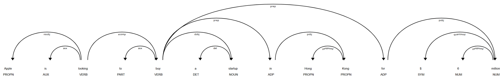

# ניתוח טקסט עם SpaCy – פונקציונליות בסיסית המשך

## Noun Chunks, displaCy, and Visualization in SpaCy

## 🧠 מה זה Noun Chunk?

### Noun Chunk (צירוף שמני)

השורש ש־ם־ע או ליתר דיוק מהמילה שֵׁם — במשמעות שם עצם

צירוף שמני הוא רצף מילים שמכיל ⭐שם עצם⭐ (או כנוי גוף) יחד עם תארים, מילות יחס או קבעים שמתארים אותו.

#### דוגמא:
> "The quick brown fox" ← צרוף שמני אחד

## כיצד SpaCy מזהה אותם?

המודל מזהה באופן אוטומטי צירופים שמניים בכל משפט בטקסט, ומציע להם גישה עם `noun_chunks`

```python
import spacy
nlp = spacy.load("en_core_web_sm")
doc = nlp("The quick brown fox jumps over the lazy dog.")

for chunk in doc.noun_chunks:
    print(chunk.text)
```

#### Output:
```
The quick brown fox
the lazy dog
```

## למה זה שימוש?

Noun Chunks represent meaningful content units that reflect the main entities and owners in the sentence

Recognizing them helps identify the core structure and focus of the text

### Uses of Noun Chunks:
- **Information Retrieval** → Isolate and extract relevant information from text  
- **Text Summarization** → Identify the most informative parts of a sentence  
- **Semantic NLP Tasks** → Useful in tasks involving deeper understanding of meaning and relationships in text

## ה- 🎨 displaCy – ויזואליזציה גרפית

ספייסי מצעה displaCy ככלי שמזרה בספסי הפעלה את המבנה הגרמטית במשפט ואת הישויות בשם

### שינוי displaCy:
- **Dependency Parsing** → מציג את הקשר בין המילים
- **Named Entity Recognition (NER)** → מציג את הישויות השם

### ששוו:
```python
from spacy import displacy
import spacy

nlp = spacy.load("en_core_web_sm")
doc = nlp("Apple is looking to buy a startup in Hong Kong for $6 million")

displacy.render(doc, style="dep", jupyter=True)  # להציג תחביר

displacy.render(doc, style="ent", jupyter=True)  # להציג ישויות בשם
```




```python
doc = nlp('Over the last quarter Apple sold nearly 20 thousand iPods for a profit of $6 million.')
displacy.render(doc, style='ent', jupyter=True)
```


## סיכום:

* `noun_chunks` returns noun phrases automatically from the text
* `displaCy` offers visual representation of key linguistic elements in the sentence
* Understanding and using these tools helps you analyze both the structure and content of text effectively
