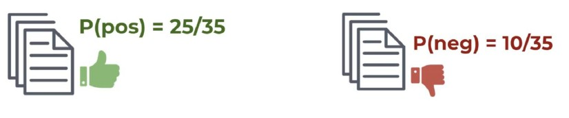

# דוגמה פשוטה: Naive Bayes ב־NLP

## שלב 1: הגדרת הבעיה


יש לנו 35 ביקורות סרטים.  
כל ביקורת כוללת טקסט ואת הסיווג שלה: חיובית או שלילית

המטרה: לאמן מודל Naive Bayes שיוכל לחזות אם ביקורת חדשה היא חיובית או שלילית

## שלב 2: חישוב הסתברויות בסיסיות (Prior)

מתוך 35 ביקורות:

- 25 חיוביות  
- 10 שליליות  

לכן:

- P(pos) = 25 / 35  
- P(neg) = 10 / 35  



## שלב 3: ספירת מילים בכל קטגוריה

אנחנו מבצעים Count Vectorization — סופרים כמה פעמים כל מילה הופיעה בכל קטגוריה

**חיובי**:

| מילה   | מופעים |
|--------|--------|
| movie  | 10     |
| actor  | 2      |
| great  | 8      |
| film   | 4      |

**סה״כ מילים בקטגוריה חיובית: 24**

**שלילי**:

| מילה   | מופעים |
|--------|--------|
| movie  | 8     |
| actor  | 10      |
| great  | 0     |
| film   | 2      |

**סה״כ מילים בקטגוריה שלילית: 20**


אז:

- P(movie | pos) = 10 / 24 = 0.42  
- P(actor | pos) = 2 / 24 = 0.08  
- P(great | pos) = 8 / 24 = 0.33  
- P(film | pos) = 4 / 24 = 0.17


## שלב 4: חישוב הסתברויות עבור קטגוריה שלילית

**שלילי**:

| מילה   | מופעים |
|--------|--------|
| movie  | 8      |
| actor  | 10     |
| great  | 0      |
| film   | 2      |

**סה״כ מילים בקטגוריה שלילית: 20**

אז:

- P(movie | neg) = 8 / 20 = 0.4  
- P(actor | neg) = 10 / 20 = 0.5  
- P(great | neg) = 0 / 20 = 0  
- P(film | neg) = 2 / 20 = 0.1


## שלב 5: חיזוי טקסט חדש: "movie actor"

### עבור "positive":

```
P(pos) * P(movie | pos) * P(actor | pos)
= (25/35) * (0.42) * (0.08) = 0.024
```

### עבור "negative":

```
P(neg) * P(movie | neg) * P(actor | neg)
= (10/35) * (0.4) * (0.5) = 0.057
```

🟢 לכן התוצאה הסופית היא: **Negative**

🖼️ **הוספת תמונה**: ADD IMAGE HERE FROM PAGE 13

## שלב 6: בעיית אפס הסתברות

ניקח טקסט חדש: `"great movie"`

אם נחשב עבור negative:

```
P(neg) * P(great | neg) * P(movie | neg)
= (10 / 35) * 0 * 0.4 = 0
```

למה? כי המילה "great" לא הופיעה בכלל בביקורות שליליות → הסתברות = 0

### פתרון: Alpha Smoothing

נוסיף ערך קטן (למשל 1) לכל ספירת מילה, כדי למנוע אפס.

🖼️ **הוספת תמונה**: ADD IMAGE HERE FROM PAGE 14