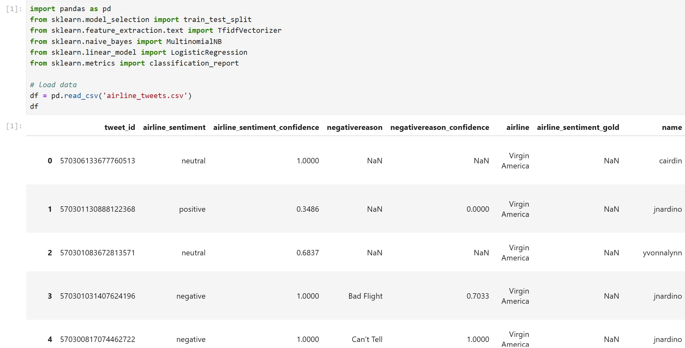
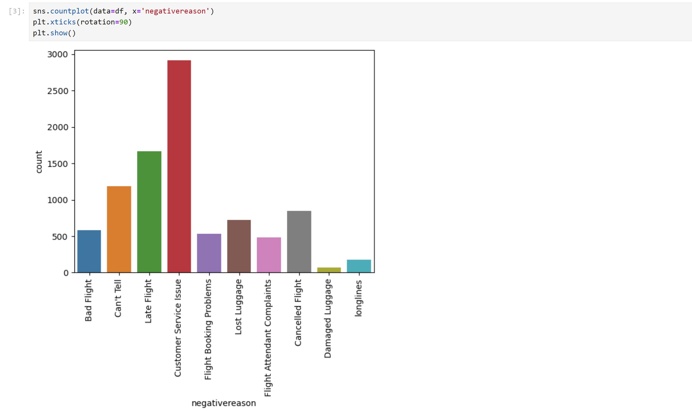
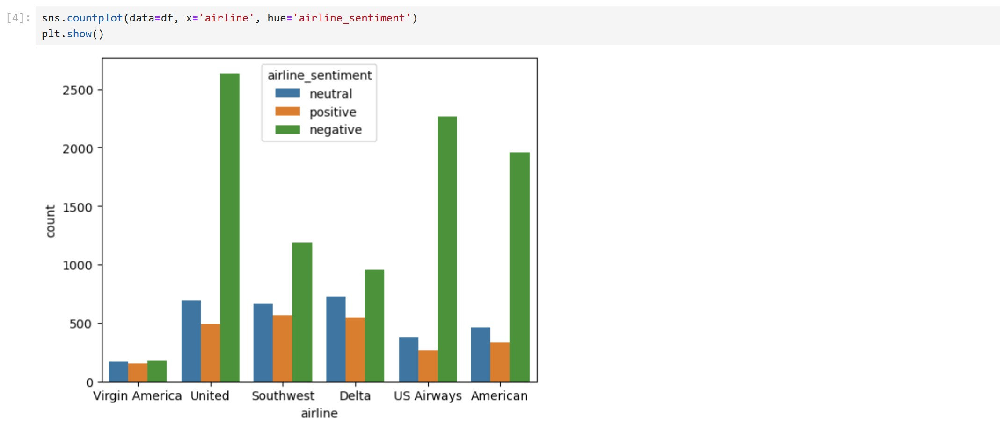
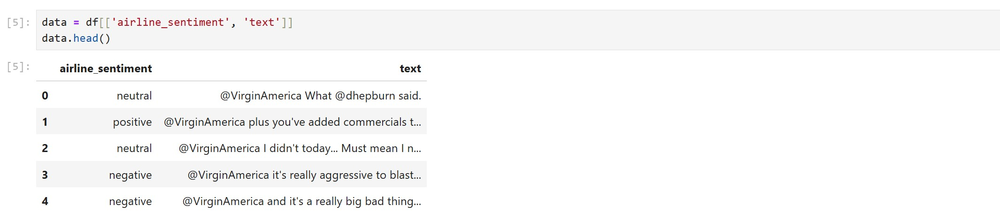
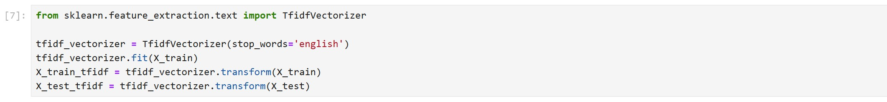

# Naive Bayes in NLP – Python Example

אנחנו עובדים עם הקובץ `airline_tweets.csv` שמכיל ציוצים של לקוחות, עם טקסט חופשי ותווית רגשית (positive, neutral, negative)

המטרה שלנו היא לחזות את הרגש של כל ציוץ לפי התוכן שלו בלבד

## שלב 1: טעינת הנתונים



## שלב 2: חקירת הנתונים

- סופרים כמה ציוצים יש לכל תווית רגשית
- מזהים שמרבית הציוצים הם שליליים
- בודקים אילו סיבות ניתנו לציוצים שליליים

נספור כמות ציוצים:


נספור כמה לכל סיבה:



נספור כמה יש בכל קטגוריה לפי חברת תעופה:



## שלב 3: הכנת הנתונים

- בוחרים רק את עמודת `text` (תוכן הציוץ) כקלט
- עמודת `airline_sentiment` משמשת כתיוג (label)



- מבצעים פיצול ל־Train/Test


- מבצעים וקטוריזציה מסוג TF-IDF על טקסט בלבד

> שים לב: כדי להימנע מדליפת מידע (Data Leakage), מבצעים את הפיצול **לפני** הווקטוריזציה



מה זה וקטוריזציה?

וקטוריזציה היא תהליך שבו אנחנו ממירים טקסטים (שפה טבעית) לייצוג מספרי (וקטורים), כדי שמודלים של למידת מכונה יוכלו לעבוד איתם

במקרה הזה, אנחנו משתמשים בשיטת TF-IDF — Term Frequency-Inverse Document Frequency — שמחשבת משקל לכל מילה בטקסט לפי:

ה- כמה פעמים היא מופיעה בטקסט (TF)

ה- ועד כמה היא ייחודית ביחס לשאר הטקסטים (IDF)

## שלב 4: אימון המודלים

- מאמנים מודל מסוג `MultinomialNB` (Naive Bayes)
- בנוסף, מאמנים גם `LogisticRegression` לצורך השוואה

**AD PICTURE FROM PAGE 19**

### קוד Python לאימון המודלים:

```python
# ייבוא ספריות
import pandas as pd
from sklearn.model_selection import train_test_split
from sklearn.feature_extraction.text import TfidfVectorizer
from sklearn.naive_bayes import MultinomialNB
from sklearn.linear_model import LogisticRegression
from sklearn.metrics import classification_report

# טעינת הדאטה
df = pd.read_csv('airline_tweets.csv')

# יצירת תכונות ותוויות
X = df['text']
y = df['airline_sentiment']

# פיצול ל-Train ו-Test
X_train, X_test, y_train, y_test = train_test_split(X, y, test_size=0.2, random_state=42)

# וקטוריזציה עם TF-IDF (רק על הטקסט)
vectorizer = TfidfVectorizer(stop_words='english')
X_train_vec = vectorizer.fit_transform(X_train)
X_test_vec = vectorizer.transform(X_test)

# יצירת מודל Naive Bayes ואימון
nb_model = MultinomialNB()
nb_model.fit(X_train_vec, y_train)

# מודל נוסף להשוואה – Logistic Regression
log_model = LogisticRegression(max_iter=1000)
log_model.fit(X_train_vec, y_train)

# בדיקת דיוק וביצועים
def evaluate_model(model, name):
    print(f"\n{name} Results:")
    predictions = model.predict(X_test_vec)
    print(classification_report(y_test, predictions))

# הצגת ביצועים של שני המודלים
evaluate_model(nb_model, "Naive Bayes")
evaluate_model(log_model, "Logistic Regression")
```
## שלב 5: הערכת ביצועים

- פונקציה שמחשבת את התוצאות של כל מודל על סט הבדיקה
- מדפיסים precision, recall, f1 לכל מחלקה

**AD PICTURE FROM PAGE 20**

## שלב 6: השוואת ביצועים

- המודל של Logistic Regression מדויק יותר מ־Naive Bayes
- זה צפוי, כי Logistic Regression מודל מורכב יותר

**AD PICTURE FROM PAGE 21**

## גרף השוואת דיוק בין מודלים

