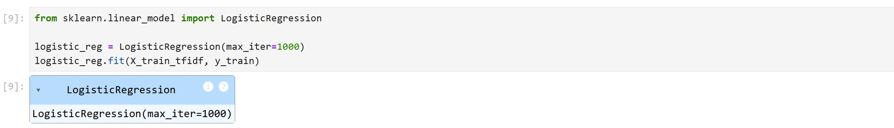

# Naive Bayes in NLP – Python Example

אנחנו עובדים עם הקובץ `airline_tweets.csv` שמכיל ציוצים של לקוחות, עם טקסט חופשי ותווית רגשית (positive, neutral, negative)

המטרה שלנו היא לחזות את הרגש של כל ציוץ לפי התוכן שלו בלבד

## שלב 1: טעינת הנתונים


## שלב 2: חקירת הנתונים

- סופרים כמה ציוצים יש לכל תווית רגשית
- מזהים שמרבית הציוצים הם שליליים
- בודקים אילו סיבות ניתנו לציוצים שליליים

נספור כמות ציוצים:


נספור כמה לכל סיבה:


נספור כמה יש בכל קטגוריה לפי חברת תעופה:


## שלב 3: הכנת הנתונים

- בוחרים רק את עמודת `text` (תוכן הציוץ) כקלט
- עמודת `airline_sentiment` משמשת כתיוג (label)


- מבצעים פיצול ל־Train/Test


- מבצעים וקטוריזציה מסוג TF-IDF על טקסט בלבד

> שים לב: כדי להימנע מדליפת מידע (Data Leakage), מבצעים את הפיצול **לפני** הווקטוריזציה


**מה זה וקטוריזציה?**

וקטוריזציה היא תהליך שבו אנחנו ממירים טקסטים (שפה טבעית) לייצוג מספרי (וקטורים), כדי שמודלים של למידת מכונה יוכלו לעבוד איתם

במקרה הזה, אנחנו משתמשים בשיטת TF-IDF — Term Frequency-Inverse Document Frequency — שמחשבת משקל לכל מילה בטקסט לפי:

פ- כמה פעמים המילה מופיעה בטקסט (TF)

פ- ועד כמה המילה ייחודית ביחס לשאר הטקסטים (IDF)

הפקודה transform לוקחת את הטקסט שלך (למשל X_train או X_test) וממירה כל טקסט ל־וקטור של מספרים

בהתאם למה שנלמד קודם עם fit

**מה עושה הפרמטר stop_words='english'?**

הוא אומר: "אל תכלול מילים נפוצות באנגלית בתהליך הוקטוריזציה"

מדוע?

בזמן שאנחנו עושים וקטוריזציה לטקסט (כמו TF-IDF), אנחנו לא רוצים לכלול מילים חסרות משמעות

כאלה שמופיעות כמעט בכל משפט ולא באמת תורמות להבנת התוכן

**למה לא עושים fit_transform(X_test) בנפרד ל־test?**

כי אם תעשה fit_transform(X_test), אתה בעצם מלמד את המודל מחדש על דאטה שהוא אמור לבדוק —

וזה גורם ל־Data Leakage ❌

כי ב־test אתה רוצה לבדוק את המודל על משהו חדש לגמרי בלי שהייתה לו גישה מראש למידע הזה

## שלב 4: אימון המודלים

**מאמנים מודל מסוג `MultinomialNB` (Naive Bayes)**

ה- MultinomialNB הוא מימוש של אלגוריתם Naive Bayes, שמיועד לבעיות סיווג (classification)

למה דווקא Multinomial?

כי בניגוד לגרסאות אחרות של Naive Bayes (כמו Gaussian),
הגרסה הזו יודעת לעבוד הכי טוב כשאנחנו סופרים כמה פעמים מופיעה כל מילה בטקסט
וזה בדיוק מה שאנחנו עושים בטקסטים אחרי CountVectorizer או TF-IDF

אם לדוגמא הנתונים שלנו הם רציפים (continuous values) — כלומר מספרים אמיתיים ולא ספירות של מילים
לדוגמא: טמפרטורה, גובה וכו' נשתמש ב- GaussianNB


בנוסף, מאמנים גם `LogisticRegression` לצורך השוואה



**מה התוכנית עושה?**

אנחנו רוצים לחזות את הרגש של ציוץ (חיובי, שלילי או ניטרלי) כדי לעשות את זה — אנחנו צריכים מודל שלומד מתוויות העבר

מה Naive Bayes עושה פה?

הוא מקבל: טקסטים של ציוצים ומה התיוג שלהם (רגש)

ואז: לומד מה הסיכוי שמילים מסוימות שייכות לרגש מסוים

לדוגמה: אם מופיעה המילה "delayed", הוא לומד שזה מופיע הרבה בציוצים שליליים

כלומר: הוא בונה מודל שאומר "אם מופיעות המילים האלו — הסיכוי הכי גבוה שהציוץ שלילי"

**מה Logistic Regression עושה פה?**

הוא מקבל את אותם הנתונים בדיוק כמו Naive Bayes אבל הוא לא משתמש בהסתברויות, אלא:

מחשב גבול החלטה מתמטי בין המחלקות

לומד באופן סטטיסטי מה שוקל הכי הרבה כדי לקבוע אם ציוץ הוא חיובי או שלילי

כלומר: הוא מנסה למצוא פונקציה שמפרידה הכי טוב בין רגשות, על סמך כל המילים יחד

**אז למה צריך את שניהם?**

כי אנחנו רוצים לבדוק: איזה מודל מתאים יותר לבעיה שלנו

ולכן מריצים את שניהם על אותם נתונים:
ה- Naive Bayes: פשוט ומהיר, מתאים כשיש תכונות עצמאיות (מילים בלי קשר ביניהן)

ה- Logistic Regression: חזק ומדויק יותר, מתאים כשהקשרים בין מילים חשובים

ואז משווים: מי פגע טוב יותר ברגש? מי נתן תוצאה טובה יותר?

### קוד Python לאימון המודלים:

```python
# ייבוא ספריות
import pandas as pd
from sklearn.model_selection import train_test_split
from sklearn.feature_extraction.text import TfidfVectorizer
from sklearn.naive_bayes import MultinomialNB
from sklearn.linear_model import LogisticRegression
from sklearn.metrics import classification_report

# טעינת הדאטה
df = pd.read_csv('airline_tweets.csv')

# יצירת תכונות ותוויות
X = df['text']
y = df['airline_sentiment']

# פיצול ל-Train ו-Test
X_train, X_test, y_train, y_test = train_test_split(X, y, test_size=0.2, random_state=42)

# וקטוריזציה עם TF-IDF (רק על הטקסט)
vectorizer = TfidfVectorizer(stop_words='english')
X_train_vec = vectorizer.fit_transform(X_train)
X_test_vec = vectorizer.transform(X_test)

# יצירת מודל Naive Bayes ואימון
nb_model = MultinomialNB()
nb_model.fit(X_train_vec, y_train)

# מודל נוסף להשוואה – Logistic Regression
log_model = LogisticRegression(max_iter=1000)
log_model.fit(X_train_vec, y_train)

# בדיקת דיוק וביצועים
def evaluate_model(model, name):
    print(f"\n{name} Results:")
    predictions = model.predict(X_test_vec)
    print(classification_report(y_test, predictions))

# הצגת ביצועים של שני המודלים
evaluate_model(nb_model, "Naive Bayes")
evaluate_model(log_model, "Logistic Regression")
```
## שלב 5: הערכת ביצועים

- פונקציה שמחשבת את התוצאות של כל מודל על סט הבדיקה
- מדפיסים precision, recall, f1 לכל מחלקה

**AD PICTURE FROM PAGE 20**

## שלב 6: השוואת ביצועים

- המודל של Logistic Regression מדויק יותר מ־Naive Bayes
- זה צפוי, כי Logistic Regression מודל מורכב יותר

**AD PICTURE FROM PAGE 21**

## גרף השוואת דיוק בין מודלים

