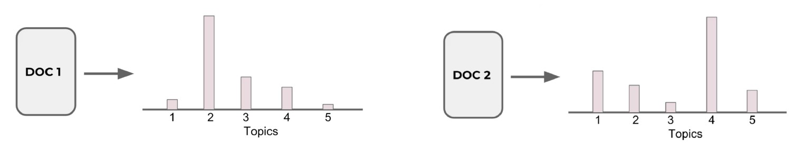

# Topic Modeling 

## 🧠 מה זה Topic Modeling?

ה- Topic Modeling הוא שיטה ב־NLP שמטרתה **לגלות נושאים סמויים** מתוך טקסטים לא מתויגים  
(כלומר: Unsupervised Learning).  
זהו מודל סטטיסטי שמנסה להבין על מה מדברים בטקסט, מבלי שהתווינו לו תגיות מראש

## 📌 מה זה Topic?

ה- "Topic" (נושא) הוא אוסף מילים שמופיעות הרבה יחד ומרמזות על נושא משותף  
לדוגמה: נושא על פירות עשוי לכלול את המילים "apple", "banana", "orange"

## 🛠️ למה משתמשים בזה?

- **המלצות תוכן** – התאמת מאמרים דומים לפי נושאים
- **קיבוץ מסמכים** – על בסיס דמיון רעיוני
- **ניתוח מגמות** – מעקב אחרי שינויי נושאים לאורך זמן
- **שיפור מנועי חיפוש** – על ידי הבנת נושא המסמך

## 🔑 שלבים עיקריים ב־Topic Modeling:

**עיבוד מקדים של הטקסט**  
כולל טוקניזציה, הסרת stop words, סטמינג / למטיזציה, וקטוריזציה (TF-IDF / Count)
- פ- טוקניזציה פיצול הטקסט למילים בודדות
- פ- הסרת stop words
- פ- למטיזציה מחזירים את המילים לשורש שלהן
- פ- וקטוריזציה: סופרים כמה פעמים כל מילה מופיעה (Count), או מחשבים משקל לכל מילה לפי הופעתה במסמך ביחס לשאר המסמכים (TF-IDF)

**בחירת מספר נושאים (k)**  
כמו ב־Clustering – אנחנו קובעים כמה נושאים המודל ינסה למצוא

**אימון המודל**  
שתמשים באלגוריתמים כמו:
- פ- LDA – Latent Dirichlet Allocation - יוסבר בהמשך
- פ- NMF – Non-Negative Matrix Factorization - יוסבר בהמשך

**פרשנות והבנה של הנושאים**  
המודל מחזיר:
- עבור כל נושא → רשימת מילים אופייניות
- עבור כל טקסט → הסתברות לכל נושא

## מודל LDA Model

### מה זה LDA – Latent Dirichlet Allocation?

 Latent = סמוי, חבוי

 Dirichlet = שם של התפלגות סטטיסטית

 Allocation = הקצאה

Latent Dirichlet Allocation = הקצאה של נושאים סמויים למסמכים, בעזרת התפלגות דירישלה

ה- LDA הוא מודל הסתברותי גנרטיבי שמשמש ל־**Topic Modeling**  
המטרה שלו היא לגלות אילו נושאים סמויים מרכיבים אוסף של מסמכים

#### 💡 מה ההנחה של המודל?

- כל **מסמך** הוא תערובת של **כמה נושאים**
- כל **נושא** הוא תערובת של **כמה מילים**

המשימה של המודל היא:
> לגלות מהי תערובת הנושאים בכל מסמך, ומהי תערובת המילים בכל נושא

#### 🧪 איך זה עובד?

1. עבור כל מסמך, המודל מחזיר התפלגות הסתברותית – כמה הוא שייך לכל נושא  
2. עבור כל נושא, המודל מחזיר את המילים שמאפיינות אותו (עם הסתברויות)

#### 🔍 לדוגמה:

- מסמך 1: 70% נושא "טכנולוגיה", 30% נושא "ספורט"  
- נושא "טכנולוגיה": ["computer", "keyboard", "internet"]  
- נושא "ספורט": ["game", "score", "team"]

#### 🧩 למה זה דומה?

אפשר לחשוב על נושאים כעל קלאסטרים (clusters)  
המסמכים לא משתייכים רק לאחד – אלא לכל הנושאים, עם הסתברויות שונות

#### 🎯 מתי זה שימושי?

- כשאין תוויות למסמכים
- כשאנחנו רוצים להבין על מה מדברים טקסטים
- כשצריך לסכם או לקבץ טקסטים לפי רעיונות סמויים

#### 📊 ההבדל בין Topic Modeling לבין Clustering רגיל

| תכונה                      | Topic Modeling (LDA)           | Clustering רגיל (KMeans למשל) |
|----------------------------|--------------------------------|-------------------------------|
| מספר תוויות לכל מסמך       | כמה נושאים עם הסתברויות       | רק קלאסטר אחד                |
| למידה מונחית או לא?         | לא מונחית (Unsupervised)        | לרוב לא מונחית               |
| משקל לכל תכונה              | לפי הסתברות מילה לנושא         | לפי מיקום במרחב              |

#### 🧪 בפועל:

> נריץ LDA על טקסטים ונקבל:
> - עבור כל מסמך: לאיזה נושאים הוא שייך (ואחוז שייכות)
> - עבור כל נושא: אילו מילים מייצגות אותו הכי חזק

### 🧩 ההבדל בין LDA לבין Clustering רגיל

ב־**Clustering רגיל** (כמו K-Means):
- כל מסמך משויך **לאשכול אחד בלבד**

לעומת זאת, ב־**LDA**:
- כל מסמך משויך **לכמה נושאים שונים**, לפי **הסתברות**  
- כלומר, כל מסמך מורכב מתערובת של נושאים

### 🎯 דוגמה:

נניח שיש לנו 2 מסמכים והרצנו עליהם מודל LDA עם 5 נושאים (`Topics 1–5`)

#### עבור כל מסמך, נקבל:
- **DOC 1**: Mostly belongs to topic 2, and partially to topics 3 and 4  
- **DOC 2**: Mostly belongs to topic 4, and partially to topics 1, 2, and 5

🟩 כלומר:
> כל מסמך מיוצג כווקטור הסתברויות – כמה הוא שייך לכל Topic

