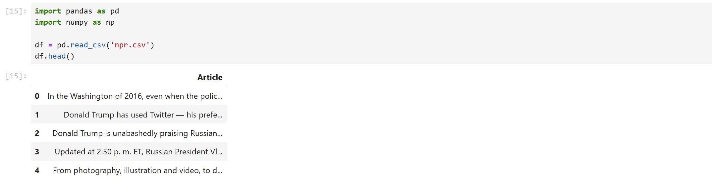
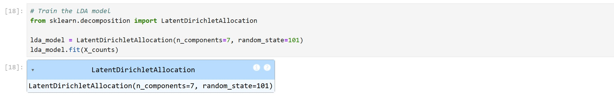

# Topic Modeling with LDA – Python Example 

### שלב 1: טעינת הקובץ ובדיקת טקסט לדוגמה

המודל יתבסס על הקובץ `npr.csv` שמכיל מסמכי טקסט לא מתויגים ממגוון תחומים  
נתבונן על דוגמה אחת מתוך המסמכים כדי להבין את מבנה הטקסט



נסתכל על המסמך הראשון


### שלב 2: וקטוריזציה באמצעות CountVectorizer

נשתמש ב־CountVectorizer כדי להמיר את הטקסטים למטריצת תכונות  
נשתמש בפרמטרים:

- `min_df=2` → מסיר מילים שמופיעות בפחות משני מסמכים
- `max_df=0.9` → מסיר מילים שמופיעות בלמעלה מ־90% מהמסמכים


### שלב 3: אימון מודל LDA

נאמן את המודל בעזרת המחלקה `LatentDirichletAllocation` מ־sklearn

- `n_components=7` → נגדיר שנרצה לגלות 7 נושאים
- `random_state=42` → להבטיח תוצאה עקבית



### שלב 4: בדיקת התפלגות הסתברויות של מילים לכל נושא

נשתמש במתודה `get_feature_names_out` כדי לקבל את רשימת כל הטוקנים  
ולאחר מכן נבדוק את המטריצה שנוצרה — שבה:

- כל שורה מייצגת נושא
- כל עמודה מייצגת מילה
- הערכים הם הסתברות שהמילה שייכת לאותו נושא


### שלב 5: איתור המילים החזקות ביותר לכל נושא

נשתמש ב־`np.argsort()` כדי לסדר את כל המילים לפי ההסתברות שלהן  
ונבחר את **10 המילים עם ההסתברות הגבוהה ביותר לכל Topic**

כך נוכל **לנסות לתת שם לנושא לפי המילים שמייצגות אותו**  
לדוגמה: נושא 1 מכיל מילים שקשורות ל־Politics → ניתן לתייג אותו כ־"בחירות"


### שלב 6: שיוך נושא לכל מסמך

לבסוף, נגדיר עמודה חדשה ב־DataFrame עם השיוך לנושא הכי סביר  
נשתמש ב־`.argmax(axis=1)` על מטריצת התוצאות כדי לשייך כל מסמך לנושא בעל ההסתברות הגבוהה ביותר

📷 **הוסף תמונה מעמוד 33**

## הקוד המלא

```python
# Load the data
import pandas as pd
import numpy as np

df = pd.read_csv('npr.csv')
df.head()

# Look at a specific document
df['Article'][0]

# Feature extraction with count vectorization
from sklearn.feature_extraction.text import CountVectorizer

X = df['Article']
count_vectorizer = CountVectorizer(max_df=0.9, min_df=2, stop_words='english')
X_counts = count_vectorizer.fit_transform(X)

# Train the LDA model
from sklearn.decomposition import LatentDirichletAllocation

lda_model = LatentDirichletAllocation(n_components=7, random_state=101)
lda_model.fit(X_counts)

# Examine the count vectorizer tokens
print(len(count_vectorizer.get_feature_names_out()))
print(type(count_vectorizer.get_feature_names_out()))

# Check the LDA model components
lda_model.components_.shape

# Look at the components (probabilities of tokens for each topic)
lda_model.components_

# Example of using np.argsort
array = np.array([10, 2, 5])
np.argsort(array)

# Get the top 10 tokens for the first topic
first_topic = lda_model.components_[0]
np.argsort(first_topic)[-10:]

# Get the top 10 tokens for each topic
for topic_idx, topic in enumerate(lda_model.components_):
    topic_token_array = []
    for index in topic.argsort()[-10:]:
        topic_token_array.append(count_vectorizer.get_feature_names_out()[index])
    print(f"Topic number {topic_idx} - Top 10 tokens:")
    print(topic_token_array)
    print()

# Get the topic distribution for the documents
topic_results = lda_model.transform(X_counts)
topic_results[0]  # Probability distribution for the first document

# Assign the most likely topic to each document
df['topic'] = topic_results.argmax(axis=1)
df.head()
```