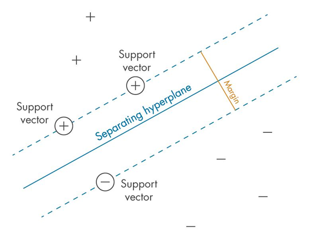
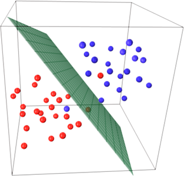

# 🤖 מכונת וקטורים תומכים (SVM – Support Vector Machine)

## 🧠 מה זה SVM?

SVM היא שיטת **למידת מכונה מונחית (Supervised Learning)**, שנועדה:
- **לסווג** דוגמאות (Classification)
- או לבצע **רגרסיה** (Regression – חיזוי ערכים רציפים)

המטרה העיקרית:  
**למצוא את הגבול שמפריד בצורה הכי טובה בין קבוצות שונות של דוגמאות**


---

## 🎯 מה המטרה של SVM?

למצוא את **הקו/מישור (Hyperplane)** שמפריד בצורה מקסימלית בין קבוצות 
המטרה היא להגדיל את המרחק מהקו אל הנקודות הקרובות ביותר – הנקראות **וקטורים תומכים**

**וקטורים תומכים – Support Vectors**

הנקודות הקרובות ביותר לקו ההפרדה

- הן אלו שקובעות את מיקום הקו
- אם תזיז נקודה אחרת – הקו לא יזוז
- אם תזיז וקטור תומך – הקו ישתנה

📌 אלה "הנקודות החשובות ביותר" באימון של SVM



**למה "וקטור תומך" ולא "נקודה תומכת"?**

ההסבר המתמטי:

במתמטיקה, בפרט בגיאומטריה ולמידת מכונה:

כל נקודה במרחב מיוצגת כ־וקטור

לדוגמה: [3, 4] זו נקודה, אבל גם וקטור מהמוצא (0,0) אל [3, 4]

כלומר: נקודה = וקטור שמראה לאן "להגיע" מהראשית

אז במונחים של למידת מכונה:

הנתונים שלנו הם וקטורים במרחב

ולכן גם ה־Support Vectors הם וקטורים שנמצאים הכי קרוב למישור ההפרדה

ולמה "תומך"?
כי הם אלו ש:

תומכים במיקום של מישור ההפרדה

כלומר: הם אלו שקובעים אותו

אם תזיז אחד מהם — המישור יזוז!


---

## 🛤️ מה זה Hyperplane?

- ב־2D: קו ישר
- ב־3D: משטח
- ב־4D ומעלה: פשוט נקרא "Hyperplane"



---

## 🔓 מרווח רך – Soft Margin

בעולם האמיתי הנתונים לא תמיד מופרדים בצורה מושלמת.

Soft Margin:
- מאפשר כמה טעויות קטנות
- נותן למודל להיות **גמיש יותר**
- עוזר למנוע **Overfitting**


---

## ⚙️ פרמטר C

פרמטר חשוב מאוד ב־SVM שמחליט **כמה נאפשר טעויות**:

| ערך C | מה זה עושה? |
|-------|---------------|
| גבוה  | פחות סלחני לטעויות (מודל קשיח, פחות גמיש) |
| נמוך  | סלחני יותר – מאפשר שגיאות קטנות (מודל כללי יותר) |


---

## 🌌 גרעין – Kernel

כאשר הנתונים **לא ניתנים להפרדה בקו ישר**, נשתמש בקרנלים כדי להפוך את המרחב:

- נבצע **מיפוי ל־מרחב חדש** (לרוב גבוה יותר)
- במרחב החדש – כן ניתן להפריד ביניהם בקו ישר!


---

## 🎩 Kernel Trick

"טריק מתמטי" שמאפשר:
- לחשב את **המכפלה הפנימית במרחב החדש**
- בלי באמת לחשב את המיקום החדש של כל נקודה!

זה חוסך **הרבה מאוד זמן וזיכרון**.


---

## 📌 סוגי Kernels נפוצים:

- **Linear** – מתאים כשאפשר להפריד בקו ישר
- **Polynomial** – מתאים כשיש קשרים מורכבים
- **RBF (Gaussian)** – ברירת מחדל, מתאים להרבה בעיות
- **Sigmoid** – כמו נוירונים ברשת עצבית


---

## 🧪 דוגמה קצרה בקוד (Python)

```python
from sklearn import datasets
from sklearn.svm import SVC
import matplotlib.pyplot as plt
import numpy as np
from mlxtend.plotting import plot_decision_regions

# יצירת סט נתונים פשוט
X, y = datasets.make_classification(n_samples=100, n_features=2, 
                                    n_classes=2, n_informative=2, 
                                    n_redundant=0, random_state=42)

# יצירת מודל SVM עם Kernel לינארי
model = SVC(kernel='linear', C=1)
model.fit(X, y)

# הדמיה של תוצאות המודל
plt.figure(figsize=(10, 6))
plot_decision_regions(X, y, clf=model, legend=2)

# סימון הוקטורים התומכים
plt.scatter(model.support_vectors_[:, 0], model.support_vectors_[:, 1],
            s=100, facecolors='none', edgecolors='k', alpha=0.5)

plt.title('SVM עם גרעין לינארי')
plt.xlabel('מאפיין 1')
plt.ylabel('מאפיין 2')
plt.show()
```

## 📊 דוגמאות ויזואליות

### השפעת פרמטר C


### השוואה בין סוגי קרנלים שונים על אותו סט נתונים:


---

## 🔍 דוגמא - בעיית XOR

בעיית XOR היא דוגמא קלאסית לנתונים שלא ניתנים להפרדה בקו ישר:


### עם קרנל RBF ניתן לפתור את בעיית XOR:

```python
from sklearn.svm import SVC
import matplotlib.pyplot as plt
import numpy as np

# סט נתונים של XOR
X = np.array([[0, 0], [0, 1], [1, 0], [1, 1]])
y = np.array([0, 1, 1, 0])

# יצירת מודל עם קרנל RBF
model = SVC(kernel='rbf')
model.fit(X, y)

# הדמיה
h = 0.01
x_min, x_max = -0.5, 1.5
y_min, y_max = -0.5, 1.5
xx, yy = np.meshgrid(np.arange(x_min, x_max, h),
                     np.arange(y_min, y_max, h))

Z = model.predict(np.c_[xx.ravel(), yy.ravel()])
Z = Z.reshape(xx.shape)

plt.contourf(xx, yy, Z, cmap=plt.cm.Paired, alpha=0.8)
plt.scatter(X[:, 0], X[:, 1], c=y, cmap=plt.cm.Paired)
plt.title('פתרון בעיית XOR באמצעות SVM עם קרנל RBF')
plt.show()
```


---

## 📈 שימושים נפוצים של SVM

- **זיהוי טקסט וכתב יד**
- **סיווג תמונות**
- **זיהוי פנים**
- **חיזוי במדעי הרפואה**
- **ניתוח רגשות בטקסט**


