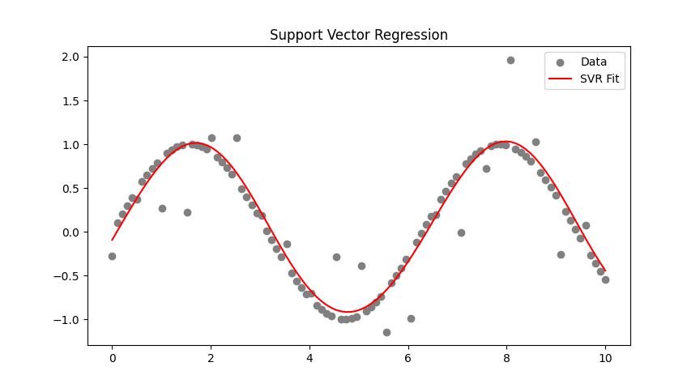

# 📈 Support Vector Regression (SVR)

## מה זה SVR?

SVR (Support Vector Regression) 

גרסה של אלגוריתם מכונת וקטורים תומכים, 
אבל במקום סיווג (קלסיפיקציה) – הוא מבצע **רגרסיה** (חיזוי של ערכים רציפים, כמו מחירים או טמפרטורות)

הוא מנסה למצוא **פונקציה פשוטה ככל האפשר** שמתאימה לנתונים — אך תוך התעלמות משגיאות קטנות



---

# 🎯 Core Idea

Instead of requiring the model to fit every point exactly, SVR allows a **tolerance margin (ε)** around the function. As long as the error is within this ε — we don't care. Only points **above or below this margin** matter.

> ✨ Goal: Find a function where **as many points as possible fall within ±ε**.

---

## 📐 The SVR Tube – "ε-Tube"

- This is a region of ±ε around the predicted function.
- Points **inside the tube** → do not affect the function.
- Points **outside the tube** → affect it (Support Vectors).

---

## 🧠 What Are Support Vectors in SVR?

- They are **points outside the tube** (error > ε).
- They receive weights \( \alpha_i \) or \( \alpha_i^* \). see below
- They are the **only ones that influence the prediction function**.

### 🔍 Analogy:
> The graph is like a rubber band, and the points outside the tube are strings pulling on it — **shaping the function**.

## 🌟 What is Alpha-Star (\( \alpha_i^* \))?

In SVR, every support vector may influence the prediction in one of two ways:

- If the prediction is **too high** compared to the true value → it contributes with \( \alpha_i \)
- If the prediction is **too low** compared to the true value → it contributes with \( \alpha_i^* \)

This leads to the full prediction function:

$$
f(x) = \sum_i (\alpha_i - \alpha_i^*) K(x_i, x) + b
$$

Only **one** of the two (\( \alpha_i \) or \( \alpha_i^* \)) is non-zero for a given point. Together, they create a tug-of-war:

- \( \alpha_i \) pulls the function **down** (penalizing overestimation)
- \( \alpha_i^* \) pulls the function **up** (penalizing underestimation)

> So the support vectors collectively shape the regression line based on whether the model over- or under-shoots the true value.

##### 🔍 But what is \( K(x_i, x) \)?

- \( K(x_i, x) \) is the **kernel function**.
- It measures the **similarity** between a training point \( x_i \) and a prediction point \( x \).
- But here’s the magic:

> 🪄 The kernel allows us to act as if we’ve mapped the data into a higher-dimensional space — **without actually doing it**.

This is what enables SVR (and SVM in general) to model complex, nonlinear functions without computational cost of actual transformation. That’s the **kernel trick**!

---

## ⚙️ General SVR Optimization Formula

$$
\text{Minimize: } \frac{1}{2} \|w\|^2 + C \sum_i (\xi_i + \xi_i^*)
$$

Subject to:

$$
\begin{aligned}
& y_i - w^T x_i - b \leq \varepsilon + \xi_i \\
& w^T x_i + b - y_i \leq \varepsilon + \xi_i^*
\end{aligned}
$$

Where:
- \( \xi_i \): the amount the prediction exceeds the upper boundary (above the ε-tube)
- \( \xi_i^* \): the amount the prediction falls below the lower boundary (below the ε-tube)
- Only one of \( \xi_i \) or \( \xi_i^* \) is non-zero per data point
- \( C \) controls the penalty for large errors (how much we care about violations outside the tube)
- x𝑖 is the input vector (feature)
- 𝑦𝑖 is the true output (label) for that input

---

## 🔢 Linear vs Nonlinear SVR

- In **Linear SVR**, the function is explicitly:
  $$ f(x) = w^T x + b $$
  and we can compute:
  $$ w = \sum_i (\alpha_i - \alpha_i^*) x_i $$

- In **Nonlinear SVR**, we use a **kernel** to measure similarity, and we don’t compute an explicit w:
  $$ f(x) = \sum_i (\alpha_i - \alpha_i^*) K(x_i, x) + b $$

---

## 🎛️ Important SVR Parameters

| Parameter | Role |
|----------|------|
| `ε` (epsilon) | Defines the width of the tube – errors smaller than ε are ignored |
| `C` | Penalizes points outside the tube – controls model complexity |
| `kernel` | Determines function shape (linear, rbf, poly, sigmoid) |
| `gamma` | Used in nonlinear kernels – sets how far each point's influence reaches |

---

## 🧪 Basic Example in Code
```python
from sklearn.svm import SVR
import numpy as np
import matplotlib.pyplot as plt

# Generate data
X = np.linspace(0, 10, 100).reshape(-1, 1)
y = np.sin(X).ravel()
y[::5] += 0.5 * np.random.randn(20)  # add some noise

# SVR model with RBF kernel
model = SVR(kernel='rbf', C=100, epsilon=0.1)
model.fit(X, y)
y_pred = model.predict(X)

# Plot
plt.scatter(X, y, color='gray', label='Data')
plt.plot(X, y_pred, color='red', label='SVR Prediction')
plt.title('SVR with ε-Tube')
plt.legend()
plt.show()
```

---

## 💬 Quick Summary

| Feature              | SVM (Classification)       | SVR (Regression)                      |
|----------------------|-----------------------------|----------------------------------------|
| Goal                 | Separate between classes    | Fit function with ε tolerance         |
| Margin               | Distance between classes    | No margin – there's a tolerance tube  |
| Support Vectors      | Touch the margin boundaries | Outside the tube – influence function |
| Penalized Points     | Misclassified samples        | Points with error > ε                 |
| Prediction Formula   | \( f(x) = w^T x + b \)       | \( f(x) = \sum_i (\alpha_i - \alpha_i^*) K(x_i, x) + b \) |

---

