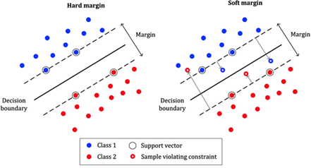
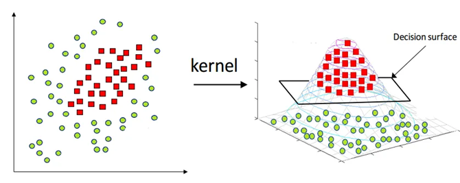
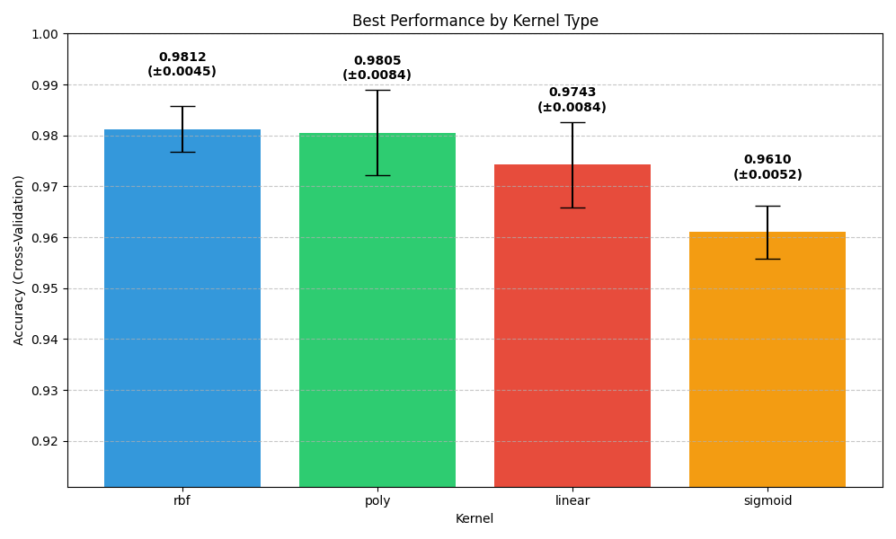

# Support Vector Machines (SVM) - הבנה מקיפה

## 🧠 מה זה SVM?

SVM (Support Vector Machine) היא שיטת **למידת מכונה מונחית (Supervised Learning)**, שנועדה:
- **לסווג** דוגמאות (Classification)
- או לבצע **רגרסיה** (Regression – חיזוי ערכים רציפים)

המטרה העיקרית:  
**למצוא את הגבול שמפריד בצורה הכי טובה בין קבוצות שונות של דוגמאות**

SVM הוא אלגוריתם למידה מונחית המחפש היפרפלן אופטימלי (מישור הפרדה) שיפריד בין קבוצות שונות של נתונים. היפרפלן אופטימלי הוא זה שיוצר את המרווח (margin) המרבי בין הנקודות הקרובות ביותר מכל קבוצה, הידועות כווקטורי תמיכה (support vectors).

מתמטית, עבור נתונים לינאריים, המודל מיוצג על ידי:
- $f(x) = w^T x + b$
- כאשר $w$ הוא וקטור המשקלות
- x הוא וקטור תכונות הקלט
- b הוא ערך ההסטה (bias)
- הנוסחא מתאימה להרבה מימדים ולא רק לדו-מימד


## 🎯 מה המטרה של SVM?

למצוא את **הקו/מישור (Hyperplane)** שמפריד בצורה מקסימלית בין קבוצות. 
המטרה היא להגדיל את המרחק מהקו אל הנקודות הקרובות ביותר – הנקראות **וקטורים תומכים**

### **וקטורים תומכים – Support Vectors**

הנקודות הקרובות ביותר לקו ההפרדה:

- הן אלו שקובעות את מיקום הקו
- אם תזיז נקודה אחרת – הקו לא יזוז
- אם תזיז וקטור תומך – הקו ישתנה

📌 אלה "הנקודות החשובות ביותר" באימון של SVM


### **למה "וקטור תומך" ולא "נקודה תומכת"?**

ההסבר המתמטי:

במתמטיקה, בפרט בגיאומטריה ולמידת מכונה:

כל נקודה במרחב מיוצגת כ־וקטור

לדוגמה: [3, 4] זו נקודה, אבל גם וקטור מהמוצא (0,0) אל [3, 4]

כלומר: נקודה = וקטור שמראה לאן "להגיע" מהראשית

אז במונחים של למידת מכונה:

הנתונים שלנו הם וקטורים במרחב

ולכן גם ה־Support Vectors הם וקטורים שנמצאים הכי קרוב למישור ההפרדה

ולמה "תומך"?
כי הם אלו ש:

תומכים במיקום של מישור ההפרדה

כלומר: הם אלו שקובעים אותו

אם תזיז אחד מהם — המישור יזוז!

## 🛤️ מה זה Hyperplane?

- ב־2D: קו ישר
- ב־3D: משטח
- ב־4D ומעלה: פשוט נקרא "Hyperplane"


## ✅ מה הן נקודות התמיכה?

- נקודות התמיכה הן **הנקודות הקרובות ביותר למישור המפריד**.
- הן יושבות בדיוק **על גבולות הרווח** (margin boundaries).
- הן מקיימות את התנאי:

$$
y_i(w^T x_i + b) = 1 \quad \text{או} \quad -1
$$

## 📐 האם הקו חייב לעבור דרכן?

### 🔹 המישור המרכזי (ההיפר־פליין):

$$
w^T x + b = 0
$$

- **לא עובר דרך נקודות התמיכה**.
- הוא עובר **באמצע** בין שתי הקבוצות.

### 🔹 גבולות הרווח (margin boundaries):

- גבול עליון:

$$
w^T x + b = +1
$$

- גבול תחתון:

$$
w^T x + b = -1
$$

✅ **כן! גבולות הרווח חייבים לעבור דרך נקודות התמיכה.**

## 💡 למה נקודות התמיכה הכי חשובות?

- כי רק נקודות התמיכה משפיעות על הפתרון.
- כל שאר הנקודות **לא משנות את המיקום של ההיפר־פליין**.
- הפתרון של \( w \) מבוסס אך ורק עליהן:

$$
w = \sum_i \alpha_i y_i x_i
$$

כאשר רק ל־support vectors יש \( \alpha_i \neq 0 \)

### 🧠 סיכום בטבלה:

| מרכיב | עובר דרך נקודות התמיכה? |
|--------|---------------------------|
| המישור המרכזי \( w^T x + b = 0 \) | ❌ לא חייב |
| גבולות הרווח \( w^T x + b = \pm1 \) | ✅ כן, חייב |

ולכן הן נקראות **וקטורי תמיכה** – הן ממש **תומכות** במיקום של הקו! 💙

## 🔓 מרווח רך – Soft Margin ומרווח קשה - Hard Margin

בעולם האמיתי הנתונים לא תמיד מופרדים בצורה מושלמת.

**Soft Margin:**
- מאפשר כמה טעויות קטנות
- נותן למודל להיות **גמיש יותר**
- עוזר למנוע **Overfitting**

**Hard Margin:**

מניחים שהנתונים ניתנים להפרדה בצורה מושלמת – אין שגיאות!

כלומר: אפשר למצוא קו שמפריד 100% נכון בין הקבוצות.

מאפיינים:

לא מאפשר אף טעות (אין נקודות בצד הלא נכון)

דורש שהנתונים יהיו ליניארית נפרדים (linearly separable)

מאוד רגיש לרעש — נקודה אחת שגויה יכולה להרוס הכול

📉 מתי להשתמש:

רק כשאתה בטוח שאין חפיפה בין המחלקות

לא מתאים לרוב המקרים האמיתיים



## ⚙️ פרמטר C

פרמטר חשוב מאוד ב־SVM שמחליט **כמה נאפשר טעויות**:

| ערך C | מה זה עושה? |
|-------|---------------|
| גבוה  | פחות סלחני לטעויות (מודל קשיח, פחות גמיש) |
| נמוך  | סלחני יותר – מאפשר שגיאות קטנות (מודל כללי יותר) |


## 🌌 גרעין – Kernel

כאשר הנתונים **לא ניתנים להפרדה בקו ישר**, נשתמש בקרנלים כדי להפוך את המרחב:

- נבצע **מיפוי ל־מרחב חדש** (לרוב גבוה יותר)
- במרחב החדש – כן ניתן להפריד ביניהם בקו ישר!



## 🎩 Kernel Trick

"טריק מתמטי" שמאפשר:
- לחשב את **המכפלה הפנימית במרחב החדש**
- בלי באמת לחשב את המיקום החדש של כל נקודה!

זה חוסך **הרבה מאוד זמן וזיכרון**.

ה-Kernel Trick הוא הטכניקה שמאפשרת ל-SVM להתמודד עם בעיות סיווג לא-לינאריות מבלי לחשב במפורש את הטרנספורמציה למרחב גבוה-ממדי. הרעיון הבסיסי הוא:

1. במקום להפעיל טרנספורמציה $\phi$ על כל וקטור קלט $x$ ו-$y$ בנפרד
2. ואז לחשב את מכפלת הנקודות שלהם $\phi(x) \cdot \phi(y)$
3. אנחנו מחשבים ישירות את $K(x, y)$ שנותן את אותה תוצאה

זה חוסך זמן חישוב משמעותי, במיוחד כאשר מרחב התכונות הגבוה-ממדי יכול להיות אינסופי (כמו ב-RBF Kernel).

### היתרונות של Kernel Trick:
- מאפשר ל-SVM להתמודד עם נתונים לא לינאריים
- חוסך בזמן חישוב ובשימוש בזיכרון
- מאפשר עבודה במרחבי תכונות אינסופיים
- משפר את הדיוק בבעיות סיווג מורכבות

ה-Kernel Trick מאפשר לנו לעבוד עם מרחבים בעלי ממדים גבוהים, לעתים אפילו אינסופיים, מבלי לשלם את המחיר החישובי של עבודה במרחבים אלו.

### 🧠 איך קרנל משיג את אותה תוצאה מבלי לחשב את הטרנספורמציה?

#### ✨ מה עושה הקרנל?

הקרנל עוקף את הצורך לחשב את הטרנספורמציה עצמה. במקום זה, הוא עושה משהו חכם:

#### שלבים פשוטים:

1. **לא מחושב את המיקום החדש של כל נקודה** (לא מחשב את phi(x))
2. **בודק רק את הדמיון** בין נקודות:
   שואל: "כמה דומה x לנקודה אחרת x_i אם היינו מעבירים את שתיהן למרחב הגבוה?"
3. הקרנל נותן את התשובה לשאלה הזו – הוא מחשב את הדמיון **כאילו בוצעה טרנספורמציה**, בלי לעשות אותה בפועל.
4. האלגוריתם של SVM משתמש רק בדמיון הזה כדי להחליט אם נקודה חדשה שייכת לקבוצה החיובית או השלילית.

#### 📦 דימוי פשוט:

זה כאילו אתה רוצה לדעת כמה דומות שתי תמונות —  
במקום לעבור על כל הפיקסלים ולחשב אחד אחד, אתה שואל מישהו שמבין חזותית והוא פשוט אומר לך "מאוד דומות" או "לא דומות בכלל".

#### ✅ ואז באה הנוסחה:

המודל של SVM משתמש בדמיון שהקרנל נותן (בין נקודות) כדי לחזות לאיזו קבוצה שייכת נקודה חדשה.

## 📌 סוגי Kernels נפוצים:

- **Linear** – מתאים כשאפשר להפריד בקו ישר
- **Polynomial** – מתאים כשיש קשרים מורכבים
- **RBF (Gaussian)** – ברירת מחדל, מתאים להרבה בעיות
- **Sigmoid** – כמו נוירונים ברשת עצבית


### Common types of Kernel Functions:


1. **Linear Kernel**:
   $K(x, y) = x \cdot y$

2. **Polynomial Kernel**:
   $K(x, y) = (\gamma x \cdot y + c)^d$
   where $\gamma > 0$, $c \geq 0$, and $d$ is an integer representing the degree of the polynomial.

3. **Radial Basis Function (RBF) or Gaussian Kernel**:
   $K(x, y) = \exp(-\gamma \|x - y\|^2)$
   where $\gamma > 0$, typically $\gamma = \frac{1}{2\sigma^2}$.

4. **Sigmoid Kernel**:
   $K(x, y) = \tanh(\gamma x \cdot y + c)$
   where $\gamma > 0$ and $c \geq 0$.

## Kernel Functions with Examples

**What is γ (Gamma)?**

Gamma is a hyperparameter that appears in several kernel functions, including the Polynomial kernel, RBF/Gaussian kernel, and Sigmoid kernel. It controls different aspects of the kernel's behavior.

**The "exp"** in the RBF/Gaussian kernel formula refers to the exponential function, which is commonly written as "exp" in mathematics and programming.

The exponential function exp(x) is equivalent to e^x, where "e" is Euler's number (approximately 2.71828...), a mathematical constant that forms the base of natural logarithms.

### 1. Linear Kernel
**Formula**: $K(x, y) = x \cdot y$

**Example**:
For two 2D vectors $x = [1, 2]$ and $y = [3, 4]$:

$K(x, y) = x \cdot y = 1 \times 3 + 2 \times 4 = 3 + 8 = 11$

**Use case**: Linear kernels work well when the data is already linearly separable. They're computationally efficient but cannot handle non-linear relationships in data.

### 2. Polynomial Kernel
**Formula**: $K(x, y) = (\gamma x \cdot y + c)^d$

where $\gamma > 0$, $c \geq 0$, and $d$ is the polynomial degree.

**Example**:
For vectors $x = [1, 2]$ and $y = [3, 4]$, with $\gamma = 1$, $c = 1$, and $d = 2$:

$K(x, y) = (1 \times (1 \times 3 + 2 \times 4) + 1)^2 = (11 + 1)^2 = 12^2 = 144$

**Use case**: Polynomial kernels are useful for problems where training data is not linearly separable. The degree $d$ determines the flexibility of the decision boundary. Common choices are $d = 2$ (quadratic) or $d = 3$ (cubic).

### 3. Radial Basis Function (RBF) / Gaussian Kernel
**Formula**: $K(x, y) = \exp(-\gamma \|x - y\|^2)$

where $\gamma > 0$, typically $\gamma = \frac{1}{2\sigma^2}$.

**Example**:
For vectors $x = [1, 2]$ and $y = [3, 4]$ with $\gamma = 0.5$:

1. Calculate the squared Euclidean distance: 
   $\|x - y\|^2 = (1-3)^2 + (2-4)^2 = 4 + 4 = 8$

2. Apply the RBF formula:
   $K(x, y) = \exp(-0.5 \times 8) = \exp(-4) \approx 0.018$

**Use case**: RBF kernels are versatile and work well for most types of data. They're especially effective when the relationship between classes is non-linear. The parameter $\gamma$ controls the "reach" of a single training example's influence.

### 4. Sigmoid Kernel
**Formula**: $K(x, y) = \tanh(\gamma x \cdot y + c)$

tanh = Hyperbolic Tangent 

where $\gamma > 0$ and $c \geq 0$.

**Example**:
For vectors $x = [1, 2]$ and $y = [3, 4]$, with $\gamma = 0.1$ and $c = 0$:

$K(x, y) = \tanh(0.1 \times (1 \times 3 + 2 \times 4)) = \tanh(0.1 \times 11) = \tanh(1.1) \approx 0.8$

**Use case**: The sigmoid kernel comes from neural networks (it's similar to using a neural network with one hidden layer). It's less commonly used in SVMs than RBF kernels but can be effective for specific problems.

### Choosing the Right Kernel

The choice of kernel depends on the specific problem:

- **Linear kernel**: When data is linearly separable
- **Polynomial kernel**: When you need a more flexible decision boundary with clear degree of separation
- **RBF kernel**: Most versatile, works well for most datasets when properly tuned
- **Sigmoid kernel**: Works for specific types of problems, often related to neural networks

In practice, it's common to try different kernels and use cross-validation to determine which one performs best for your specific dataset.

### Visual Intuition

To understand how kernels transform data:

1. **Linear**: Data remains in the same space, separated by a straight line
2. **Polynomial**: Data is mapped to a higher-dimensional space where curved boundaries in original space become linear boundaries
3. **RBF**: Essentially creates a "bump" around each data point, with the width controlled by $\gamma$
4. **Sigmoid**: Creates a decision boundary similar to that of a neural network

The kernel trick allows us to compute these separations without explicitly transforming the data to higher dimensions, making SVMs computationally efficient even for complex decision boundaries.

## 📚 טרנספורמציות במכונות לומדות

### 🧠 מה זה טרנספורמציה?

**טרנספורמציה** (Transformation) היא פעולה מתמטית שמעבירה נקודה ממקום אחד למקום אחר – לרוב ממימד מסוים **למימד גבוה יותר**.

במילים פשוטות:  
זה כמו לקחת נקודה במרחב פשוט (למשל קו ישר – חד־מימדי), ולהעביר אותה למרחב עשיר יותר (למשל מישור או מרחב תלת־מימדי), כדי שיהיה לנו **יותר קל לעשות דברים כמו הפרדה בין קבוצות**


### ✨ למה צריך טרנספורמציה?

לפעמים, הקבוצות שאנחנו רוצים להפריד **לא ניתנות להפרדה ליניארית** במרחב המקורי.  
אבל אם נעלה למימד גבוה יותר – אולי כן נצליח להפריד ביניהן עם קו ישר (או מישור).

### 📌 דוגמה פשוטה:

#### בעיה:
יש לנו נקודות על ציר \( x \), במימד אחד (1D):

- נקודות שליליות: \( x = -2, -1, 0, 1, 2 \)
- נקודה חיובית אחת: \( x = 0 \)

אין דרך לשים **קו אחד בציר** שיפריד בין הקבוצות בצורה טובה.

#### טרנספורמציה:

נעשה טרנספורמציה פשוטה:

$$
\phi(x) = x^2
$$

כלומר – ממפים את כל הנקודות מ־1D ל־2D, כך שהמימד החדש הוא \( x^2 \)

#### מה קורה עכשיו?

x = -2  →  phi(x) = 4  
x = -1  →  phi(x) = 1  
x =  0  →  phi(x) = 0  
x =  1  →  phi(x) = 1  
x =  2  →  phi(x) = 4  

פתאום, כל הנקודות שליליות הן רחוקות מהאפס, והנקודה החיובית \( x = 0 \) נשלחת ל־0.

✅ עכשיו אפשר להפריד בין הקבוצות בעזרת קו פשוט ב־2D (או אפילו ב־1D של \( x^2 \)).

### 💬 סיכום:

- טרנספורמציה היא שינוי ייצוג של הנתונים.
- אנחנו משתמשים בה כדי להפוך בעיה שקשה לפתור (לא ליניארית) – לבעיה שקל לפתור (ליניארית).
- לא תמיד צריך לממש את הטרנספורמציה – לפעמים נשתמש בקרנל שיחשב את מה שצריך בלי לעבור למרחב בפועל.

## 🔍 דוגמא - בעיית XOR

בעיית XOR היא דוגמא קלאסית לנתונים שלא ניתנים להפרדה בקו ישר:


עם קרנל RBF ניתן לפתור את בעיית XOR בקלות.

## 📈 שימושים נפוצים של SVM

- **זיהוי טקסט וכתב יד**
- **סיווג תמונות**
- **זיהוי פנים**
- **חיזוי במדעי הרפואה**
- **ניתוח רגשות בטקסט**

## 🧠 איך SVM מתמודד עם יותר משתי קבוצות?

### 🎯 הבעיה:
SVM "קלאסי" נועד לבעיה של **שני סוגים בלבד**:
- מחלקה חיובית: \( +1 \)
- מחלקה שלילית: \( -1 \)

אבל מה עושים כשיש **שלוש קבוצות או יותר**? (למשל A, B, C)

### ✅ פתרונות נפוצים:

#### 1. One-vs-Rest (OvR) – "אחד מול כל השאר"

- אם יש 3 קבוצות (A, B, C) → נבנה 3 מודלים:
  - מודל 1: A מול (B ו־C)
  - מודל 2: B מול (A ו־C)
  - מודל 3: C מול (A ו־B)

- כל מודל מאמן SVM בינארי.
- כשבודקים דוגמה חדשה:
  - מריצים את שלושת המודלים.
  - בוחרים את הקבוצה עם הציון הגבוה ביותר.

#### 2. One-vs-One (OvO) – "כל זוג מול זוג"

- נבנה SVM עבור כל **זוג קבוצות**.
- לדוגמה, עבור קבוצות A, B, C → נבנה:
  - A מול B
  - A מול C
  - B מול C
- עבור \( k \) קבוצות יש:

$$
\frac{k(k - 1)}{2}
$$

  מודלים שונים.

- כשבודקים דוגמה חדשה:
  - כל מודל נותן "הצבעה".
  - הקבוצה שזוכה בהכי הרבה הצבעות היא הזוכה.

### 🤖 בפועל – עם Scikit-learn:
- אם תשתמש ב־`SVC` (ספריית `sklearn.svm`) — אין צורך לטפל בזה ידנית!
- כברירת מחדל, האלגוריתם מפעיל **One-vs-One** באופן אוטומטי.

### 💡 סיכום:

| מס' קבוצות | פתרון SVM               |
|------------|-------------------------|
| 2          | SVM רגיל                |
| >2         | One-vs-Rest או One-vs-One |

## 🎩 כיצד מוצאים את וקטור המשקלים \( w \) ב־SVM

### 🎯 המטרה של SVM
למצוא את הקו (או ההיפר־פליין) שמפריד הכי טוב בין שתי קבוצות, כך שהמרחק מהנקודות הקרובות ביותר מכל צד (ה־**support vectors**) אל הקו יהיה **הכי גדול שאפשר**.

### 🔢 איך מוצאים את \( w \)?
המודל מגדיר בעיה מתמטית של **אופטימיזציה** (מציאת מקסימום/מינימום)

#### 1. נוסחת ההיפר־פליין:
$$
f(x) = w^T x + b
$$

אם:

$$f(x) \geq 1$$

→ הדגימה שייכת למחלקה החיובית (label = +1)

$$f(x) \leq -1$$ 

→ הדגימה שייכת למחלקה השלילית (label = -1)

#### 2. תנאי ההפרדה:
לכל דוגמה Xi Yi:

$$
y_i (w^T x_i + b) \geq 1
$$

**מה זה Yi**

ה- Yi זה התווית (label) של הדוגמה ה־ i

כל Xi הוא וקטור

כל Yi הוא מספר שאומר לאיזה קבוצה שייכת הדוגמא, לקבוצה החיובית או לקבוצה השלילית

#### 3. פונקציית המטרה (Objective Function):
כדי למקסם את המרחק בין הקבוצות, נמזער את גודל \( w \):

$$
\min \left( \frac{1}{2} \|w\|^2 \right)
$$

תחת ההגבלה:

$
y_i (w^T x_i + b) \geq 1 \quad \forall i
$

### ❓ למה צריך להקטין את \( \|w\| \) ב־SVM?

#### ✨ ההסבר: כל הסוד נמצא ב־**Margin** – המרווח בין הקבוצות

##### המרחק של נקודה מהמישור:
לפי הנוסחה:

$
\text{Distance from hyperplane} = \frac{|w^T x + b|}{\|w\|}
$

##### המטרה של SVM:
למצוא מישור שמפריד בין הקבוצות עם **המרחק הכי גדול מהנקודות הקרובות ביותר** — כלומר, מרווח (margin) מקסימלי.

##### תנאי ההפרדה:

$
y_i(w^T x_i + b) \geq 1
$

הנקודות הכי קרובות למישור הן ה־**Support Vectors**, שמקיימות:

$
y_i(w^T x_i + b) = 1
$

##### ✅ המרחק שלהן מהמישור:

$
\text{margin} = \frac{1}{\|w\|}
$

##### ולכן:
- ככל ש־\( \|w\| \) **קטן יותר**, המרווח **גדול יותר**.
- כלומר: אם נקטין את \( \|w\| \), אנחנו **מרחיקים** את המישור מהנקודות הקרובות ביותר — וזה בדיוק מה שאנחנו רוצים!

##### 🧠 ולכן בפונקציית המטרה של SVM:
אנחנו **ממזערים** את:

$
\frac{1}{2} \|w\|^2
$

כדי למצוא את ההיפר־פליין עם **margin מקסימלי** ולוודא הפרדה טובה בין הקבוצות.

### ❓ למה ממזערים את 

$ 
\frac{1}{2} \|w\|^2 
$

ולא פשוט את 

$ 
\|w\| 
$

ב־SVM?

#### ✅ המטרה המקורית:
אנחנו רוצים למקסם את המרווח (**margin**) בין שתי הקבוצות.

#### המרווח מוגדר כ:

$
\text{margin} = \frac{1}{\|w\|}
$

כדי **למקסם** את המרווח — צריך **למזער** את:

$
\|w\|
$

אז למה ממזערים דווקא את 

$ 
\frac{1}{2} \|w\|^2 
$

?

#### סיבות מתמטיות:

**נגזרות פשוטות יותר**:

אם נגדיר את פונקציית המטרה כך:

$
\frac{1}{2} \|w\|^2
$

אז הנגזרת שלה היא פשוט 

$ 
w 
$

ואין צורך בשורשים או נגזרות מורכבות

ה 1/2 הוא רק קיצור דרך הוא לא משפיע על פתרון האופטימיזציה — זה רק מקל על החישוב

#### 💡 סיכום:
- **מזעור** 

$ 
\|w\| 
$ 

= הגדלת המרווח.

- **אבל בפועל ממזערים** 

$ 
\frac{1}{2} \|w\|^2 
$

כי זה הרבה יותר נוח מבחינה מתמטית.

- והפתרון שמתקבל זהה — אז זה חכם ויעיל יותר 💙

## 🤖 איך פותרים את זה בפועל?

1. משתמשים בשיטה מתמטית בשם **Lagrange Multipliers**.
2. פותרים את הבעיה הכפולה (Dual Problem).
3. הפתרון מבוסס רק על ה־**Support Vectors** (הנקודות הכי קרובות להיפר־פליין).
4. מהם מחשבים את \( w \) כך:

$
w = \sum_i \alpha_i y_i x_i
$

כאשר:

$
\alpha_i
$

-  הם פרמטרים שקובעים את חשיבות כל דוגמה
- רק עבור ה־support vectors יש alpha שונה מאפס

### 💡 סיכום
- אנחנו לא מחשבים את \( w \) ישירות, אלא פותרים בעיית אופטימיזציה.
- המטרה היא למצוא את הקו שמפריד הכי טוב בין הקבוצות עם **margin** מקסימלי.
- התוצאה: משוואה שמבוססת רק על ה־support vectors.

## 📘 איך SVM בוחר את נקודות התמיכה (Support Vectors)

### 1. המטרה של SVM

בשלב האימון, המודל מנסה למצוא **את המישור שמפריד הכי טוב** בין שתי הקבוצות, כך שהמרחק מהנקודות הקרובות ביותר (ה־margin) יהיה הכי גדול שאפשר.

### 2. הנוסחה המתמטית

האלגוריתם פותר בעיית אופטימיזציה:

- ממזער את:
  
  (1/2) * ||w||²

- תחת תנאים של הפרדה:

  לכל נקודה מהאימון:  
  yᵢ * (wᵀ * xᵢ + b) ≥ 1
- **x_i** — נקודה מהסט של האימון
- **y_i** — הסיווג של x_i (או +1 או -1)

### 3. שימוש ב־Lagrange Multipliers

כדי לפתור את זה, SVM משתמש בשיטה שנקראת *שיטת לגראנז'* (Lagrange multipliers).  
היא מוסיפה משתנים חדשים: αᵢ (alpha_i) — אחד לכל נקודה.

הפתרון של הבעיה מוביל לנוסחה עבור וקטור w:

w = Σ (αᵢ * yᵢ * xᵢ)

אבל — ברוב הנקודות יוצא:

αᵢ = 0

- **x_i** — נקודה מהסט של האימון
- **y_i** — הסיווג של x_i (או +1 או -1)
- **alpha_i** — כמה חשובה הנקודה הזו במודל, נקבע באימון
  
רק נקודות ש־**alpha_i > 0** משתתפות בפועל — אלו הן נקודות התמיכה (Support Vectors).

### 4. מי נקודת תמיכה?

נקודה הופכת להיות Support Vector אם:

- יש לה αᵢ > 0
- כלומר — היא **יושבת בדיוק על גבול הרווח (margin)**

רק הנקודות שנמצאות בדיוק "על הקצה" — הכי קרובות למישור — הן אלו שבאמת משפיעות על צורת ההפרדה.

### 5. כל השאר? נזרקות הצידה

אם נקודה רחוקה מהמישור, SVM מזהה שהיא לא באמת משנה את ההחלטה –  
אז הוא נותן לה αᵢ = 0, והיא לא תשתתף בחישובים של המודל.

### 💡 לכן:

- **Support Vectors הן הנקודות שקובעות את המיקום של המישור**
- והן היחידות ש"מושכות" או "דוחפות" את הקו בעת החיזוי

## 🧠 איפה עובר הקו המפריד ב-SVM?

### ✨ המטרה של SVM

SVM מחפש מישור (קו) שמפריד בין שתי קבוצות — אבל לא סתם כל קו.  
אלא כזה שנמצא **בדיוק באמצע** בין שתי הקבוצות, עם **מרחק מקסימלי** לשתי הקבוצות.

### ✅ שלושת הקווים ש-SVM משתמש בהם:

1. **המישור המרכזי (הקלאסי):**

    זה הקו שמפריד בפועל:
    ```
    wᵀ x + b = 0
    ```

2. **קווי ה-margin (הקווים שנוגעים בנקודות התמיכה):**

    - עבור הקבוצה החיובית:  
      ```
      wᵀ x + b = +1
      ```

    - עבור הקבוצה השלילית:  
      ```
      wᵀ x + b = -1
      ```

### 📏 איפה עובר הקו המפריד?

הקו המפריד עובר בדיוק באמצע בין שני קווי ה-margin.

## דוגמאות קוד בפייתון

להלן מספר דוגמאות קוד המדגימות את השימוש ב-SVM בספריית scikit-learn:

### דוגמה בסיסית של סיווג בינארי
```python
import numpy as np
import matplotlib.pyplot as plt
from sklearn import svm

# Create a simple dataset for apples and bananas
# Using two features: sweetness (x-axis) and weight (y-axis)
apples = np.array([[3, 150], [4, 130], [2, 160], [3, 140], [3.5, 145]])
bananas = np.array([[7, 120], [6, 110], [8, 115], [7.5, 125], [6.5, 118]])

# Combine features and create labels (-1 for apples, 1 for bananas)
X = np.vstack([apples, bananas])
y = np.array([-1, -1, -1, -1, -1, 1, 1, 1, 1, 1])

# Create and train the SVM model
# Using a linear kernel for simplicity
clf = svm.SVC(kernel='linear', C=1000)  # clf=classifier
clf.fit(X, y)

# Extract the model parameters
w = clf.coef_[0]  # The weights (normal vector to the hyperplane)
b = clf.intercept_[0]  # The bias (b in w·x + b = 0)
print(f"Model weights (w): {w}")
print(f"Model bias (b): {b}")

# Create a new test point
test_point = np.array([[5, 135]])  # A point with sweetness=5, weight=135
prediction = clf.predict(test_point)[0]
class_name = "Banana" if prediction == 1 else "Apple"
print(class_name)
```


### דוגמה של סיווג רב-קטגוריאלי (יותר משתי קבוצות)
```python
import numpy as np
import matplotlib.pyplot as plt
from sklearn import svm
from sklearn.preprocessing import StandardScaler
from itertools import combinations

# Create a dataset for apples, bananas, and oranges
# Features: sweetness (x-axis) and weight (y-axis)
apples = np.array([[3, 150], [4, 130], [2, 160], [3, 140], [3.5, 145]])
bananas = np.array([[7, 120], [6, 110], [8, 115], [7.5, 125], [6.5, 118]])
oranges = np.array([[5, 180], [4.5, 195], [5.5, 185], [6, 175], [4.8, 190]])

# Combine features and create labels (0 for apples, 1 for bananas, 2 for oranges)
X = np.vstack([apples, bananas, oranges])
y = np.array([0, 0, 0, 0, 0, 1, 1, 1, 1, 1, 2, 2, 2, 2, 2])

# Scale the features (important for SVM)
scaler = StandardScaler()
X_scaled = scaler.fit_transform(X)

# Create and train the SVM model
# For multiclass problems, SVM creates multiple binary classifiers (one-vs-one by default)
clf = svm.SVC(kernel='linear', C=1000, decision_function_shape='ovr')
clf.fit(X_scaled, y)

# Create a test point
test_point = np.array([[5, 150]])  # A point with sweetness=5, weight=150
test_point_scaled = scaler.transform(test_point)
prediction = clf.predict(test_point_scaled)[0]
class_names = ["Apple", "Banana", "Orange"]
predicted_class = class_names[prediction]

print(f"Test point: Sweetness={test_point[0][0]}, Weight={test_point[0][1]}")
print(f"Predicted class: {predicted_class}")
```


### חלוקה ל-train-test ובדיקת דיוק
```python
import numpy as np
import matplotlib.pyplot as plt
from sklearn import svm
from sklearn.model_selection import train_test_split
from sklearn.metrics import classification_report, confusion_matrix, accuracy_score
from sklearn.preprocessing import StandardScaler
import seaborn as sns

# Create a dataset with 20 points manually
# Class 0: Points forming a cluster on the left
# Class 1: Points forming a cluster on the right
X = np.array([
    # 10 points for Class 0
    [2, 3], [1, 2], [2, 2], [1, 3], [3, 2],
    [2, 1], [1, 1], [3, 3], [2.5, 2], [1.5, 2.5],
    
    # 10 points for Class 1
    [6, 5], [5, 6], [7, 6], [6, 7], [5, 5],
    [7, 5], [6, 6], [5, 7], [7, 7], [6, 4]
])

# Create labels (0 for first 10 points, 1 for last 10 points)
y = np.array([0, 0, 0, 0, 0, 0, 0, 0, 0, 0, 1, 1, 1, 1, 1, 1, 1, 1, 1, 1])

# Split the data into training and testing sets (70% train, 30% test)
X_train, X_test, y_train, y_test = train_test_split(X, y, test_size=0.3, random_state=42, stratify=y)

# Scale the features for better SVM performance
scaler = StandardScaler()
X_train_scaled = scaler.fit_transform(X_train)
X_test_scaled = scaler.transform(X_test)

# Create and train the SVM model
clf = svm.SVC(kernel='linear', C=1.0)
clf.fit(X_train_scaled, y_train)

# Make predictions on the test set
y_pred = clf.predict(X_test_scaled)

# Evaluate the model
accuracy = accuracy_score(y_test, y_pred)
conf_matrix = confusion_matrix(y_test, y_pred)
class_report = classification_report(y_test, y_pred)

# Print performance metrics
print(f"Model Accuracy: {accuracy:.2f}")
print("\nConfusion Matrix:")
print(conf_matrix)
print("\nClassification Report:")
print(class_report)

# Plot the confusion matrix as a heatmap
plt.figure(figsize=(8, 6))
sns.heatmap(conf_matrix, annot=True, fmt='d', cmap='Blues',
            xticklabels=['Class 0', 'Class 1'],
            yticklabels=['Class 0', 'Class 1'])
plt.title('Confusion Matrix')
plt.xlabel('Predicted Label')
plt.ylabel('True Label')
plt.tight_layout()
plt.show()
```


### שימוש ב-GridSearchCV למציאת הפרמטרים האידיאליים
```python
import numpy as np
import pandas as pd
import matplotlib.pyplot as plt
from sklearn import svm, datasets
from sklearn.model_selection import train_test_split, GridSearchCV
from sklearn.metrics import classification_report, confusion_matrix, accuracy_score
from sklearn.preprocessing import StandardScaler
import seaborn as sns
from time import time

# Load the digits dataset (larger dataset with 1797 samples, 64 features, 10 classes)
digits = datasets.load_digits()
X = digits.data
y = digits.target

print(f"Dataset shape: {X.shape} - {X.shape[0]} samples, {X.shape[1]} features")
print(f"Number of classes: {len(np.unique(y))}")

# Split the data into training and testing sets (80% train, 20% test)
X_train, X_test, y_train, y_test = train_test_split(X, y, test_size=0.2, random_state=42, stratify=y)

# Scale the features
scaler = StandardScaler()
X_train_scaled = scaler.fit_transform(X_train)
X_test_scaled = scaler.transform(X_test)

# Define a smaller parameter grid to make computation more manageable
# but still diverse enough to show differences between kernels
param_grid = {
    'C': [0.1, 1, 10],
    'gamma': ['scale', 0.01, 0.1],  # scale gamma:  1 / (n_features * [variance of X.var])
    'kernel': ['linear', 'rbf', 'poly', 'sigmoid'],
    'degree': [2, 3]  # Only relevant for poly kernel
}

# Create an SVM classifier
svm_clf = svm.SVC(probability=True, random_state=42)

# Set up GridSearchCV
print("Starting grid search. This might take a few minutes with this larger dataset...")
start_time = time()
grid_search = GridSearchCV(
    estimator=svm_clf,
    param_grid=param_grid,
    cv=3,  # Reduce to 3-fold cross-validation for speed
    n_jobs=-1,  # Use all available cores
    verbose=1,
    scoring='accuracy',
    return_train_score=True
)

# Perform the grid search
grid_search.fit(X_train_scaled, y_train)
search_time = time() - start_time

# Print the best parameters
print(f"\nGrid search completed in {search_time:.2f} seconds")
print(f"Best parameters: {grid_search.best_params_}")
```



## השוואה בין סוגי קרנלים שונים

כאשר מדובר על פרמטר ה-gamma, הוא משפיע משמעותית על התנהגות המודל:

**The gamma parameter** הוא היפר-פרמטר חשוב ב-SVM הקובע את ההשפעה של דוגמאות אימון בודדות. הוא משמש בעיקר בקרנלים לא-לינאריים כמו RBF, פולינומיאלי, וסיגמואיד.

- ערכי gamma גבוהים (למשל 10, 100):
  - יוצרים גבול החלטה עם עקומות "צרות" סביב נקודות נתונים בודדות

- ערכי gamma נמוכים (למשל 0.001, 0.01):
  - יוצרים גבול החלטה עם עקומות חלקות ורחבות יותר


### השוואה חזותית בין סוגי קרנלים


## סיכום

SVM הוא אלגוריתם חזק ונפוץ בלמידת מכונה המאפשר:

1. **סיווג לינארי** - כאשר הנתונים ניתנים להפרדה בקו ישר
2. **סיווג לא-לינארי** - באמצעות שימוש בקרנלים שונים
3. **רגרסיה** - לחיזוי ערכים רציפים

היתרונות העיקריים של SVM כוללים:
- יעילות במרחבים גבוהי מימד
- זיכרון יעיל (שימוש רק בתת-קבוצה של נקודות האימון - וקטורי התמיכה)
- שימוש בקרנלים שונים המאפשרים גמישות

חסרונות עיקריים:
- קושי בהתמודדות עם מספר גדול של דוגמאות
- בחירת הקרנל והפרמטרים המתאימים יכולה להיות מאתגרת

SVM נשאר אלגוריתם פופולרי לסיווג, במיוחד במקרים בהם מספר התכונות גדול ביחס למספר הדוגמאות.