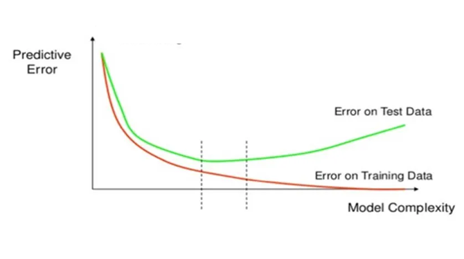

# Homework Assignment

## Question 1:  

### Tasks:
1. Calculate the **Mean Absolute Error (MAE)**.  
2. Calculate the **Mean Squared Error (MSE)**.  
3. Calculate the **Root Mean Squared Error (RMSE)**.

<a href="https://github.com/pythonai170624/pages/blob/main/4-evaluating-regression-error-func.md">see example here</a>

```python
import numpy as np
from sklearn.metrics import mean_absolute_error, mean_squared_error

y_true = np.array([
    10.5, 8.2, 7.3, 15.4, 12.0,
    9.8, 6.7, 11.2, 13.5, 9.0,
    8.1, 14.2, 10.0, 7.5, 12.8,
    9.3, 11.8, 8.9, 10.7, 13.1
])

# predicted values
y_pred = np.array([
    11.2, 7.8, 7.0, 16.1, 11.5,
    9.5, 7.2, 10.8, 14.0, 8.7,
    8.5, 13.9, 10.4, 7.8, 12.5,
    9.0, 12.3, 9.4, 11.1, 12.8
])

# calculate here

```

## Question 2:

### Tasks:
1. use the code below
2. save the model
3. in a new program, load the model and ask the user to input a number, show the prediction for this value

<a href="https://github.com/pythonai170624/pages/blob/main/5-deploy-model.md">see example here</a>

```python
import numpy as np
from sklearn.linear_model import LinearRegression

# Create simple data with 10 data points
X = np.array([1, 2, 3, 4, 5, 6, 7, 8, 9, 10]).reshape(-1, 1)  # reshape for sklearn
y = np.array([2, 4, 5, 4, 5, 7, 8, 9, 11, 12])

# Fit the model
model = LinearRegression()
model.fit(X, y)
print("Model fitted")
print(f"Coefficient: {model.coef_[0]:.4f}")
print(f"Intercept: {model.intercept_:.4f}")

new_data = np.array([5]).reshape(-1, 1)
new_predictions = model.predict(new_data)
print("Predictions on new data:", new_predictions)
```

4. in the code below, does the dump also include the scaler? do we need to add code that scales before prediction?

```python
model = Pipeline([
    ('scaler', StandardScaler()),
    ('regressor', LinearRegression())
])
model.fit(X, y)
joblib.dump(model, 'linear_model.joblib')
```

## Question 3:

#### 1

You have trained a linear regression model, and you notice the following:

The model performs very well on the training set but poorly on the validation set

The predictions on the validation set are highly sensitive to small changes in the input data (high variance)

The model seems to be overfitting

Which regularization technique would help reduce the variance and prevent overfitting in this scenario?

- L1 regularization (Lasso) 

- L2 regularization (Ridge) 

#### 2

You are working with a linear regression model that includes many input features, and you suspect that some features are irrelevant (they contribute little to the prediction).

You want to:

Reduce the number of features used by the model

Encourage the model to automatically set some coefficients to zero (effectively removing those features)

Which regularization method should you use?

- L1 regularization (Lasso) 

- L2 regularization (Ridge) 


## Question 4:

in the following graph:



where is the underfit? where is the overfit?

where is the ideal area?

use the dotted line in your answer, i.e. left to the dotted line

---

submit to: pythonai170624+HWAI4@gmail.com