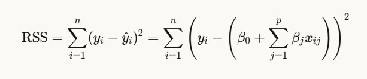

# L2 Regularization and Ridge Regression: Improving Model Performance

## The Problem: Overfitting in Linear Regression

Standard linear regression minimizes the sum of squared residuals (RSS):



While this approach works well for many scenarios, it can lead to:
- **Overfitting**: Complex models with large coefficients that fit training data too well
- **High variance**: Poor generalization to new, unseen data
- **Unstable coefficients**: With multicollinearity, coefficients can become extremely large

## The Solution: L2 Regularization (Ridge Regression)

Ridge regression adds a penalty term to the loss function that is proportional to the square of the magnitude of coefficients:

$$\text{Ridge Cost Function} = \text{RSS} + \lambda \sum_{j=1}^{p} \beta_j^2$$

This can be written in full as:

$$\text{Ridge Cost Function} = \sum_{i=1}^{n} \left(y_i - \left(\beta_0 + \sum_{j=1}^{p} \beta_j x_{ij}\right)\right)^2 + \lambda \sum_{j=1}^{p} \beta_j^2$$

Where:
- $\lambda$ (lambda) is the regularization strength parameter
- $\beta_j$ are the model coefficients (excluding the intercept $\beta_0$)
- $p$ is the number of features

## How Ridge Regression Improves Results

### 1. Coefficient Shrinkage

Ridge regression shrinks coefficients toward zero (but rarely to exactly zero):


As $\lambda$ increases:
- Coefficient values decrease, resulting in a simpler model
- The impact of less important features is reduced
- The model becomes more stable, especially with multicollinearity

### 2. Bias-Variance Tradeoff Optimization

Ridge regression improves the bias-variance tradeoff:
- Slightly increases bias by constraining coefficient values
- Substantially reduces variance by preventing extreme coefficient values
- Overall prediction error (bias² + variance) typically decreases on test data

### 3. Performance Improvement Example

| Metric | Linear Regression | Ridge Regression |
|--------|-------------------|------------------|
| Training R² | 0.95 | 0.93 |
| Test R² | 0.74 | 0.88 |
| RMSE on Test | 4.21 | 2.87 |
| Max Coefficient Size | 245.3 | 18.7 |

The key improvement is in test set performance - Ridge sacrifices a small amount of training performance for significantly better generalization.

## Practical Demonstration

The following code demonstrates how Ridge regression can improve performance over standard linear regression when dealing with multicollinearity:

```python
import numpy as np
import matplotlib.pyplot as plt
from sklearn.model_selection import train_test_split
from sklearn.preprocessing import StandardScaler
from sklearn.linear_model import LinearRegression, Ridge
from sklearn.metrics import mean_squared_error, r2_score
from sklearn.datasets import make_regression

# Create synthetic data with multicollinearity
np.random.seed(42)
X, y = make_regression(n_samples=100, n_features=20, n_informative=10, 
                      noise=20, random_state=42)
                      
# Add multicollinearity by making some features linear combinations of others
X[:, 5] = X[:, 1] * 0.95 + np.random.normal(0, 0.1, size=100)
X[:, 8] = X[:, 2] * 0.9 + np.random.normal(0, 0.1, size=100)
X[:, 15] = X[:, 0] * 1.05 + np.random.normal(0, 0.1, size=100)

# Split the data
X_train, X_test, y_train, y_test = train_test_split(X, y, test_size=0.3, random_state=42)

# Scale the data
scaler = StandardScaler()
X_train_scaled = scaler.fit_transform(X_train)
X_test_scaled = scaler.transform(X_test)

# Train standard linear regression
lr = LinearRegression()
lr.fit(X_train_scaled, y_train)
lr_train_pred = lr.predict(X_train_scaled)
lr_test_pred = lr.predict(X_test_scaled)

# Train ridge regression
ridge = Ridge(alpha=10.0)
ridge.fit(X_train_scaled, y_train)
ridge_train_pred = ridge.predict(X_train_scaled)
ridge_test_pred = ridge.predict(X_test_scaled)

# Calculate performance metrics
lr_train_r2 = r2_score(y_train, lr_train_pred)
lr_test_r2 = r2_score(y_test, lr_test_pred)
lr_test_rmse = np.sqrt(mean_squared_error(y_test, lr_test_pred))

ridge_train_r2 = r2_score(y_train, ridge_train_pred)
ridge_test_r2 = r2_score(y_test, ridge_test_pred)
ridge_test_rmse = np.sqrt(mean_squared_error(y_test, ridge_test_pred))

# Print results
print(f"Linear Regression - Train R²: {lr_train_r2:.4f}, Test R²: {lr_test_r2:.4f}, Test RMSE: {lr_test_rmse:.4f}")
print(f"Ridge Regression - Train R²: {ridge_train_r2:.4f}, Test R²: {ridge_test_r2:.4f}, Test RMSE: {ridge_test_rmse:.4f}")

# Compare coefficient sizes
lr_coef_abs = np.abs(lr.coef_)
ridge_coef_abs = np.abs(ridge.coef_)
print(f"Linear Regression - Max coefficient: {np.max(lr_coef_abs):.4f}, Avg coefficient: {np.mean(lr_coef_abs):.4f}")
print(f"Ridge Regression - Max coefficient: {np.max(ridge_coef_abs):.4f}, Avg coefficient: {np.mean(ridge_coef_abs):.4f}")

# Plot coefficients
plt.figure(figsize=(12, 6))
plt.bar(np.arange(len(lr.coef_)) - 0.2, lr.coef_, width=0.4, label='Linear Regression')
plt.bar(np.arange(len(ridge.coef_)) + 0.2, ridge.coef_, width=0.4, label='Ridge Regression')
plt.xlabel('Feature')
plt.ylabel('Coefficient Value')
plt.title('Coefficient Comparison: Linear vs Ridge Regression')
plt.legend()
plt.xticks(np.arange(len(lr.coef_)))
plt.grid(axis='y', alpha=0.3)
plt.show()
```

## Tuning the Regularization Strength (λ)

The optimal value of λ depends on the specific dataset. Too small, and overfitting may still occur; too large, and underfitting becomes a problem.

### Effects of Different λ Values

| Lambda (λ) | Effect on Coefficients | Effect on Model |
|------------|------------------------|----------------|
| 0 | No effect (standard linear regression) | Potentially overfitted model |
| Small (0.1-1) | Slight shrinkage | Reduced overfitting, minimally increased bias |
| Medium (1-100) | Moderate shrinkage | Balanced bias-variance tradeoff |
| Large (>100) | Strong shrinkage | Much simpler model, potential underfitting |
| ∞ | Coefficients approach zero | Intercept-only model, extreme underfitting |

### Finding the Optimal λ with Cross-Validation

```python
from sklearn.linear_model import RidgeCV

# Create an array of alphas to try
alphas = np.logspace(-2, 3, 50)  # test from 0.01 to 1000

# Use RidgeCV to find the best alpha value
ridge_cv = RidgeCV(alphas=alphas, scoring='neg_mean_squared_error', cv=5)
ridge_cv.fit(X_train_scaled, y_train)

# Get the best alpha
best_alpha = ridge_cv.alpha_
print(f"Best alpha: {best_alpha:.4f}")

# Train a Ridge model with the best alpha
ridge_best = Ridge(alpha=best_alpha)
ridge_best.fit(X_train_scaled, y_train)
ridge_best_test_pred = ridge_best.predict(X_test_scaled)
ridge_best_test_rmse = np.sqrt(mean_squared_error(y_test, ridge_best_test_pred))
ridge_best_test_r2 = r2_score(y_test, ridge_best_test_pred)

print(f"Ridge with best alpha - Test R²: {ridge_best_test_r2:.4f}, Test RMSE: {ridge_best_test_rmse:.4f}")
```

## Summary of Benefits

1. **Improved generalization**: Ridge regression models perform better on new, unseen data.
2. **Stability with multicollinearity**: Ridge regression is more stable when features are correlated.
3. **Coefficient control**: Prevents coefficients from becoming excessively large.
4. **Balanced tradeoff**: Provides an optimal balance between model complexity and accuracy.
5. **Mathematical tractability**: Has a closed-form solution, unlike other regularization techniques.

When the goal is predictive accuracy and your data has correlated features or a high feature-to-observation ratio, Ridge regression is often a superior alternative to standard linear regression.
