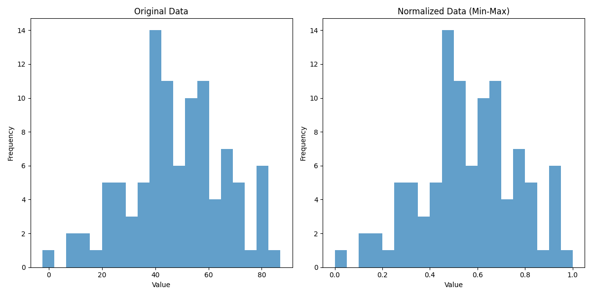
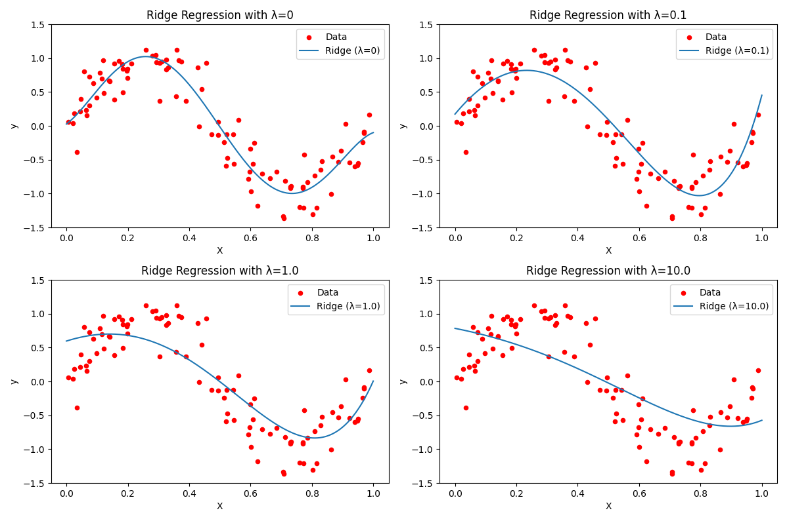
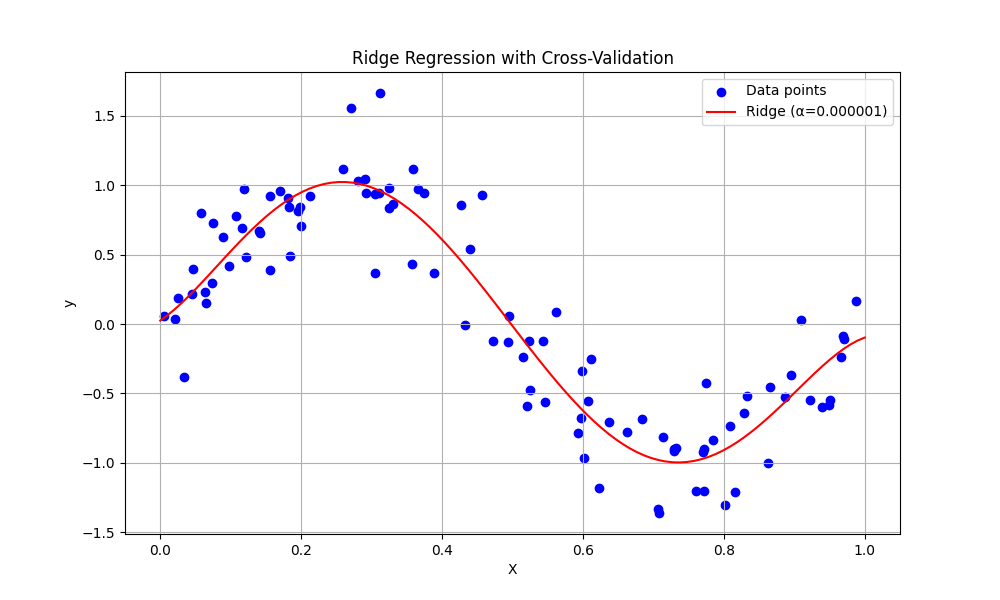

# Feature Scaling and Regularization

## Feature Scaling

Feature scaling is a preprocessing step that transforms numerical features to a comparable scale. This is essential when features have different ranges or units.

### Pros and Cons

**Pros:**
* Accelerates convergence of gradient-based algorithms
* Essential for distance-based algorithms (KNN, K-means)
* Required for regularization techniques (Ridge, Lasso)
* Improves numerical stability
* Makes feature importance comparisons more meaningful

**Cons:**
* Reduces direct interpretability of features
* Introduces additional preprocessing complexity
* Some methods are sensitive to outliers
* Must be applied consistently to training and test data

### Normalization (Min-Max Scaling)

Normalization rescales features to a specific range, typically [0,1].

**Mathematical formula:**
$$X_{normalized} = \frac{X - X_{min}}{X_{max} - X_{min}}$$

**Visualization:**

```python
import numpy as np
import matplotlib.pyplot as plt
from sklearn.preprocessing import MinMaxScaler

# Generate sample data
np.random.seed(42)
original_data = np.random.normal(loc=50, scale=20, size=100)

# Apply normalization
scaler = MinMaxScaler()
normalized_data = scaler.fit_transform(original_data.reshape(-1, 1)).flatten()

# Visualization
plt.figure(figsize=(12, 6))
plt.subplot(1, 2, 1)
plt.hist(original_data, bins=20, alpha=0.7)
plt.title('Original Data')
plt.xlabel('Value')
plt.ylabel('Frequency')

plt.subplot(1, 2, 2)
plt.hist(normalized_data, bins=20, alpha=0.7)
plt.title('Normalized Data (Min-Max)')
plt.xlabel('Value')
plt.ylabel('Frequency')

plt.tight_layout()
plt.show()
```



### 🔥 Real-Life Example: Credit Scoring in Banks

Imagine a bank is building a model to decide whether to approve a loan. The dataset includes features like:

- **Salary** (e.g., ranges from $20,000 to $200,000)  
- **Age** (e.g., 18 to 100)  
- **Credit Card Debt** (e.g., $0 to $50,000)  
- **Number of Late Payments** (e.g., 0 to 10)

💡 Without normalization, the **salary** feature would dominate the others due to its large numerical range. This can bias the model and make training unstable or ineffective.

✅ To prevent this, the bank **normalizes all features** to a common range (like `[0, 1]` or `[-1, 1]`). This ensures that:

- All features contribute more equally to the learning process  
- The model trains faster and more reliably  
- Gradient descent behaves more consistently across features

> 📌 **Normalization helps the model focus on patterns, not raw scale differences.**

### Standardization (Z-score Normalization)

Standardization transforms data to have zero mean and unit variance.

**Mathematical formula:**
$$X_{standardized} = \frac{X - \mu}{\sigma}$$

Where:
- $\mu$ is the mean of the feature
- $\sigma$ is the standard deviation
  
The standard deviation (σ) is calculated as: $$\sigma = \sqrt{\frac{1}{N} \sum_{i=1}^{N} (x_i - \mu)^2}$$

Where:
- N is the number of samples
- x_i is each individual value
- μ is the mean of the values


**Visualization:**

```python
import numpy as np
import matplotlib.pyplot as plt
from sklearn.preprocessing import StandardScaler

# Generate sample data
np.random.seed(42)
original_data = np.random.normal(loc=50, scale=20, size=100)

# Apply standardization
scaler = StandardScaler()
standardized_data = scaler.fit_transform(original_data.reshape(-1, 1)).flatten()

# Visualization
plt.figure(figsize=(12, 6))
plt.subplot(1, 2, 1)
plt.hist(original_data, bins=20, alpha=0.7)
plt.title('Original Data')
plt.xlabel('Value')
plt.ylabel('Frequency')

plt.subplot(1, 2, 2)
plt.hist(standardized_data, bins=20, alpha=0.7)
plt.title('Standardized Data (Z-score)')
plt.xlabel('Value')
plt.ylabel('Frequency')

plt.tight_layout()
plt.show()
```


**Real-Life Example:**
Blood test results often have different normal ranges. Standardization allows clinicians to compare multiple biomarkers with different units (like cholesterol in mg/dL and hemoglobin in g/dL) on a unified scale to identify abnormal patterns.

## Regularization

Regularization techniques help prevent overfitting by adding penalty terms to the model's loss function.

### L2 Regularization (Ridge Regression)

Ridge Regression adds the squared magnitude of coefficients as a penalty term.

**Mathematical formula:**
$$\text{Loss} = \text{MSE} + \lambda \sum_{i=1}^{n} w_i^2$$

Where:
- MSE is the Mean Squared Error
- $\lambda$ is the regularization strength (hyperparameter)
- $w_i$ are the model coefficients

**Why Apply Feature Scaling First:**
Ridge Regression's penalty term depends on coefficient magnitude. Without scaling, features with larger scales would be penalized more heavily, leading to biased shrinkage.

**Visualization - Effect of Ridge with different λ values:**

```python
import numpy as np
import matplotlib.pyplot as plt
from sklearn.linear_model import Ridge
from sklearn.preprocessing import StandardScaler
from sklearn.pipeline import Pipeline

# Generate synthetic data
np.random.seed(42)
X = np.sort(np.random.rand(100, 1), axis=0)
y = np.sin(2 * np.pi * X).ravel() + np.random.normal(0, 0.3, X.shape[0])

# Add polynomial features to make the problem harder
X_poly = np.hstack([X, X**2, X**3, X**4, X**5])

# Test points
X_test = np.linspace(0, 1, 1000).reshape(-1, 1)
X_test_poly = np.hstack([X_test, X_test**2, X_test**3, X_test**4, X_test**5])

# Create pipelines with different regularization strengths
alphas = [0, 0.1, 1.0, 10.0]
plt.figure(figsize=(12, 8))

for i, alpha in enumerate(alphas):
    # Create a pipeline with standardization and Ridge
    ridge = Pipeline([
        ('scaler', StandardScaler()),
        ('ridge', Ridge(alpha=alpha))
    ])
    
    # Fit model
    ridge.fit(X_poly, y)
    
    # Predict
    y_pred = ridge.predict(X_test_poly)
    
    # Plot
    plt.subplot(2, 2, i+1)
    plt.scatter(X, y, color='red', s=20, label='Data')
    plt.plot(X_test, y_pred, label=f'Ridge (λ={alpha})')
    plt.title(f'Ridge Regression with λ={alpha}')
    plt.xlabel('X')
    plt.ylabel('y')
    plt.ylim(-1.5, 1.5)
    plt.legend()

plt.tight_layout()
plt.show()
```


#### RidgeCV

RidgeCV is a cross-validation implementation that automatically selects the best regularization parameter ($\lambda$) from a given set.

```python
import numpy as np
import matplotlib.pyplot as plt
from sklearn.linear_model import RidgeCV
from sklearn.preprocessing import StandardScaler, PolynomialFeatures
from sklearn.pipeline import Pipeline

# Generate synthetic data
np.random.seed(42)
X = np.sort(np.random.rand(100, 1), axis=0)
y = np.sin(2 * np.pi * X).ravel() + np.random.normal(0, 0.3, X.shape[0])

# Create polynomial features
poly = PolynomialFeatures(degree=5)
X_poly = poly.fit_transform(X)

# Set up RidgeCV with a range of alphas
alphas = np.logspace(-6, 6, 13)  # Range of alpha values to test
ridge_cv = RidgeCV(alphas=alphas, cv=5, scoring='neg_mean_squared_error')

# Create and fit the pipeline
pipeline = Pipeline([
    ('scaler', StandardScaler()),
    ('ridge_cv', ridge_cv)
])
pipeline.fit(X_poly, y)

# Print the best alpha found
best_alpha = pipeline.named_steps['ridge_cv'].alpha_
print(f"Best alpha: {best_alpha}")

# Visualize the results
X_test = np.linspace(0, 1, 100).reshape(-1, 1)
X_test_poly = poly.transform(X_test)
X_test_poly_scaled = pipeline.named_steps['scaler'].transform(X_test_poly)
y_pred = pipeline.predict(X_test_poly)

plt.figure(figsize=(10, 6))
plt.scatter(X, y, color='blue', label='Data points')
plt.plot(X_test, y_pred, color='red', label=f'Ridge (α={best_alpha:.6f})')
plt.title('Ridge Regression with Cross-Validation')
plt.xlabel('X')
plt.ylabel('y')
plt.legend()
plt.grid(True)
plt.show()

# You can also examine the coefficients
coefficients = pipeline.named_steps['ridge_cv'].coef_
feature_names = [f'X^{i}' for i in range(len(coefficients))]
plt.figure(figsize=(10, 6))
plt.bar(feature_names, coefficients)
plt.title('Ridge Regression Coefficients')
plt.xlabel('Features')
plt.ylabel('Coefficient Value')
plt.xticks(rotation=45)
plt.grid(True, axis='y')
plt.tight_layout()
plt.show()
```


#### Scoring Metrics for RidgeCV

Common scoring metrics for cross-validation:

- **Mean Squared Error (MSE)**: Average squared difference between predicted and actual values
- **R-squared**: Proportion of variance explained by the model
- **Mean Absolute Error (MAE)**: Average absolute difference between predicted and actual values
- **Negative Mean Squared Error**: Used in scikit-learn's cross-validation (which maximizes scores)

**Real-Life Example:**
When predicting housing prices, Ridge Regression performs well because most features (like square footage, number of rooms, neighborhood characteristics) contribute to the price, but with varying importance.

### L1 Regularization (Lasso Regression)

Lasso Regression adds the absolute value of coefficients as a penalty term, which can lead to sparse models.

**Mathematical formula:**
$$\text{Loss} = \text{MSE} + \lambda \sum_{i=1}^{n} |w_i|$$

**Lasso Regression** is a predictive modeling technique (regression) that adds a *"penalty"* when the model’s weights (coefficients) get too large — but not just any penalty!  
It adds the **sum of the absolute values of the coefficients**.

- **MSE** – Mean Squared Error (regular prediction error)
- **λ (lambda)** – Penalty strength
- **|βᵢ|** – Absolute value of each coefficient (so negatives don't cancel out)

---

### ✂️ Why does it create a Sparse Model?

Because **Lasso pushes some coefficients to exactly zero** if they are not important enough!  
In other words: if a feature doesn't really add value to the prediction — the model sets its weight to zero.

---

## 📦 Everyday Example:

Imagine you're building a model to predict whether someone will like pizza based on:

- Age
- Eye color
- Height
- Whether they are Italian
- Number of cats at home

🤷‍♂️ Probably eye color and number of cats don’t really matter.  
So **Lasso will zero out those feature weights** → and keep only what's truly important (like age and being Italian).

---

## ✅ What do we gain from this?

- Simpler models  
- Faster models  
- Easier to interpret  
- No time wasted on irrelevant features 💁‍♀️

**Visualization - Effect of Lasso with different λ values:**

```python
import numpy as np
import matplotlib.pyplot as plt
from sklearn.linear_model import Lasso
from sklearn.preprocessing import StandardScaler
from sklearn.pipeline import Pipeline

# Generate synthetic data (same as previous)
np.random.seed(42)
X = np.sort(np.random.rand(100, 1), axis=0)
y = np.sin(2 * np.pi * X).ravel() + np.random.normal(0, 0.3, X.shape[0])
X_poly = np.hstack([X, X**2, X**3, X**4, X**5])
X_test = np.linspace(0, 1, 1000).reshape(-1, 1)
X_test_poly = np.hstack([X_test, X_test**2, X_test**3, X_test**4, X_test**5])

# Create pipelines with different regularization strengths
alphas = [0.001, 0.01, 0.1, 1.0]
plt.figure(figsize=(12, 8))

for i, alpha in enumerate(alphas):
    # Create a pipeline with standardization and Lasso
    lasso = Pipeline([
        ('scaler', StandardScaler()),
        ('lasso', Lasso(alpha=alpha, max_iter=10000))
    ])
    
    # Fit model
    lasso.fit(X_poly, y)
    
    # Get coefficients
    coefs = lasso.named_steps['lasso'].coef_
    
    # Predict
    y_pred = lasso.predict(X_test_poly)
    
    # Plot
    plt.subplot(2, 2, i+1)
    plt.scatter(X, y, color='red', s=20, label='Data')
    plt.plot(X_test, y_pred, label=f'Lasso (λ={alpha})')
    plt.title(f'Lasso Regression with λ={alpha}\nNon-zero coeffs: {np.sum(coefs != 0)}')
    plt.xlabel('X')
    plt.ylabel('y')
    plt.ylim(-1.5, 1.5)
    plt.legend()

plt.tight_layout()
plt.show()
```

#### LassoCV and Optimal Lambda Value

LassoCV uses cross-validation to find the optimal regularization parameter.

```python
from sklearn.linear_model import LassoCV

# Using LassoCV to find optimal alpha
alphas = np.logspace(-6, 0, 100)  # Range of alpha values to test
lasso_cv = LassoCV(alphas=alphas, cv=5, max_iter=10000, random_state=42)
pipeline = Pipeline([
    ('scaler', StandardScaler()),
    ('lasso_cv', lasso_cv)
])

pipeline.fit(X_poly, y)
print(f"Best alpha: {lasso_cv.alpha_}")
print(f"Non-zero coefficients: {np.sum(lasso_cv.coef_ != 0)}")
```

The optimal $\lambda$ balances between underfitting (high $\lambda$, too simple) and overfitting (low $\lambda$, too complex).

**Visualization of coefficients path in Lasso:**

```python
from sklearn.linear_model import lasso_path

# Compute coefficient paths
alphas, coefs, _ = lasso_path(StandardScaler().fit_transform(X_poly), y, alphas=np.logspace(-5, 0, 100))

# Plot coefficient paths
plt.figure(figsize=(10, 6))
for i, coef in enumerate(coefs):
    plt.plot(alphas, coef, label=f'Feature {i+1}')

plt.axvline(lasso_cv.alpha_, color='black', linestyle='--', label='Optimal λ')
plt.xscale('log')
plt.xlabel('Alpha (λ)')
plt.ylabel('Coefficient values')
plt.title('Lasso Path: Coefficient Values vs. λ')
plt.legend(loc='best')
plt.grid(True)
plt.show()
```

**Real-Life Example:**
In genomic studies, researchers often have thousands of genetic markers but only a few hundred patients. Lasso helps identify the most relevant genes associated with a disease by setting coefficients of irrelevant genes to zero.

### Lasso vs Ridge Regression Comparison

| Aspect | Ridge Regression | Lasso Regression |
|--------|------------------|------------------|
| Penalty | L2 norm (sum of squared coefficients) | L1 norm (sum of absolute coefficients) |
| Effect on coefficients | Shrinks all coefficients toward zero, but rarely to exactly zero | Can shrink coefficients exactly to zero (feature selection) |
| Solution uniqueness | Always unique | May not be unique when features are correlated |
| Computational complexity | Closed-form solution available | Requires iterative optimization |
| Best use case | When all features contribute to the outcome | When feature selection is desired |
| Handling correlated features | Distributes weight among correlated features | Tends to pick one feature from correlated groups |

**Visualization of Ridge vs Lasso effect on coefficients:**

```python
import numpy as np
import matplotlib.pyplot as plt
from sklearn.linear_model import Ridge, Lasso
from sklearn.preprocessing import StandardScaler

# Generate synthetic data with correlated features
np.random.seed(42)
n_samples, n_features = 50, 20
X = np.random.randn(n_samples, n_features)
# Add correlation between features
X[:, 5:10] = X[:, 0:5] + np.random.randn(n_samples, 5) * 0.1
# True coefficients: only first 5 features matter
true_coef = np.zeros(n_features)
true_coef[:5] = np.array([5, 4, 3, 2, 1])
y = np.dot(X, true_coef) + np.random.randn(n_samples) * 0.1

# Standardize data
scaler = StandardScaler()
X_scaled = scaler.fit_transform(X)

# Fit models
alpha = 0.1
ridge = Ridge(alpha=alpha)
lasso = Lasso(alpha=alpha)

ridge.fit(X_scaled, y)
lasso.fit(X_scaled, y)

# Plot coefficients
plt.figure(figsize=(12, 6))
plt.subplot(1, 2, 1)
plt.stem(range(n_features), ridge.coef_, markerfmt='ro', linefmt='r-', basefmt='b-')
plt.title('Ridge Coefficients')
plt.xlabel('Feature Index')
plt.ylabel('Coefficient Value')
plt.axhline(y=0, color='k', linestyle='-')

plt.subplot(1, 2, 2)
plt.stem(range(n_features), lasso.coef_, markerfmt='ro', linefmt='r-', basefmt='b-')
plt.title('Lasso Coefficients')
plt.xlabel('Feature Index')
plt.ylabel('Coefficient Value')
plt.axhline(y=0, color='k', linestyle='-')

plt.tight_layout()
plt.show()
```

## Real-Life Applications

1. **Healthcare Predictive Models**
   - **Problem**: Predicting patient readmission risk using hundreds of medical variables
   - **Solution**: Feature scaling + Lasso regression to identify key risk factors
   - **Benefit**: Simplified model focusing on the most important predictors, improving clinical usability

2. **Financial Credit Scoring**
   - **Problem**: Predicting credit risk with features on different scales (income, debt ratio, payment history)
   - **Solution**: Standardization + Ridge regression for stability
   - **Benefit**: Balanced consideration of all relevant factors without excessive influence from large-scale features

3. **Housing Price Prediction**
   - **Problem**: Predicting housing prices with features like square footage (large values) and number of rooms (small values)
   - **Solution**: Feature scaling + Elastic Net (combination of L1 and L2)
   - **Benefit**: Accurate price prediction model that balances feature selection and coefficient stability

4. **Image Classification Performance**
   - **Problem**: Optimizing neural network performance for image classification
   - **Solution**: Normalize pixel values from [0,255] to [0,1]
   - **Benefit**: Faster convergence and improved model accuracy
